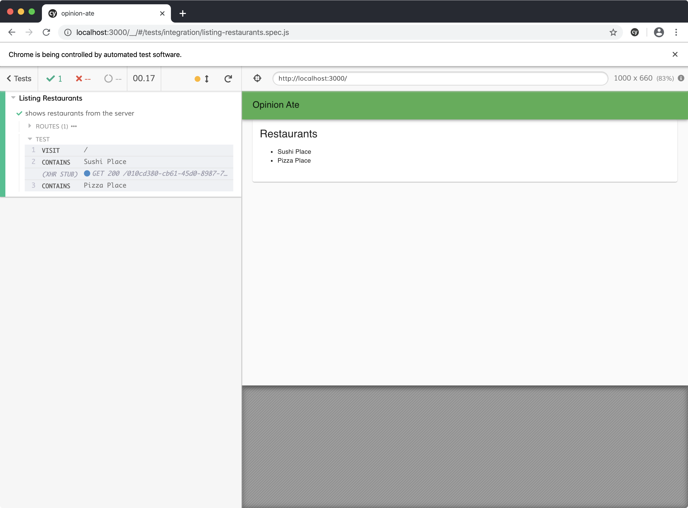

import Chat from '../_chat.mdx';

# 4 - Refactoring Styles

In this chapter we'll see one example of the kind of refactoring you can do when you have the thorough test coverage that TDD provides: restyling. We'll update our application from using plain unstyled HTML elements to using styled elements provided by a UI component library. TDD allows us to separate the process of getting the application working from the process of making it look good, so we can focus on one thing at a time.

Our next story in Trello is "Style App with Material Design"; drag it to "In Progress".

This work is definitely needed. By following TDD and writing only the minimal code to pass the tests, our app certainly isn't going to win any awards for visual design:


But one of the benefits of the thorough test suite that TDD provides is that you can make changes to the look and feel of your app with confidence that the functionality still works.

First, let's confirm our tests are passing. Run `yarn test`. You may get the message:

```sh
No tests found related to files changed since last commit.
Press `a` to run all tests, or run Jest with `--watchAll`.

Watch Usage
 › Press a to run all tests.
 › Press f to run only failed tests.
 › Press q to quit watch mode.
 › Press p to filter by a filename regex pattern.
 › Press t to filter by a test name regex pattern.
 › Press Enter to trigger a test run.
```

If you get this message, press `a` to run all the tests. They should pass. Keep the unit test process running throughout this chapter.

In another terminal, run `yarn start`, and in a third, run `yarn cypress`. Click `listing-restaurants.spec.js` and make sure it passes.

Now that we know all our tests pass, we're ready to update the look-and-feel of the app. We're going to use MUI, a popular React component library that follows Google's Material Design.

Create a new branch for this story:

```sh
$ git checkout -b material-design
```

Install the MUI packages:

```sh
$ yarn add @mui/material@5.6.3 \
           @emotion/react@11.9.0 \
           @emotion/styled@11.8.1
```

Then, in `public/index.html`, add the following `link` tag to load Roboto, the font used by MUI:

```diff
   Learn how to configure a non-root public URL by running `npm run build`.
 -->
+<link
+  rel="stylesheet"
+  href="https://fonts.googleapis.com/css?family=Roboto:300,400,500,700&display=swap"
+/>
 <title>Opinion Ate</title>
```

Now we're ready to begin styling our app. We'll begin by styling the `App` component to give it a title bar and some theme-standard layout.

In `App.js`, let's add a number of MUI components around our `<RestaurantScreen />` component:

```diff
 import {Provider} from 'react-redux';
+import {createTheme} from '@mui/material/styles';
+import {green} from '@mui/material/colors';
+import {ThemeProvider} from '@mui/material/styles';
+import CssBaseline from '@mui/material/CssBaseline';
+import AppBar from '@mui/material/AppBar';
+import Toolbar from '@mui/material/Toolbar';
+import Typography from '@mui/material/Typography';
+import Container from '@mui/material/Container';
 import store from './store';
 import RestaurantScreen from './components/RestaurantScreen';

+const theme = createTheme({
+  palette: {
+    primary: green,
+  },
+});
+
 export default function App() {
   return (
     <Provider store={store}>
+      <ThemeProvider theme={theme}>
+        <CssBaseline />
+        <AppBar position="static">
+          <Toolbar>
+            <Typography variant="h6">Opinion Ate</Typography>
+          </Toolbar>
+        </AppBar>
+        <Container>
           <RestaurantScreen />
+        </Container>
+      </ThemeProvider>
    </Provider>
   );
 }
```

Rerun the E2E test. It still passes, and notice we now have a nice green toolbar, and there's some padding on the left and right on the content area.


Here's what each of these MUI components does to help achieve this look:

- `createTheme()` allows us to create a theme, including setting the `primary` color of our app to the `green` color defined by MUI.
- `ThemeProvider` allows you to make the theme you created with `createThem()` available to the whole app. It's an optional component that isn't needed if you aren't customizing the theme.
- `CssBaseline` applies some default page-wide CSS styles.
- `AppBar` and `Toolbar` work together to provide the top title bar.
- `Typography` formats text to styles that are part of the Material Design system. MUI components are designed with certain typographic styles in mind, so it's best to check the docs for full examples of what typography settings are recommended for text displayed inside other components.
- `Container` centers your content horizontally to provide some padding and keeps the content from stretching too much in very wide browser windows.

Next let's style `RestaurantScreen`. A common UI element in Material Design is a card, which is a box around some content. Let's style the `RestaurantScreen` as a card:

```diff
+import Card from '@mui/material/Card';
+import CardContent from '@mui/material/CardContent';
+import Typography from '@mui/material/Typography';
 import RestaurantList from './RestaurantList';

 export default function RestaurantScreen() {
   return (
-    <div>
-      <h1>Restaurants</h1>
+    <Card>
+      <CardContent>
+        <Typography variant="h5">Restaurants</Typography>
         <RestaurantList />
-    </div>
+      </CardContent>
+    </Card>
   );
 }
```

Reload the E2E test and notice there's a box around the content now.



Here's what the components do:

- `Card` is the wrapper for the card and provides the outline.
- `CardContent` provides appropriate padding around the content area of a card.
- We saw `Typography` earlier for styling text. In this case, the recommended variant for a card title is `h5`.

Finally, let's style the list of the restaurants. Material Design includes the concept of a list, and its design will look nice here:

```diff
 import {useEffect} from 'react';
 import {connect} from 'react-redux';
+import List from '@mui/material/List';
+import ListItem from '@mui/material/ListItem';
+import ListItemText from '@mui/material/ListItemText';
 import {loadRestaurants} from '../store/restaurants/actions';

 export function RestaurantList({loadRestaurants, restaurants}) {
...
   return (
-    <ul>
+    <List>
       {restaurants.map(restaurant => (
-        <li key={restaurant.id}>{restaurant.name}</li>
+        <ListItem key={restaurant.id}>
+          <ListItemText>{restaurant.name}</ListItemText>
+        </ListItem>
       ))}
-    </ul>
+    </List>
   );
```

Rerun the E2E test to see the changes:


Here's what these components do:

- `List` wraps a list and provides appropriate outer styling.
- `ListItem` is the wrapping component for the list item.
- `ListItemText` is the primary title in the list item.

Our E2E and unit tests still pass. With that, we've completed restyling our app. Because we have a thorough test suite, we can have a high degree of confidence that we haven't broken anything. As a result, we didn't feel the need to balance visual improvements with the cost of manual retesting or the risk of breaking anything; we were able to do as many visual improvements as we liked.

:::tip
Some frontend TDD approaches recommend specifying every detail of your markup and styling in your component tests. TDD traditionally says you shouldn't write any production code without a test driving you to do it. These folks argue that because in React markup and styling are part of your code, therefore you shouldn't write complex markup and CSS without a test for them.

I think that's a bad idea. Here's why:

- Tests of detailed markup and styles don't add a much value; they are just repeating what is in the production code.
- Behavioral tests aren't well-suited to visuals. Test-driving the markup and CSS won't ensure the component looks right; it just ensures that you typed in the HTML tag you intended to.
- Such tests are incredibly highly-coupled to the production code. Every change to the production code would require a change to the test. That's a sign that they aren't testing the interface, but rather the implementation.
- Such tests prevent refactoring. You wouldn't be able to do the visual changes we did in this chapter under test; you would need to change the tests at the same time, so the tests would not provide a high degree of confidence that the behavior is still working.

This kind of extreme view, and the downsides that come from it, convince folks not to try TDD or give them a bad experience if they do try it.

Here's what I recommend as a better approach: don't write any *behavioral* production code without a failing test driving you to do so, but *do* write markup and styling without specifying it in a test. Keep your component tests focused on the behavior of the component, and consider markup and styling specifics to be implementation details.
:::

If you have any uncommitted changes, commit them to git. Push up your branch to the origin and open a pull request. Wait for CI to complete, then merge the pull request. Now we can drag our "Style App with Material Design" story to "Done" in Trello.

## What's Next
In this chapter we improved the look-and-feel of our first feature. That isn't the only improvement it needs: there are some functionality improvements it could benefit from as well. In the next chapter we'll add test-drive the code for edge cases related to loading and error states.

<Chat />
