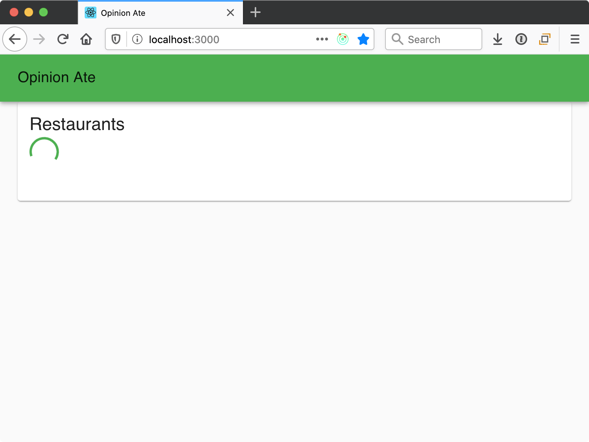
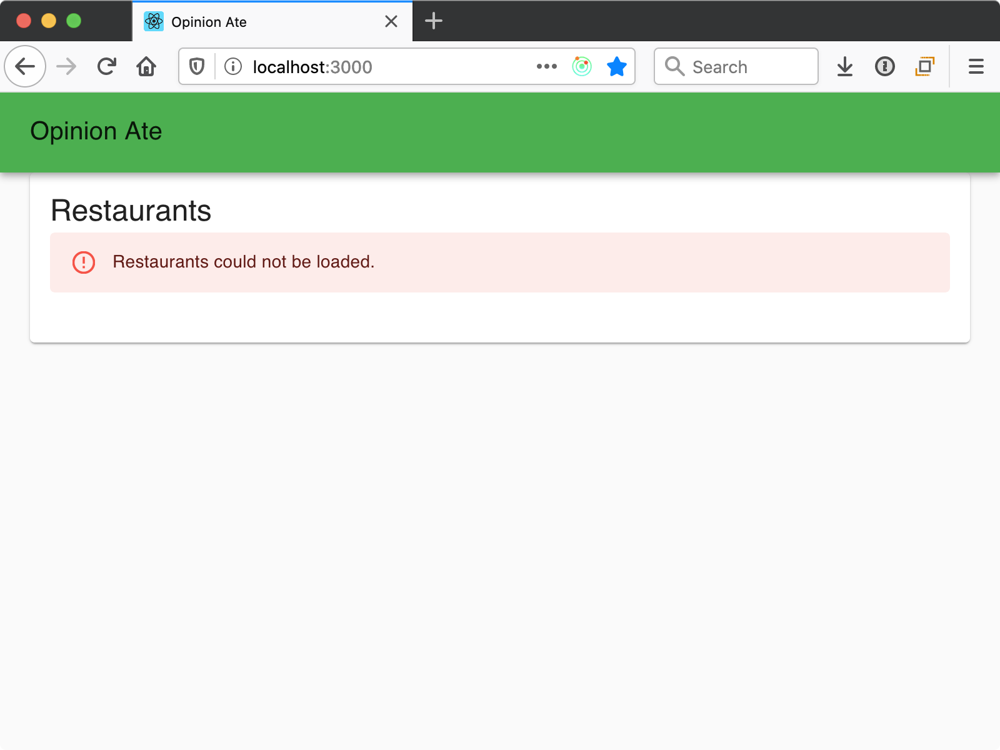

import Chat from '../_chat.mdx';

# 5 - Edge Cases

In this chapter we'll look at how to test-drive edge case functionality using unit tests. This relates to our next story in Trello, "Show Loading and Error States". Drag it to "In Progress".

Our first story was "List Restaurants", and we kept it minimal so that we could build out a vertical slice quickly and get all the parts of our app talking together. Our next story will make the restaurant loading functionality more robust, providing a loading indicator and an error message in case of problems.

Create a new branch for this story:

```sh
$ git checkout -b edge-cases
```

You could theoretically write an E2E test for this functionality, confirming the loading indicator and error message appear at the appropriate times. But if you write too many E2E tests, your test suite will get slow. That slowdown will cause you to run it locally less and less frequently over time, and slow CI runs will slow down your ability to merge PRs.

To prevent this from happening, it's best to write fewer E2E tests and more unit tests. But how should you decide exactly what ratio to use? Outside-in TDD provides an answer to this question. In outside-in TDD, you write an E2E test for each main flow of your application, as well as the unit tests to help implement that flow. Then, for more detailed or edge-case functionality, you only write the unit tests.

In our case, we're considering the loading indicator and error message to be detailed, edge-case functionality. We'll TDD them at the unit level but forego any E2E tests for them.

## Loading Indicator
First let's add the loading indicator. Although we aren't writing an E2E test, we can still start from the "outside" in the sense of the user interface: the `RestaurantList` component. First we'll TDD the loading indicator in the UI, then we'll move "inside" to TDD the store functionality to support it.

### Component Layer
In `RestaurantList.spec.js` we render our component using a `renderComponent()` helper function. This is working well, but now we need a way to set up the props slightly differently for different tests. We want a test where a loading flag prop is set. To do this, let's refactor our tests for more flexibility.

First, start the unit tests with `yarn test` and keep them running for the duration of this chapter.

Next, let's change the `renderComponent` function to allow passing in props to override the defaults:

```diff
-function renderComponent() {
-  loadRestaurants = jest.fn().mockName('loadRestaurants');
-
-  render(
-    <RestaurantList
-      loadRestaurants={loadRestaurants}
-      restaurants={restaurants}
-    />,
-  );
+function renderComponent(propOverrides = {}) {
+  const props = {
+    loadRestaurants: jest.fn().mockName('loadRestaurants'),
+    restaurants,
+    ...propOverrides,
+  };
+  loadRestaurants = props.loadRestaurants;
+
+  render(<RestaurantList {...props} />);
 }
```

Here's what's going on:

- `renderComponent` now takes an optional `propOverrides` argument. If it's not passed, it defaults to an empty object.
- We create a local `props` variable and assign an object to it. By default, that object contains values for the `loadRestaurants` and `restaurants` props. But we use the object spread operator to take any passed-in `propOverrides` and assign those values to the object, potentially overriding the defaults.
- Whatever the final value of the `loadRestaurants` property is (either the default Jest mock function or a passed-in override) we assign that value to a variable so it can be accessed in the tests.
- We `render` the component, passing it all the props.

Save the changes and the tests should still pass.

Now we're ready to write our a new test for when the store is in a loading state. First, let's render the component, passing in a new `loading` prop indicating that the restaurants are currently loading:

```js
it('displays the loading indicator while loading', () => {
  renderComponent({loading: true});
});
```

Now, how can we check that a loading indicator is shown? Sometimes apps will show the text "Loading…" as a loading indicator, but say we want to indicate it visually instead. For example, now that we're using MUI, say that we check its docs and see the `CircularProgress` component, an animated circulator indicator. If no text is shown, how can we check for it in our test? This isn't just a problem for tests: it's also a problem for screen readers, tools that allow visually impaired users to interact with software. Screen readers will read out textual content, but how do they decide what out when there's an element with no textual content?

One way screen readers can interpret elements without text is using [ARIA roles](https://developer.mozilla.org/en-US/docs/Web/Accessibility/ARIA/Roles), which are descriptions of what an element is meant to represent. One such role is "progressbar", which fits what we want. And MUI provides good screen reader support here by automatically giving its `CircularProgress` component an ARIA role of "progressbar". Because of this, we can look for an element with the ARIA role of "progressbar":

```diff
 it('displays the loading indicator while loading', () => {
   renderComponent({loading: true});
+  expect(screen.getByRole('progressbar')).toBeInTheDocument();
 });
```

Save the test. In good TDD style, our test fails, because the element isn't yet present.

Next, we want to follow the TDD practice of making the smallest possible change to get the test to pass. The smallest change in this case would be to hard-code the loading indicator to show *all* the time. We import MUI's `CircularProgress` spinner and render it:

```diff
 import {connect} from 'react-redux';
+import CircularProgress from '@mui/material/CircularProgress';
 import List from '@mui/material/List';
...
   return (
+    <>
+      <CircularProgress />
       <List>
         {restaurants.map(restaurant => (
           <ListItem key={restaurant.id}>
             <ListItemText>{restaurant.name}</ListItemText>
           </ListItem>

         ))}
       </List>
+    </>
   );
```

Save and the test passes.

This last step might make you feel uncomfortable. We don't want the loading indicator to *always* show, right? Shouldn't we go ahead and put a conditional on it?

No, and here's why: if we add the conditional now, *the conditional is not tested*. This is because our tests pass whether or not there is a conditional in place. It's good that we want the conditional, but **we also need to implement the tests that will confirm the conditional is working.** After we make the tests pass in the easiest way possible, if we see that there is more logic we need, we should think: what is the additional application behavior that we need to write a test for?

In this case, the behavior we need is that the loading indicator should *not* show when the data is *not* being loaded. To build that behavior, our first step is to write a test for it:

```js
it('does not display the loading indicator while not loading', () => {
  renderComponent({loading: false});
  expect(screen.queryByRole('progressbar')).not.toBeInTheDocument();
});
```

Note that we used `queryByRole` instead of `getByRole` here. `query` methods return a `null` if an element is not found, whereas `get` methods throw an error. Because we _expect_ to not find the element here, a `query` method is necessary for our assertion to succeed.

This test fails, of course, because we are not yet hiding the loading indicator the way we want. And now that we have two tests, this will force us to implement the conditional to get them both to pass:

```diff
 import {loadRestaurants} from '../store/restaurants/actions';

-export default function RestaurantList({loadRestaurants, restaurants}) {
+export default function RestaurantList({loadRestaurants, restaurants, loading}) {
...
   return (
     <>
-      <CircularProgress />
+      {loading && <CircularProgress />}
       <List>
```

Save the file and all tests pass.

Now, let's think about refactoring. We're getting a lot of tests in our `RestaurantList.spec.js`. A few of them are more closely related than others: both the "don't display loading indicator" test and the "display restaurants" test relate to the situation when the loading is done. We can use a `describe` block to represent this. Wrap the two of them in the following:

```js
describe('when loading succeeds', () => {
//...
});
```

Save and confirm the tests still pass.

Now, look at the "does not display the loading indicator" test. In it, we pass a `loading: false` prop to `renderComponent`. But conceptually "not loading" will be the default state of our application. To represent this, let's set up `renderComponent` with `loading: false` as a default prop:

```diff
 const props = {
   loadRestaurants: jest.fn().mockName('loadRestaurants'),
+  loading: false,
   restaurants,
   ...propOverrides,
 };
```

Now we don't need to pass a prop override in the test of the loading indicator hiding:

```diff
 it('does not display the loading indicator while not loading', () => {
-  renderComponent({loading: false});
+  renderComponent();
```

Save and the tests should pass.

Now both of our tests in the "when loading succeeds" group call `renderComponent()` with no argument. There is one other test that calls `renderComponent()` with no argument: the test that it "loads restaurants on first render." Should we group that test together to remove duplication? I wouldn't recommend it. Although the call is the same, conceptually the situation is different. That test is focused on the situation when loading restaurants is first kicked off, and the other tests are focused on the situation when loading completes. It just so happens that the state of the store is the same in both cases, but conceptually it's describing a different situation. Keeping them separate makes the test suite easier to understand, and it can prevent test failures if the state of the store later needs to be different in those two different situations.

### Data Layer

Now that we've implemented the loading indicator in the UI, we need to drive out the loading flag in the store itself. Open `src/store/restaurants.spec.js`. Our store test will have the same separation as our component test between the scenarios of starting loading and loading succeeding. Because of this, let's proactively group our existing "stores the restaurants" test in a describe:

```js
describe('when loading succeeds', () => {
  it('stores the restaurants', async () => {
//...
  });
});
```

Now let's add a new group for while loading is happening, at the same level as "when loading succeeds":

```js
describe('while loading', () => {
});
```

Inside that describe block, add the test:

```js
it('sets a loading flag', () => {
  const api = {
    loadRestaurants: () => new Promise(() => {}),
  };

  const initialState = {};

  const store = createStore(
    restaurantsReducer,
    initialState,
    applyMiddleware(thunk.withExtraArgument(api)),
  );

  store.dispatch(loadRestaurants());

  expect(store.getState().loading).toEqual(true);
});
```

Here's what's going on:

- We define a stubbed API with a `loadRestaurants` method that returns a promise. The function passed to the promise never calls its arguments, so the promise never resolves or rejects. This is the best way to create the scenario we want for this test, because we want to test what happens *before* the promise resolves.
- We set up a store with the `restaurantsReducer` and our stubbed API.
- We dispatch the `loadRestaurants` async action. This time we don't want to `await` it because we want to check the state of the store immediately upon the action returning, *before* it resolves. (And our promise will ensure it never resolves, anyway.)
- We check the store's `loading` flag to confirm that it's `true` after we initiate a load.

Our test fails, as we expect:

```sh
 ● restaurants › loadRestaurants action › while loading › sets a loading flag

    expect(received).toEqual(expected) // deep equality

    Expected: true
    Received: undefined
```

We're getting back `undefined` because the `loading` flag isn't even defined yet.

Following the principle of making the test green in the easiest way possible, we set up a `loading` child reducer of the restaurants reducer that always returns `true`:

```diff
 };

+function loading() {
+  return true;
+}

 export default combineReducers({
   records,
+  loading,
 });
```

As before, we know this won't be our final implementation, but we want to write tests that drive us to handle all the scenarios.

When we save the file, the test passes.

So why is it not enough to have a `loading` flag that is always `true`? Well, we want it to be `false` once loading is complete. We already have another test that makes an assertion when loading is complete. Let's extract out the setup code we will need for both tests.

First, the `records` array is never modified by the test, so we can move it outside the test to the `describe`:

```diff
 describe('when loading succeeds', () => {
+  const records = [
+    {id: 1, name: 'Sushi Place'},
+    {id: 2, name: 'Pizza Place'},
+  ];

   it('stores the restaurants', async () => {
-    const records = [
-      {id: 1, name: 'Sushi Place'},
-      {id: 2, name: 'Pizza Place'},
-    ];
     const api = {
```

Next, we will need to access the `store` from both tests, so make it a `let` variable defined outside the individual test:

```diff
 ];

+let store;
+
 it('stores the restaurants', async () => {
   const api = {
     loadRestaurants: () => Promise.resolve(records),
   };

   const initialState = {
     records: [],
   };

-  const store = createStore(
+  store = createStore(
     restaurantsReducer,
```

Finally, we move the code that sets up the `api`, the `store`, and dispatches the action to a `beforeEach` block:

```diff
 let store;

+beforeEach(async () => {
+  const api = {
+    loadRestaurants: () => Promise.resolve(records),
+  };
+
+  const initialState = {
+    records: [],
+  };
+
+  store = createStore(
+    restaurantsReducer,
+    initialState,
+    applyMiddleware(thunk.withExtraArgument(api)),
+  );
+
+  await store.dispatch(loadRestaurants());
+});
+
 it('stores the restaurants', async () => {
-  const api = {
-    loadRestaurants: () => Promise.resolve(records),
-  };
-
-  const initialState = {
-    records: [],
-  };
-
-  store = createStore(
-    restaurantsReducer,
-    initialState,
-    applyMiddleware(thunk.withExtraArgument(api)),
-  );
-
-  await store.dispatch(loadRestaurants());
-
   expect(store.getState().records).toEqual(records);
 });
```

A `beforeEach` block will automatically run before every test in the surrounding `describe`. As an alternative to the `beforeEach` block, another option would have been to create a helper function that we explicitly call inside each test, as we did with `renderComponent` in our component test. There are pros and cons of each approach. React Testing Library discourages rendering a component in a `beforeEach` block, so we used a helper function for that case. But our store test is just plain JavaScript and has no such discouragement. One benefit of a `beforeEach` block is that you don't have to remember to call the same helper function in each test. Another benefit is that the block communicates "this is the situation that we are testing across all the tests in this group." Feel free to try both helper methods and `beforeEach` blocks in your non-component unit tests and decide when you prefer each.

Now that our setup code has been moved to a `beforeEach` block, we can simplify it a bit. Since the `beforeEach` function only has one promise it `awaits` and that promise is returned by the final statement, we can just return the promise instead of `await`ing it. If we do, the function no longer needs to be an `async` function:

```diff
-beforeEach(async () => {
+beforeEach(() => {
   const api = {
     loadRestaurants: () => Promise.resolve(records),
   };
...
-  await store.dispatch(loadRestaurants());
+  return store.dispatch(loadRestaurants());
 });
```

:::tip
If you remove the `await` keyword but don't add the `return` keyword, you'll notice that the tests still pass. As of this writing, it seems like Jest is still waiting for the promise to resolve whether we return it or not. Why is that?

It has to do with the way Jest uses promises internally in running tests. This won't work for just any promise, though: for example, if our promise was really hitting an external service, or was set up with a `setTimeout()`, Jest would move on and not wait for the promise to resolve before running the tests.

The fact that Jest works this way is an implementation detail and isn't documented as a behavior you can rely on. This means it could change at any time without warning. It's safer to rely on the [documented behavior](https://jestjs.io/docs/en/setup-teardown#repeating-setup-for-many-tests) that if we want Jest to wait for a promise in a `beforeEach` block to resolve, we should return it. This is one way to make your tests as robust as possible, avoiding mysterious breakages in the future.
:::

Our test function has the `async` keyword, but it turns out that all the asynchronous functionality was moved to the `beforeEach` block. As a result, we can remove the `async` keyword from the test function:

```diff
-it('stores the restaurants', async () => {
+it('stores the restaurants', () => {
   expect(store.state.restaurants.records).toEqual(records);
 });
```

With this refactoring done, we're ready to add a second test in that describe block: a test to check the loading state.

```js
it('clears the loading flag', () => {
  expect(store.getState().loading).toEqual(false);
});
```

Our test fails, as we expect, and now we need to actually clear the loading flag. We can do this in the `loading` reducer:

```diff
-function loading() {
-  return true;
+function loading(state = true, action) {
+  switch (action.type) {
+    case STORE_RESTAURANTS:
+      return false;
+    default:
+      return state;
+  }
 }
```

Save the file and our test passes.

Is our implementation complete? Well, the `loading` flag starts as `true`. That's *almost* correct, because right now we happen to dispatch the `loadRestaurants` action as soon as our app starts. But conceptually it makes more sense for the `loading` flag to start `false` and for the `loadRestaurants` action to set it to `true`. That way we aren't relying on the coincidence that we start the loading when the app starts, and if we ever change when the loading begins, our `loading` flag will be ready for that change.

We don't just want to make this change to the `loading` flag directly, though—we want to specify it! Add a new `describe` block directly inside the top-level "restaurants" block:

```js
describe('initially', () => {
  it('does not have the loading flag set', () => {
    const initialState = {};

    const store = createStore(
      restaurantsReducer,
      initialState,
      applyMiddleware(thunk),
    );

    expect(store.getState().loading).toEqual(false);
  });
});
```

In this case we don't need to pass an `api` to `thunk` at all, because we won't be making any calls to the `api`. We just create a store with empty initial state, then we assert that the starting value of `loading` is `false`.

Our test fails, as we expect. Let's change the initial `loading` flag:

```diff
-function loading(state = true, action) {
+function loading(state = false, action) {
   switch (action.type) {
```

Now our test of the initial state passes, but we get another test failure: the test for while loading is happening. Previously the reason the `loading` flag was `true` while loading was that that was the flag's initial value. Now that its initial value is `false`, we need to *change* the value when `loadRestaurants` is called. We can do this by adding a new action that is dispatched immediately in the `loadRestaurants` thunk, before the API is called:

```diff
+export const START_LOADING = 'START_LOADING';
 export const STORE_RESTAURANTS = 'STORE_RESTAURANTS';

 export const loadRestaurants = () => async (dispatch, getState, api) => {
+  dispatch(startLoading());
   const records = await api.loadRestaurants();
   dispatch(storeRestaurants(records));
 };

+const startLoading = () => ({type: START_LOADING});
+
 const storeRestaurants = records => ({
```

Then, in the `loading` reducer, we return a state of `true` when `START_LOADING` happens:

```diff
 import {combineReducers} from 'redux';
-import {STORE_RESTAURANTS} from './actions';
+import {START_LOADING, STORE_RESTAURANTS} from './actions';
...
 function loading(state = false, action) {
   switch (action.type) {
+    case START_LOADING:
+      return true;
     case STORE_RESTAURANTS:
       return false;
```

Save the files, and all our tests pass. We now have a loading flag that starts `false`, is set to `true` when loading begins, and is set back to `false` when loading ends.

Our unit tests are passing, and all we need to do now is hook up the `loading` state to our component. In `RestaurantList.js`:

```diff
 const mapStateToProps = state => ({
   restaurants: state.restaurants.records,
+  loading: state.restaurants.loading,
 });
```

With this, our loading functionality should be complete. Run the app with `yarn start`, then load it in the browser. To help make it easy to see the loading state, our backend is set up with a hard-coded one-second delay before returning the restaurant list. So regardless of your internet connection speed you should see the loading spinner for at least one second before the results appear. Our loading flag is working!



Run our E2E tests and note that they still pass. They don't care whether or not a loading flag is shown; they just ensure that the restaurant names eventually appear.

## Error Flag
The other edge case we want to handle is displaying an error message if the API call fails. This will be implemented using a very similar process to the loading flag. If you like, you can try to test-drive this functionality yourself, then compare the steps you took with the steps below. Remember to always start with a failing test, and write only the minimum code to pass the test!

Note that instead of implementing both flags in the component, then implementing both in the store, we got one flag working entirely before we moved on to the second. This ensures that we could ship the loading flag to our customers even before the error flag is ready.

### Component Layer
Let's once again start with the test for the component. We are describing a new situation, when loading fails, so let's put our test in a new `describe` block:

```js
describe('when loading fails', () => {
  it('displays the error message', () => {
    renderComponent({loadError: true});
    expect(
      screen.getByText('Restaurants could not be loaded.'),
    ).toBeInTheDocument();
  });
});
```

We decide we want to indicate the error state with a flag named `loadError`, so we set it up as a prop set to `true`.
We check for a new error message on the page. Our test fails because the element is not found.

Fix it the simplest way possible by hard-coding the error message to show.
MUI has an `Alert` component that will work well. Add it:

```diff
 import {connect} from 'react-redux';
+import Alert from '@mui/material/Alert';
 import CircularProgress from '@mui/material/CircularProgress';
...
       {loading && <CircularProgress />}
+      <Alert severity="error">Restaurants could not be loaded.</Alert>
       <List>
```

Save the file and our test passes. Now, specify that the error does *not* show when loading succeeds:

```diff
 describe('when loading succeeds', () => {
   it('does not display the loading indicator while not loading', () => {
     renderComponent();
     expect(screen.queryByRole('progressbar')).not.toBeInTheDocument();
   });

+  it('does not display the error message', () => {
+    renderComponent();
+    expect(screen.queryByText('Restaurants could not be loaded.')).not.toBeInTheDocument();
+  });
+
   it('displays the restaurants', () => {
```

Make this test pass by making the display of the error alert conditional on the `loadError` prop that we set up in our test:

```diff
-export function RestaurantList({loadRestaurants, restaurants, loading}) {
+export function RestaurantList({
+  loadRestaurants,
+  restaurants,
+  loading,
+  loadError,
+}) {
   useEffect(() => {
...
       {loading && <CircularProgress />}
-      <Alert severity="error">Restaurants could not be loaded.</Alert>
+      {loadError && (
+        <Alert severity="error">Restaurants could not be loaded.</Alert>
+      )}
       <List>
```

Now both tests pass. Our component is working; on to the store.

### Store Layer

In `restaurants.spec.js`, create a new `describe` block after "when loading succeeds" for the error scenario. Let's go ahead and do the setup in a `beforeEach` block, assuming we will need to have other expectations too:

```js
describe('when loading fails', () => {
  let store;

  beforeEach(() => {
    const api = {
      loadRestaurants: () => Promise.reject(),
    };

    const initialState = {};

    store = createStore(
      restaurantsReducer,
      initialState,
      applyMiddleware(thunk.withExtraArgument(api)),
    );

    return store.dispatch(loadRestaurants());
  });

  it('sets an error flag', () => {
    expect(store.getState().loadError).toEqual(true);
  });
});
```

In writing this test we had to decide how our `api` would report that an HTTP request failed. We decided that in this case the promise `api.loadRestaurants()` returns will reject. This is common practice for JavaScript HTTP clients.

When we run our test, it fails with the following error:

```sh
thrown: undefined
```

This means that there was an error thrown that as not caught. We configured our `api.loadRestaurants()` stub to throw an error, but our async `loadRestaurants` function doesn't catch it. Since it's a good practice to handle promise rejections in general, let's set up our action to catch a rejected promise. We won't do anything with the catch for now; maybe our tests will drive us to do something with it later.

```diff
 export const loadRestaurants = () => async (dispatch, getState, api) => {
+  try {
     dispatch(startLoading());
     const records = await api.loadRestaurants();
     dispatch(storeRestaurants(records));
+  } catch {}
 };
```

This fixes the error, and now we see a failing expectation:

```sh
  ● restaurants › loadRestaurants action › when loading fails › sets an error flag

    expect(received).toEqual(expected) // deep equality

    Expected: true
    Received: undefined

       95 |
       96 |       it('sets an error flag', async () => {
    >  97 |         expect(store.getState().loadError).toEqual(true);
          |                                            ^
       98 |       });
```

Our `loadError` flag contains an `undefined` value because we haven't defined it yet.

We fix this failing test the simplest way possible, adding a `loadError` reducer that always returns `true`:

```diff
     default:
       return state;
   }
 };

+function loadError() {
+  return true;
+}
+
 export default combineReducers({
   records,
   loading,
+  loadError,
 });

```

Save and the tests pass.

Now we specify that the `loadError` flag should actually start out as `false`, and _only_ be set to true upon a failing load. First, extract the setup in the "initially" block:

```diff
 describe('initially', () => {
+  let store;
+
+  beforeEach(() => {
+    const initialState = {};
+
+    store = createStore(
+      restaurantsReducer,
+      initialState,
+      applyMiddleware(thunk),
+    );
+  });
+
   it('does not have the loading flag set', () => {
-    const initialState = {};
-
-    const store = createStore(
-      restaurantsReducer,
-      initialState,
-      applyMiddleware(thunk),
-    );
-
     expect(store.getState().loading).toEqual(false);
   });
 });
```

Then add a test for the `loadError` flag:

```diff
 describe('initially', () => {
...
   it('does not have the loading flag set', () => {
     expect(store.getState().loading).toEqual(false);
   });
+
+  it('does not have the error flag set', () => {
+    expect(store.getState().loadError).toEqual(false);
+  });
 });
```

The test fails. Make it pass while keeping the other tests passing by setting `loadError` to an initial value of `false`, then setting it to true when a new loading error action is dispatched. In `actions.js`:

```diff
 export const START_LOADING = 'START_LOADING';
 export const STORE_RESTAURANTS = 'STORE_RESTAURANTS';
+export const RECORD_LOADING_ERROR = 'RECORD_LOADING_ERROR';

 export const loadRestaurants = () => async (dispatch, getState, api) => {
   try {
     dispatch(startLoading());
     const records = await api.loadRestaurants();
     dispatch(storeRestaurants(records));
-  } catch {}
+  } catch {
+    dispatch(recordLoadingError());
+  }
 };

 const startLoading = () => ({type: START_LOADING});

 const storeRestaurants = records => ({
   type: STORE_RESTAURANTS,
   records,
 });
+
+const recordLoadingError = () => ({type: RECORD_LOADING_ERROR});
```

And in `reducers.js`:

```diff
-import {START_LOADING, STORE_RESTAURANTS} from './actions';
+import {
+  START_LOADING,
+  STORE_RESTAURANTS,
+  RECORD_LOADING_ERROR,
+} from './actions';
...
-function loadError() {
-  return true;
+function loadError(state = false, action) {
+  switch (action.type) {
+    case RECORD_LOADING_ERROR:
+      return true;
+    default:
+      return state;
+  }
+};
```

Save the file and all tests should pass.

We also want to make sure that if the restaurants are loaded again later, the error flag is cleared out, since a new request is being made. This test should go in the "loadRestaurants action > while loading" group, so extract the setup from the "sets a loading flag" test:

```diff
 describe('while loading', () => {
+  let store;
+
+  beforeEach(() => {
+    const api = {
+      loadRestaurants: () => new Promise(() => {}),
+    };
+
+    const initialState = {};
+
+    store = createStore(
+      restaurantsReducer,
+      initialState,
+      applyMiddleware(thunk.withExtraArgument(api)),
+    );
+
+    store.dispatch(loadRestaurants());
+  });
+
   it('sets a loading flag', () => {
-    const api = {
-      loadRestaurants: () => new Promise(() => {}),
-    };
-
-    const initialState = {};
-
-    const store = createStore(
-      restaurantsReducer,
-      initialState,
-      applyMiddleware(thunk.withExtraArgument(api)),
-    );
-
-    store.dispatch(loadRestaurants());
-
     expect(store.getState().loading).toEqual(true);
   });
 });
```

Save and the tests should still pass.

Now we're finally ready to set up our expectation that the `loadError` should be reset to `false` after starting a load operation. To represent this scenario, update the `initialState` in our `beforeEach` block to set `loadError` to `true`:

```diff
 const api = {
   loadRestaurants: () => new Promise(() => {}),
 };

-const initialState = {};
+const initialState = {loadError: true};

 store = createStore(
```

Next, add the following test after the "sets a loading flag" test:

```js
it('clears the error flag', () => {
  expect(store.getState().loadError).toEqual(false);
});
```

Save the file and the new test should fail.
Fix it by updating the `loadError` reducer to return `false` upon the `START_LOADING` action:

```diff
 function loadError(state = false, action) {
   switch (action.type) {
+    case START_LOADING:
+      return false;
     case RECORD_LOADING_ERROR:
       return true;
     default:
       return state;
   }
 }
```

Now that we are handling the error state, there's one more bit of functionality we could add: currently the `loading` flag is not cleared when the request errors. Let's add a test for that:

```diff
 describe('when loading fails', () => {
...
   it('sets an error flag', () => {
     expect(store.state.restaurants.loadError).toEqual(true);
   });
+
+  it('clears the loading flag', () => {
+    expect(store.getState().loading).toEqual(false);
+  });
 });
```

To make it pass, just return `false` from the `loading` reducer upon `RECORD_LOADING_ERROR`:

```diff
 function loading(state = false, action) {
   switch (action.type) {
     case START_LOADING:
       return true;
     case STORE_RESTAURANTS:
+    case RECORD_LOADING_ERROR:
       return false;
     default:
       return state;
   }
 }
```

With this, all our tests are passing. Our code has error state functionality added, and now we just need to wire up our `RestaurantList` component to our new Redux state value:

```diff
 const mapStateToProps = state => ({
   restaurants: state.restaurants.records,
   loading: state.restaurants.loading,
+  loadError: state.restaurants.loadError,
 });
```

To see this error state in action, we need to force the API requests in our running app to fail. Let's do that by putting in an incorrect API key. In `src/api.js`, in the `baseURL` property for the Axios instance, change the API key to an incorrect value. This will result in the server returning a 404 Not Found response code. Reload the web app and you should see a nice red "Restaurants could not be loaded" error box.



Restore the correct API key value, then reload the page. You should see the loading spinner, then our results.

Run the E2E test one more time to make sure it's still passing—it should be.

With that, our edge case functionality is done. If you have any uncommitted changes, commit them to git. Push up your branch to the origin and open a pull request. Wait for CI to complete, then merge the pull request. Now we can drag our story to "Done" in Trello: "Show Loading and Error States".

## What's Next

With these edge cases handled, our restaurant-loading functionality is complete. We've handled main cases, edge cases, and made it look good. In the next chapter we'll take everything we've learned and apply it to a second feature: creating a new restaurant.

<Chat />
