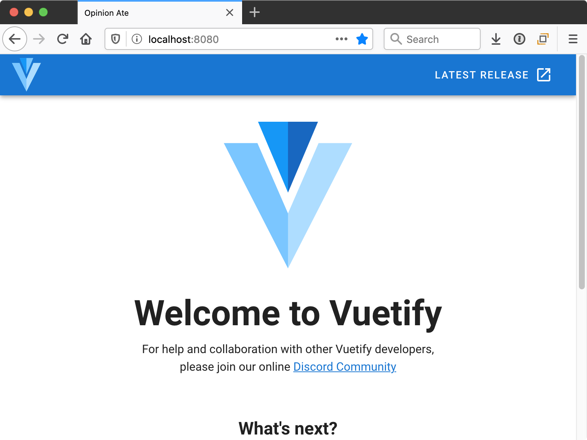
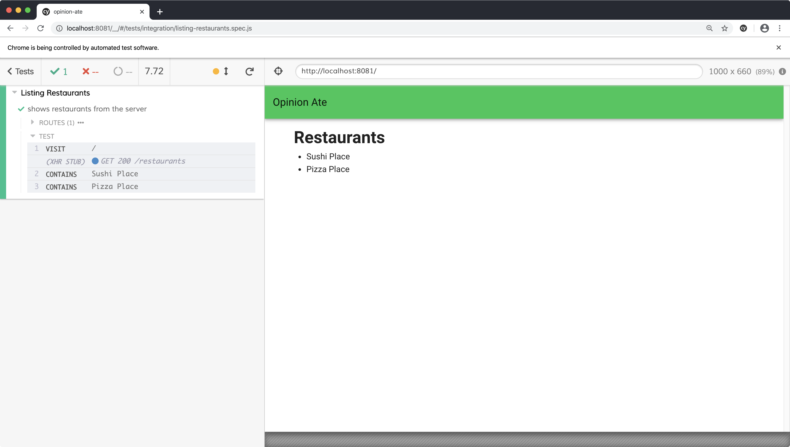
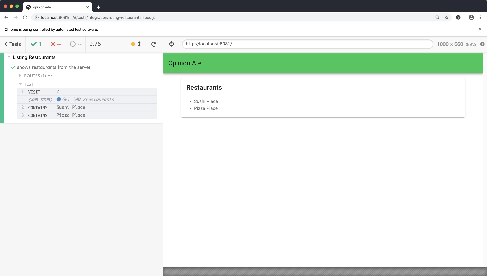

import Chat from '../_chat.mdx';

# 4 - Refactoring Styles

In this chapter we'll see one example of the kind of refactoring you can do when you have the thorough test coverage that TDD provides: restyling your application. We'll update our application from using plain unstyled HTML elements to using styled elements provided by a component library. TDD allows us to separate the process of getting the application working from the process of making it look good.

Our next story in Trello is "Style App with Material Design"; drag it to "In Progress".

And we need it: by following TDD and writing only the minimal code to pass the tests, we certainly don't have much in the way of visual design:


But one of the benefits of the thorough test suite that TDD provides is that you can make changes to the look and feel of your app with confidence that the functionality still works.

First, let's confirm our tests are passing. Run `yarn test:unit --watch`. You may get the message:

```sh
No tests found related to files changed since last commit.
Press `a` to run all tests, or run Jest with `--watchAll`.

Watch Usage
 › Press a to run all tests.
 › Press f to run only failed tests.
 › Press q to quit watch mode.
 › Press p to filter by a filename regex pattern.
 › Press t to filter by a test name regex pattern.
 › Press Enter to trigger a test run.
```

Press `a` to run all the tests. They should pass. Keep the unit test process running.

In another terminal, run `yarn test:e2e`. Click `listing-restaurants.spec.js` and make sure it passes.

Now that we know all our tests pass, we're ready to update the look-and-feel of the app.
We're going to use Vuetify, a popular Vue component library that follows Google's Material Design.

Create a new branch for this story:

```sh
$ git checkout -b material-design
```

Next, install Vuetify with the Vue CLI:

```sh
$ vue add vuetify
```

You'll be prompted to choose a preset: choose `Default (recommended)`.

When the installation finishes, Vuetify is set and ready to go. Don't commit any changes to git yet, though.

If you stop and restart `yarn test:e2e` or your app, you'll notice you see something different: a "Welcome to Vuetify" screen.



And your E2E test will no longer pass. This welcome screen is helpful for instructions and to get an example of Vuetify components in action. But in our case this tutorial will walk you through it. To get back to our functioning app, run:

```sh
$ git checkout -- src/App.vue
```

This will restore `App.vue` to the state we had it in before. There are a few other files the installer added that we won't need either; remove them:

```sh
$ rm -r src/assets src/components/HelloWorld.vue
```

Now we're ready to begin styling our app. We'll begin by configuring Vuetify's theme to set a primary color.

Open `src/plugins/vuetify.js`, a configuration file created when you installed Vuetify. Make the following change:

```diff
Vue.use(Vuetify);

-export default new Vuetify({});
+export default new Vuetify({
+  theme: {
+    themes: {
+      light: {
+        primary: '#00C853',
+      },
+    },
+  },
+});
```

This sets the primary color to a vibrant green. We'll see it in use in a moment.

Next, let's style the `App` component to give it a title bar and some theme-standard layout.

In `App.vue`, keep the `<RestaurantScreen />` component but wrap it with different Vuetify components:

```diff
 <template>
-  <div id="app">
-    <RestaurantScreen />
-  </div>
+  <v-app>
+    <v-app-bar color="primary" fixed app>
+      <v-toolbar-title>Opinion Ate</v-toolbar-title>
+    </v-app-bar>
+    <v-content>
+      <v-container>
+        <RestaurantScreen />
+      </v-container>
+    </v-content>
+  </v-app>
 </template>
```

Notice that Vuetify components all start with a `v-` prefix. We also don't have to import them into our file, as we do with our custom components. The assumption is that Vuetify components will be used *a lot* throughout your app, so this avoids having to do lots of imports.

Rerun the E2E test. They still pass, and notice we now have a nice green toolbar, and there's some padding on the left and right on the content area.



Here's what these Vuetify components do to achieve this look:

- `v-app` is the root Vuetify component that lets it set up some things that affect your whole app.
- `v-app-bar` is the top title bar.
- `v-toolbar-title` provides proper styling for the text inside the app bar. Vuetify components relate to one another like this, so it's always best to check the docs for full examples of what components to nest inside one another.
- `v-content` provides sizing for your main app content area.
- `v-container` centers your content horizontally to provide some padding, as well as keeping the content from getting too wide in really wide browser windows.

Next let's style `RestaurantScreen`. A common UI element in Material Design is a card, a box around some content. Let's style the `RestaurantScreen` to be a card:

```diff
 <template>
-  <div>
-    <h1>Restaurants</h1>
-    <RestaurantList />
-  </div>
+  <v-card>
+    <v-card-title>Restaurants</v-card-title>
+    <v-card-text>
+      <RestaurantList />
+    </v-card-text>
+  </v-card>
 </template>
```

Reload the E2E test and notice there's a box around the content now.



Here's what the components do:

- `v-card` is the wrapper for the card and provides the outline
- `v-card-title` styles title text correctly for a card
- `v-card-text`  provides appropriate padding around the text area of a card

Finally, let's style the list of the restaurants. Material Design has a list concept that will look nice:

```diff
 <template>
-  <ul>
-    <li
+  <div>
+    <v-list-item
       v-for="restaurant in restaurants"
       :key="restaurant.id"
       data-testid="restaurant"
     >
-      {{ restaurant.name }}
-    </li>
-  </ul>
+      <v-list-item-content>
+        <v-list-item-title>
+          {{ restaurant.name }}
+        </v-list-item-title>
+      </v-list-item-content>
+    </v-list-item>
+  </div>
 </template>
```

Note that we change the wrapping element from a `ul` to a `div`, because its contents are no longer `li` tags.
Rerun the E2E test to see the changes:


Here's what the components do:

- `v-list-item` is the wrapping component for the list item.
- `v-list-item-content` is for the main content of the list item. If you check the [Vuetify Lists docs](https://vuetifyjs.com/en/components/lists) you'll see that list items can also have icons, avatars, and actions. The `content` is the main text area of a list item.
- `v-list-item-title` is the primary title in the content area.

Our E2E tests still pass. Our unit tests do as well, but they also output a lot of warnings:

```sh
[Vue warn]: Unknown custom element: <v-list-item-content> - did you register
the component correctly? For recursive components, make sure to provide the
"name" option.

      found in

      ---> <RestaurantList>
```

The Vuetify installer configured our app to use Vuetify, but we need to do the same in our unit test, similar to how we do with Vuex. In the case of Vuetify, we need to make a configuration change on both the root and local Vue instances. Make the following changes as described in the Vuetify docs:

```diff
+import Vue from 'vue';
+import Vuetify from 'vuetify';
 import Vuex from 'vuex';
 import {mount, createLocalVue} from '@vue/test-utils';
 import RestaurantList from '@/components/RestaurantList';

 describe('RestaurantList', () => {
+  Vue.use(Vuetify);
+
   const records = [
     {id: 1, name: 'Sushi Place'},
     {id: 2, name: 'Pizza Place'},
   ];

+  const vuetify = new Vuetify();
   const localVue = createLocalVue();
...
-  wrapper = mount(RestaurantList, {localVue, store});
+  wrapper = mount(RestaurantList, {localVue, store, vuetify});
```

**Make sure to add the `vuetify` instance to the call to `mount()`;** if you don't, the current tests will pass, but a new test in a later chapter will fail with an unhelpful error message.

Save the file and when the unit tests rerun the warnings should be gone.

We've successfully styled our app relying on the tests to confirm all the functionality still works.

:::tip
Some frontend TDD approaches recommend specifying every detail of your markup and styling in your component tests. They argue that because TDD says you shouldn't write any production code without a test driving you to do it, therefore you shouldn't write complex markup and CSS without a test for them.

I think that's a bad idea. Here's why:

- Those tests don't add a lot of value. They are just repeating what is in the production code.
- Behavioral tests like these aren't well-suited to visuals. Test-driving the markup and CSS won't ensure the component looks right; it just ensures that you typed in the HTML tag you just said in the test you were going to type in.
- Those tests are incredibly highly-coupled to the production code. Every change to the production code would require a change to the test. That's a sign that they aren't testing the interface, but rather the implementation.
- Those tests prevent refactoring. You wouldn't be able to do the visual changes we did in this chapter under test; you would need to change the tests at the same time.

All those downsides turn folks off from TDD before they try it, or give people who do try it a bad experience.

Instead, keep your component tests focused on the behavior of the component, and leave the details of the markup and styling as implementation details.
:::

If you have any uncommitted changes, commit them to git. Push up your branch to the origin and open a pull request. Wait for CI to complete, then merge the pull request. Now we can drag our story to "Done" in Trello: "Style App with Material Design".

## What's Next
In this chapter we improved the look-and-feel of our first feature. But there are some functionality improvements it could benefit from as well. In the next chapter we'll add support for edge cases related to loading and error states.

<Chat />