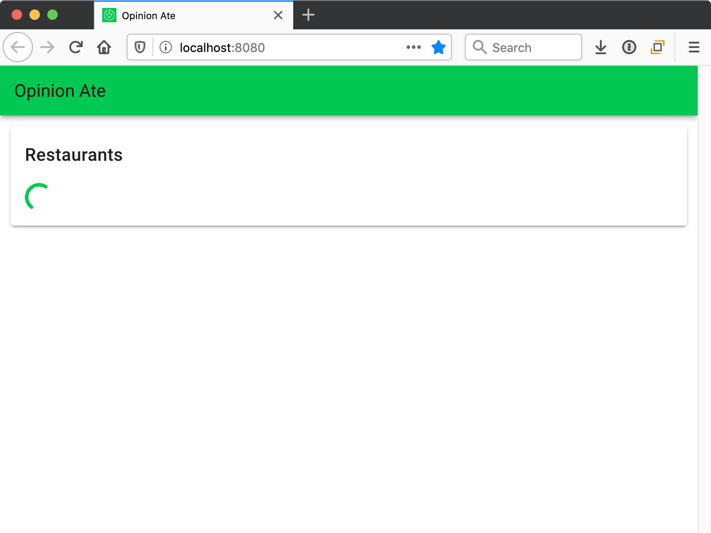
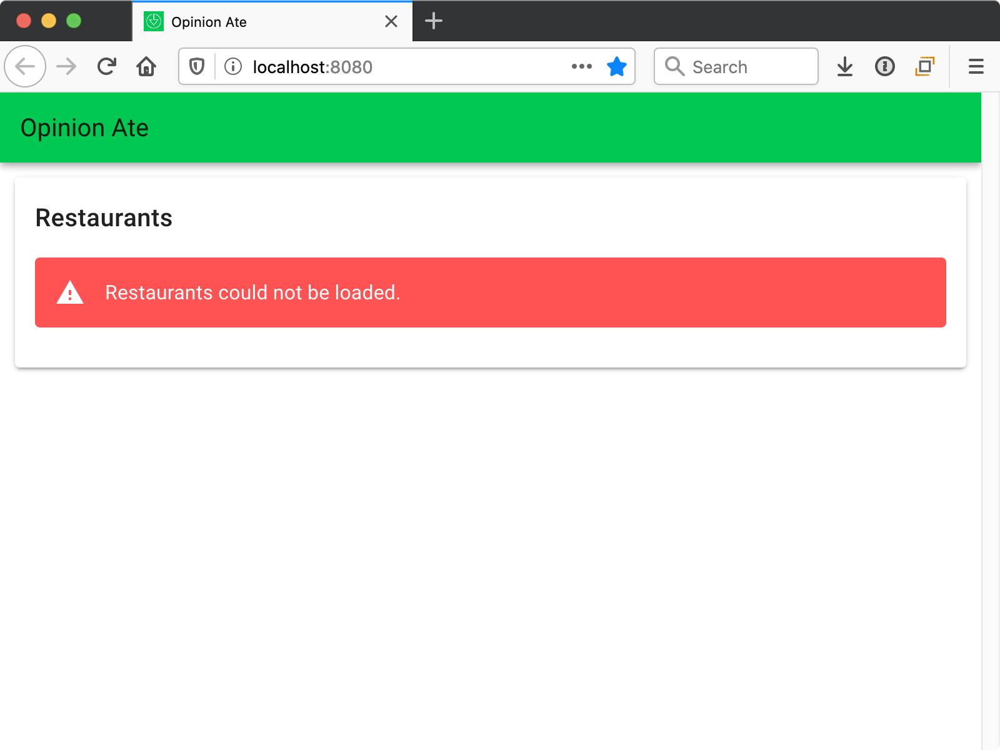

import Chat from '../_chat.mdx';

# 5 - Edge Cases

In this chapter we'll look at how to test-drive edge case functionality using unit tests.

Our next story in Trello is "Show Loading and Error States"; drag it to "In Progress".

We kept out first story, loading restaurants, minimal so that we could build out a vertical slice quickly and get all the parts of our app talking together. But now our next story is to make that restaurant loading more robust, providing a loading indicator and an error message in case of problems.

Create a new branch for this story:

```sh
$ git checkout -b edge-cases
```

You could theoretically write an E2E test for this functionality, confirming the loading indicator and error message appear at the appropriate times. But if you write too many E2E tests, your application's test suite will get slow. Over time, you'll run it less and less frequently locally, and slow CI runs will slow down your ability to merge PRs.

To prevent this from happening, it's best to write fewer E2E tests and more unit tests—and outside-in TDD provides guidance in how many of each to write. You write an E2E test for each main flow of your application, as well as the unit tests to help implement it. Then, for more detailed or edge-case functionality, you only write the unit tests. In our case, the loading indicator and error message can be considered more detailed functionality. So we are still going to TDD them, but only at the unit level.

## Loading Indicator
First, the loading indicator. Although we aren't writing an E2E test, we can still start from the "outside" in a sense: our `RestaurantList` component. Let's write a test of the loading indicator functionality for it.

Right now in `RestaurantList.spec.js` we are setting up our store in a `beforeEach` block. This has worked so far, but now we need to set up the store slightly differently for different tests. We want a test where a loading flag is set in the restaurants store module.

To do this, let's refactor our tests for more flexibility.

First, start the unit tests with `yarn test:unit --watch` and keep them running for the duration of this chapter.

Next, let's extract all the contents of the `beforeEach` into a new function, called `mountWithStore`:

```diff
 let restaurantsModule;
 let wrapper;

+const mountWithStore = () => {
+  restaurantsModule = {
+    namespaced: true,
+    state: {records},
+    actions: {
+      load: jest.fn().mockName('load'),
+    },
+  };
+  const store = new Vuex.Store({
+    modules: {
+      restaurants: restaurantsModule,
+    },
+  });
+
+  wrapper = mount(RestaurantList, {localVue, store});
+};
+
 beforeEach(() => {
+  mountWithStore();
-  restaurantsModule = {
-    namespaced: true,
-    state: {records},
-    actions: {
-      load: jest.fn().mockName('load'),
-    },
-  };
-  const store = new Vuex.Store({
-    modules: {
-      restaurants: restaurantsModule,
-    },
-  });
-
-  wrapper = mount(RestaurantList, {localVue, store});
 });
```

Save the file and the tests should still pass. When refactoring like this, we want to run the tests after each small step, so that if something breaks we know right away.

Next, let's remove the `beforeEach` block and call `mountWithStore` at the start of each our our tests instead:

```diff
-beforeEach(() => {
-  mountWithStore();
-});
-
 it('loads restaurants on mount', () => {
+  mountWithStore();
   expect(restaurantsModule.actions.load).toHaveBeenCalled();
 });

 it('displays the restaurants', () => {
+  mountWithStore();
   expect(findByTestId(wrapper, 'restaurant', 0).text()).toBe('Sushi Place');
```

Save and confirm the tests pass.

As our final refactoring, let's change the `mountWithStore` function to allow passing in the state the store should use, with a default:

```diff
-const mountWithStore = () => {
+const mountWithStore = (state = {records}) => {
   restaurantsModule = {
     namespaced: true,
-    state: {records},
+    state,
     actions: {
       load: jest.fn().mockName('load'),
     },
```

Now we're ready to write our new test for when the store is in a loading state. Let's pass in the state with a new property for whether the restaurants are loading:

```js
it('displays the loading indicator while loading', () => {
  mountWithStore({loading: true});
  expect(wrapper.find('[data-testid="loading-indicator"]').exists()).toBe(true);
});
```

Note that instead of calling `wrapper.findAll()` here, we call `wrapper.find()`, since at most only one element should be found. We just need to know if the element is present or not, so we confirm that it exists.

In good TDD style, our test fails, because the element isn't present.

Sticking with the approach of making the smallest possible change to make the test pass, let's just add the loading indicator to show *all* the time.
Vuetify has a `v-progress-circular` spinner that will work great. Add it to `RestaurantList.vue` with the correct test ID:

```diff
 <div>
+  <v-progress-circular
+    indeterminate
+    color="primary"
+    data-testid="loading-indicator"
+  />
   <v-list-item
```

The test passes.

This isn't good, though, right? We don't want the loading indicator to *always* show! Shouldn't we go ahead and put a conditional on it?

No, and here's why: if we add the conditional now, *the conditional is not tested*. This is because our tests pass whether or not there is a conditional in place. It's good that we want the conditional, but **we also need to implement the tests that will confirm the conditional is working correctly.** So after we make the tests pass in the easiest way possible, and we find there is more functionality we need, we should think: what test would drive us to make the conditional work properly?

In our case, we *also* need a test to confirm that the conditional is *not* shown when *not* loading. Let's add that now:

```js
it('does not display the loading indicator while not loading', () => {
  mountWithStore({loading: false});
  expect(wrapper.find('[data-testid="loading-indicator"]').exists()).toBe(false);
});
```

This test fails, of course. And now that we have two tests, this will force us to implement the conditional to get them both to pass:

```diff
 <div>
   <v-progress-circular
+    v-if="loading"
     indeterminate
     color="primary"
     data-testid="loading-indicator"
   />
   <v-list-item
...
 computed: mapState({
+  loading: state => state.restaurants.loading,
   restaurants: state => state.restaurants.records,
 }),
```

Save the file and all tests pass.

Now, let's think about refactoring. We're getting a lot of tests in our `RestaurantList.spec.js`. And a few of them are related. Both the "don't display loading indicator" test and the "display restaurants" test relate to the situation when the loading is done. We can use a `describe` block to represent this. Wrap the two of them in a:

```js
describe('when loading succeeds', () => {
//...
});
```

Save and confirm the tests still pass.

Now, we pass `loading: false` to the store, but conceptually that's the default state of the store. Let's set up `mountWithStore` to pass that as default state:

```diff
-const mountWithStore = (state = {records}) => {
+const mountWithStore = (state = {records, loading: false}) => {
```

Now we don't need to pass a state override in the test of the loading indicator hiding:

```diff
 it('does not display the loading indicator while not loading', () => {
-  mountWithStore({loading: false});
+  mountWithStore();
```

Now our two "when loading succeeds" tests have the same call to `mountWithStore()`. It's small, so we could leave it in the individual tests. But we could also pull it out to a `beforeEach`. Let's do that now:

```diff
 describe('when loading succeeds', () => {
+  beforeEach(() => {
+    mountWithStore();
+  });
+
   it('does not display the loading indicator while not loading', () => {
-    mountWithStore();
     expect(wrapper.find('[data-testid="loading-indicator"]').exists()).toBe(false);
   });

   it('displays the restaurants', () => {
-    mountWithStore();
     expect(findByTestId(wrapper, 'restaurant', 0).text()).toBe('Sushi Place');
```

Save and the tests should pass.

Note that we have one more test that calls `mountWithStore()` with no argument: the test that it "loads restaurants on mount."
Should we group that test together to remove duplication? I wouldn't recommend it. Although the call is the same, conceptually the situation is different. That test is considering when loading restaurants is kicked off, and the other is considering what happens when the loading completes. It just so happens that the state of the store is the same in both cases. But conceptually it's describing a different situation.

Now we need to drive out the loading flag in the store itself.
Open `tests/unit/store/restaurants.spec.js`.
We'll have the same separation of tests during loading, so let's proactively group our existing "stores the restaurants" test in a describe:

```js
describe('when loading succeeds', () => {
  it('stores the restaurants', async () => {
//...
  });
});
```

Now let's add a new group for while loading is happening, at the same level as "when loading succeeds":

```js
describe('while loading', () => {
});
```

Inside that describe block, add the test:

```js
it('sets a loading flag', () => {
  const api = {
    loadRestaurants: () => new Promise(() => {}),
  };
  const store = new Vuex.Store({
    modules: {
      restaurants: restaurants(api),
    },
  });
  store.dispatch('restaurants/load');
  expect(store.state.restaurants.loading).toEqual(true);
});
```

Here's what's going on:

- We define a stubbed API with a `loadRestaurants` method that returns a Promise. The function passed to the promise never calls its arguments, so the Promise never resolves or rejects. This is okay, because for this test we want to test what happens *before* the Promise resolves.
- We set up a store with the restaurants module with that API.
- We dispatch the load action. This time we don't `await` it, because the promise it returns will never resolve.
- We check the state of the `loading` flag to confirm that it's `true` after we initiate a load.

Our test fails, as we expect:

```sh
  ● restaurants › load action › while loading › sets a loading flag

    expect(received).toEqual(expected) // deep equality

    Expected: true
    Received: undefined
```

The `loading` flag isn't even defined yet.

Following the principle of making the test green in the easiest way possible, we just set the state of the store module to have a `loading` flag that is already `true`:

```diff
 state: {
   records: [],
+  loading: true,
 },
```

As before, we know this won't be our final implementation, but we want to write tests that drive us to handle all the scenarios.

When we save the file, the test passes.

So why is it not enough to have a `loading` flag that is always `true`? Well, we want it to be `false` once loading is complete. We already have one test for when loading is complete. Let's extract out the setup code we will need for both tests.

First, the `records` array is never modified by the test, so we can just define it at the top level:

```diff
 describe('when loading succeeds', () => {
+  const records = [
+    {id: 1, name: 'Sushi Place'},
+    {id: 2, name: 'Pizza Place'},
+  ];

   it('stores the restaurants', async () => {
-    const records = [
-      {id: 1, name: 'Sushi Place'},
-      {id: 2, name: 'Pizza Place'},
-    ];
     const api = {
```

Next, we will need to access the `store` from both tests, so make it a `let` variable defined outside the individual test:

```diff
 ];

+let store;
+
 it('stores the restaurants', async () => {
   const api = {
     loadRestaurants: () => Promise.resolve(records),
   };
-  const store = new Vuex.Store({
+  store = new Vuex.Store({
     modules: {
```

Finally, we move the code that sets up the `api`, the `store`, and dispatches the action to a `beforeEach` block:

```diff
 let store;

+beforeEach(async () => {
+  const api = {
+    loadRestaurants: () => Promise.resolve(records),
+  };
+  store = new Vuex.Store({
+    modules: {
+      restaurants: restaurants(api),
+    },
+  });
+
+  await store.dispatch('restaurants/load');
+});
+
 it('stores the restaurants', async () => {
-  const api = {
-    loadRestaurants: () => Promise.resolve(records),
-  };
-  store = new Vuex.Store({
-    modules: {
-      restaurants: restaurants(api),
-    },
-  });
-
-  await store.dispatch('restaurants/load');
-
   expect(store.state.restaurants.records).toEqual(records);
 });
```

Now we can simplify our async code. Since the `beforeEach` function only has one promise it waits on, and it's the final statement, we can just return the promise instead of `await`ing it, and then the function no longer needs to be an `async` function:

```diff
-beforeEach(async () => {
+beforeEach(() => {
   const api = {
     loadRestaurants: () => Promise.resolve(records),
   };
...
-  await store.dispatch('restaurants/load');
+  return store.dispatch('restaurants/load');
 });
```

:::tip
If you remove the `await` keyword but don't add the `return` keyword, you'll notice that the tests still pass. As of this writing, it seems like Jest is still waiting for the promise to resolve whether we return it or not. Why is that?

It has to do with the way Jest uses promises internally in running tests. This won't work for just any promise, though: for example, if our promise was really hitting an external service, or was set up with a `setTimeout()`, Jest would move on and not wait for the promise to resolve before running the tests.

The fact that Jest works this way is an implementation detail and isn't documented as a behavior you can rely on; it could change at any time without warning. Because of this, it's safer to rely on the [documented behavior](https://jestjs.io/docs/en/setup-teardown#repeating-setup-for-many-tests) that if we want Jest to wait for a promise in a `beforeEach` block to resolve, we should return it. This is one way to make your tests as robust as possible, and avoid them breaking for mysterious reasons in the future.
:::

And the test no longer has any asynchrony, so we can remove the `async` keyword from the function as well:

```diff
-it('stores the restaurants', async () => {
+it('stores the restaurants', () => {
   expect(store.state.restaurants.records).toEqual(records);
 });
```

Now we can add another test in that describe block to check the loading state:

```js
it('clears the loading flag', () => {
  expect(store.state.restaurants.loading).toEqual(false);
});
```

Our test fails, as we expect, and now we need to actually clear the loading flag. We can do this in the `storeRecords` mutation:

```diff
 storeRecords(state, records) {
   state.records = records;
+  state.loading = false;
 },
```

Save the file and our test passes.

Is our implementation complete? Well, the `loading` flag starts as `true`.
Right now we dispatch the `load` action as soon as our app starts, so that's *almost* correct. But it makes more sense for the `load` action to actually start the loading.
So it would be best if `loading` starts as `false`. We don't just want to make that change, though—we want to specify it! In this case we want to specify the starting state of the store. Add a new `describe` block directly inside the top-level "restaurants" block:

```js
describe('initially', () => {
  it('does not have the loading flag set', () => {
    const store = new Vuex.Store({
      modules: {
        restaurants: restaurants(),
      },
    });
    expect(store.state.restaurants.loading).toEqual(false);
  });
});
```

In this case we don't need to pass an `api` to the restaurant module function at all, because we won't be calling it. We assert that when we first create the store module its loading state is `false`.

Our test fails, as we expect. Let's change the initial `loading` flag:

```diff
 state: {
   records: [],
-  loading: true,
+  loading: false,
 },
```

Now our test of the initial state passes, but our test for while loading fails. Previously the way that the app ensured the `loading` flag was set while loading was the fact that it was *initially* set. Now that it's initially cleared, we need to *change* the value when `load` is called. We can do this by adding a new mutation that is committed immediately in the `load` action, before the API is called:

```diff
 actions: {
   load({commit}) {
+    commit('startLoading');
     api.loadRestaurants().then(records => {
       commit('storeRecords', records);
     });
   },
 },
 mutations: {
+  startLoading(state) {
+    state.loading = true;
+  },
   storeRecords(state, records) {
```

Save the file, and all our tests pass. We now have a loading flag that starts `false`, is set to `true` when loading begins, and is set back to `false` when loading ends.

With this, our loading functionality should be complete. Run the app with `yarn serve`, then load it in the browser. Our API is set up with a hard-coded one-second delay before returning the restaurant list. So you should see the loading spinner for one second before the results appear. Our loading flag is working!



Run our E2E tests and note that they still pass. They don't care whether or not a loading flag is shown; they just ensure that the restaurants are eventually shown.

## Error Flag
The other edge case we want to handle is displaying an error if the API call fails. This will be implemented using a very similar process to the loading flag. If you like, you can try to go through the process yourself, then compare your approach and this approach afterward. Just remember to always start with a failing test, and write only the minimum code to pass the test!

Note that instead of implementing both flags in the component, then implementing both in the store, we got one flag working entirely before we moved on to the second. This ensures that we could ship the loading flag to our customers even before the error flag is ready.

Start with the test for the component. We are describing a new situation, when loading fails, so let's put our test in a new `describe` block:

```js
describe('when loading fails', () => {
  beforeEach(() => {
    mountWithStore({loadError: true});
  });

  it('displays the error message', () => {
    expect(wrapper.find('[data-testid="loading-error"]').exists()).toBe(true);
  });
});
```

We decide we want to indicate the error state with a flag named `loadError`, so we initialize the store with that flag set to `true`.
We check for a new loading error element on the page. Our test fails because the element is not found.

Fix it the simplest way possible by hard-coding the error message to show.
Vuetify has a `v-alert` component that will work well:

```diff
 <v-progress-circular
   v-if="loading"
   indeterminate
   data-testid="loading-indicator"
 />
+<v-alert type="error" data-testid="loading-error">
+  Restaurants could not be loaded.
+</v-alert>
 <v-list-item
```

Note that we aren't asserting the text of the message in our test. This way, the copy can be changed, and our test still passes. We are just confirming that whatever the error message is, that it is displayed.

Save the file and our test should pass. If you get errors about "Cannot read property '…' of undefined", check the instructions in [the last chapter](./refactoring-styles) and make sure you added the `vuetify` instance to the call to `mount()`.

Now, specify that the error does _not_ show when loading succeeds:

```diff
 describe('when loading succeeds', () => {
   beforeEach(() => {
     mountWithStore();
   });

   it('does not display the loading indicator while not loading', () => {
     expect(wrapper.find('[data-testid="loading-indicator"]').exists()).toBe(false);
   });

+  it('does not display the error message', () => {
+    expect(wrapper.find('[data-testid="loading-error"]').exists()).toBe(false);
+  });
+
   it('displays the restaurants', () => {
```

Make this test pass by making the display of the error alert conditional on the `loadError` store property that we set up in our test:

```diff
     />
-    <v-alert type="error" data-testid="loading-error">
+    <v-alert v-if="loadError" type="error" data-testid="loading-error">
       Restaurants could not be loaded.
     </v-alert>
     <v-list-item
...
   }),
   computed: mapState({
     loading: state => state.restaurants.loading,
+    loadError: state => state.restaurants.loadError,
     restaurants: state => state.restaurants.records,
   }),
 };
```

Now both tests pass. Our component is working; on to the store.

In `restaurants.spec.js`, create a new `describe` block after "when loading succeeds" for the error scenario. Let's go ahead and do the setup in a `beforeEach` block, assuming we will need to have other expectations too:

```js
describe('when loading fails', () => {
  let store;

  beforeEach(() => {
    const api = {
      loadRestaurants: () => Promise.reject(),
    };
    store = new Vuex.Store({
      modules: {
        restaurants: restaurants(api),
      },
    });

    return store.dispatch('restaurants/load');
  });

  it('sets an error flag', () => {
    expect(store.state.restaurants.loadError).toEqual(true);
  });
});
```

We decide that when an API call fails, the promise `api.loadRestaurants()` returns will reject. This is common practice for JavaScript HTTP clients.

When we run our test, it fails, but we also get a warning:

```sh
(node:53012) UnhandledPromiseRejectionWarning: undefined
(node:53012) UnhandledPromiseRejectionWarning: Unhandled promise rejection.
```

So in addition to our expectation not passing, Jest is warning that we have an unhandled promise rejection. Since it's a good practice to handle promise rejections in general, let's set up our action to catch a rejected promise. We won't do anything with the catch for now; maybe our tests will drive us to do something in there later.

```diff
 load({commit}) {
   commit('startLoading');
-  api.loadRestaurants().then(records => {
-    commit('storeRecords', records);
-  });
+  api
+    .loadRestaurants()
+    .then(records => {
+      commit('storeRecords', records);
+    })
+    .catch(() => {});
 },
```

This fixes the warning, and now we just have the failing expectation:

```sh
  ● restaurants › load action › when loading fails › sets an error flag

    expect(received).toEqual(expected) // deep equality

    Expected: true
    Received: undefined

      81 |
      82 |       it('sets an error flag', () => {
    > 83 |         expect(store.state.restaurants.loadError).toEqual(true);
         |                                                   ^
      84 |       });
```

We fix this failing test the simplest way possible, adding an initially-true `loadError` state property:

```diff
 state: {
   records: [],
   loading: false,
+  loadError: true,
 },
```

Save and the tests pass.

Now we specify that the `loadError` flag should actually start out as `false`, and _only_ be set to true upon a failing load. First, extract the setup in the "initially" block:

```diff
 describe('initially', () => {
+  let store;
+
+  beforeEach(() => {
+    store = new Vuex.Store({
+      modules: {
+        restaurants: restaurants(),
+      },
+    });
+  });
+
   it('does not have the loading flag set', () => {
-    const store = new Vuex.Store({
-      modules: {
-        restaurants: restaurants(),
-      },
-    });
     expect(store.state.restaurants.loading).toEqual(false);
   });
 });
```

Then add a test for the `loadError` flag:

```diff
 describe('initially', () => {
...
   it('does not have the loading flag set', () => {
     expect(store.state.restaurants.loading).toEqual(false);
   });
+
+  it('does not have the error flag set', () => {
+    expect(store.state.restaurants.loadError).toEqual(false);
+  });
 });
```

The test fails. Make it pass while keeping the other tests passing by setting the flag to `false` initially, and adding a new mutation to handle if the API promise rejects:

```diff
 state: {
   records: [],
   loading: false,
-  loadError: true,
+  loadError: false,
 },
...
   load({commit}) {
     commit('startLoading');
     api
       .loadRestaurants()
       .then(records => {
         commit('storeRecords', records);
       })
-      .catch(() => {});
+      .catch(() => {
+        commit('recordLoadingError');
+      });
  },
...
 mutations: {
   startLoading(state) {
     state.loading = true;
   },
+  recordLoadingError(state) {
+    state.loadError = true;
+  },
   storeRecords(state, records) {
```

Save the file and all tests should pass.

We also want to make sure that if the restaurants are loaded again later, the error flag is cleared out, since a new request is being made. This test should go in the "load action > while loading" group, so extract the setup from the "sets the loading flag" test:

```diff
 describe('while loading', () => {
+  let store;
+
+  beforeEach(() => {
+    const api = {
+      loadRestaurants: () => new Promise(() => {}),
+    };
+    store = new Vuex.Store({
+      modules: {
+        restaurants: restaurants(api),
+      },
+    });
+    store.dispatch('restaurants/load');
+  });
+
   it('sets a loading flag', () => {
-    const api = {
-      loadRestaurants: () => new Promise(() => {}),
-    };
-    const store = new Vuex.Store({
-      modules: {
-        restaurants: restaurants(api),
-      },
-    });
     expect(store.state.restaurants.loading).toEqual(true);
   });
 });
```

Now we need a way to have our store start out with the `loadError` flag set. To do this, we can add an optional argument to our `restaurants()` module setup function to allow us to override properties of the state. It won't be used in production; it's just a convenience for testing.

```diff
-const restaurants = api => ({
+const restaurants = (api, stateOverrides) => ({
   namespaced: true,
   state: {
     records: [],
     loading: false,
     loadError: false,
+    ...stateOverrides,
   },
   actions: {
```

Using the object spread operator means the other properties are still set as defaults, but if `stateOverrides` is an object with any properties, those will be applied, overriding any defaults that they duplicate.

Save the file and ensure the tests still pass after this refactoring.

Then, update the call to `restaurants()` in the `beforeEach` block of our "while loading" group to set `loadError` to `true`:

```diff
 store = new Vuex.Store({
   modules: {
-    restaurants: restaurants(api),
+    restaurants: restaurants(api, {loadError: true}),
   },
 });
```

Save and the tests should still pass.

Now we're finally ready to set up our expectation that the `loadError` should be reset to `false` after starting a load operation. Add the following test after the "sets a loading flag" test:

```js
it('clears the error flag', () => {
  expect(store.state.restaurants.loadError).toEqual(false);
});
```

Save the file and the new test should fail.
Fix it by clearing `loadError` in the `startLoading` mutation:

```diff
 startLoading(state) {
   state.loading = true;
+  state.loadError = false;
 },
```

Now that we are handling the error state, there's one more bit of functionality we could add: currently the `loading` flag is not cleared when the request errors. Let's add a test for that:

```diff
 describe('when loading fails', () => {
...
   it('sets an error flag', () => {
     expect(store.state.restaurants.loadError).toEqual(true);
   });
+
+  it('clears the loading flag', () => {
+    expect(store.state.restaurants.loading).toEqual(false);
+  });
 });
```

To make it pass, just set the `loading` state in `recordLoadingError`:

```diff
 recordLoadingError(state) {
+  state.loading = false;
   state.loadError = true;
 },
```

With this, our tests pass.

We've now finished adding the error state. To see it in action, we need to force the API requests in our running app to fail. Let's do that by putting in an incorrect API key. In `src/api.js`, in the `baseURL` property for the Axios instance, change the API key to an incorrect value. This will result in the server returning a 404 Not Found response code. Reload the web app and you should see a nice red "Restaurants could not be loaded" error box.



Restore the correct API key value, then reload the page. You should see the loading spinner, then our results.

Run the E2E test one more time to make sure it's still passing—it should be.

If you have any uncommitted changes, commit them to git. Push up your branch to the origin and open a pull request. Wait for CI to complete, then merge the pull request. Now we can drag our story to "Done" in Trello: "Show Loading and Error States".

## What's Next

With these edge cases handled there's nothing else for us to do for our restaurant-loading feature. In the next chapter we'll apply what we've learned to a second feature, creating a new restaurant.

<Chat />