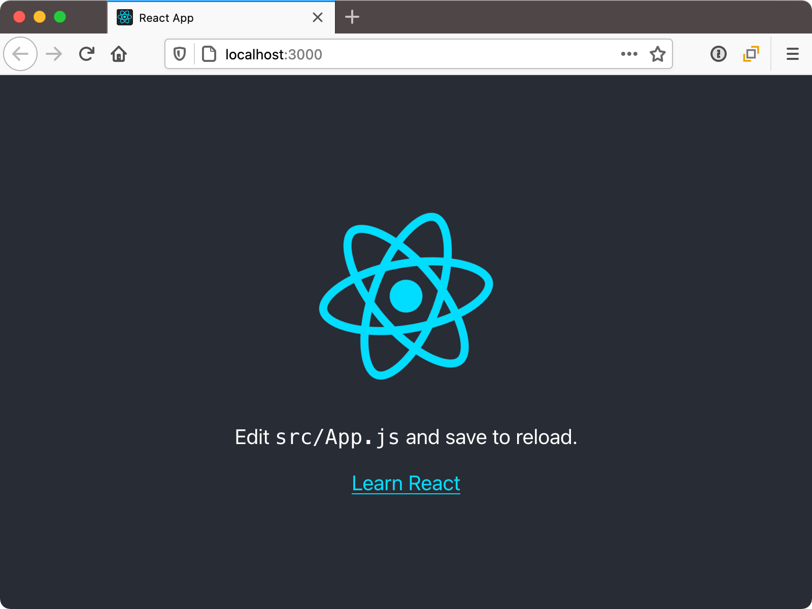
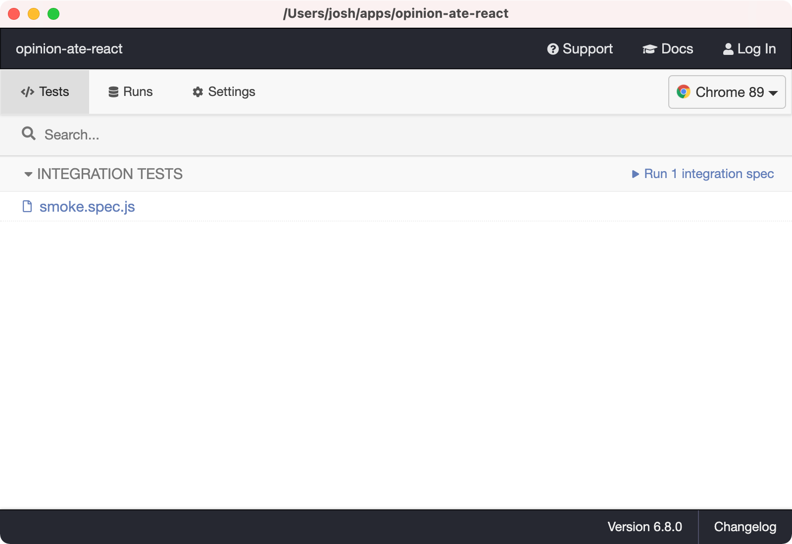
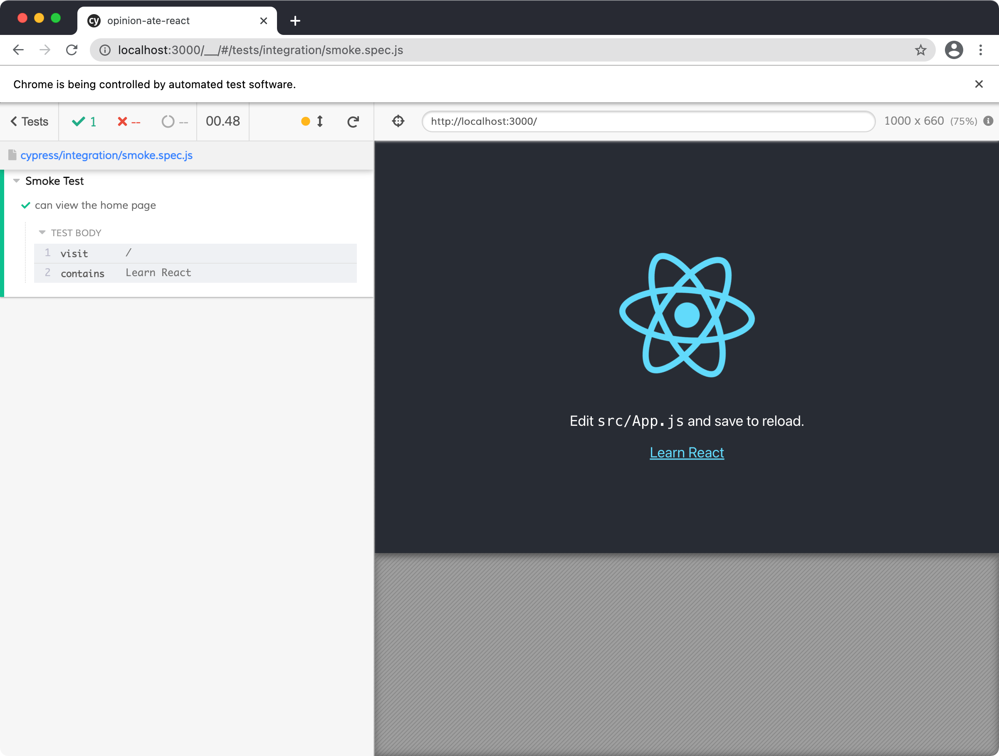

# 2 - Project Setup

In this chapter, we'll set up our project and process. This won't involve writing any app-specific functionality. Instead, what we'll do is:

- Make a list of our stories to work on
- Get our development machine dependencies installed
- Get React installed and running
- Get linting and autoformatting working
- Get E2E and component tests running
- Get our tests running on CI
- Get our application automatically deploying to a hosting service

That's a lot, but we want to get it in place before we write our first line of production code to ensure we have support in place for our agile process. And it won't take too long because we'll use powerful tools to help us get there. Once that's all in place, we'll be ready to start implementing our application's features.

## Making a List of Stories
Agile developers often use the term "stories" to refer to units of work. This term emphasizes the fact that agile developers stay focused on delivering units of work that are useful to the user. Rather than "building out the data model" (which would not make for a very compelling tale!), a story would be more likely to be something like "users can see a list of restaurants they've entered."

Before we start our work, we want a way to track it. In this guide it'll just be you working by yourself, so you could just keep a to-do list on paper or a to-do app if you like. But when doing agile development in a team environment, it's a good idea to have a shared tracker. Trello is a great flexible tool that is useful for tracking work.

If you want to try out Trello as part of this guide, go to <https://trello.com> and sign up for a free account. Create a new board and name it "Agile Frontend Dev". Create three columns: "To Do", "In Progress", and "Done". In the "To Do" column, add a card for each of the following stories:

* Set Up Development Environment
* Create App
* Set Up Autoformatting
* Set Up Tests On CI
* Set Up Automatic Deployment
* Fill In Readme
* List Restaurants
* Style App with Material Design
* Show Loading and Error States
* Add Restaurants

## Setting Up Development Environment
Our first task is "Set Up Development Environment". In Trello, drag that card to the "In Progress" column.

Here are the tools we'll need to install:

- Git
- Node
- Yarn
- An editor

### Git
Version control is essential for most developers, but even more so for agile developers. You need to be able to track the small steps you take to make sure they aren't lost. Although we won't get into it in this guide, focused and well-explained commit messages are essential for communicating to your teammates as well. [Git](https://git-scm.com/) is probably the most popular version control tool right now, and we'll use GitHub for pull requests and CI purposes as well.

### Node
We'll be using Create React App as our build tool. Like most frontend build tools, it runs on top of [Node.js](https://nodejs.org/en/), so you'll need node installed locally.

### Yarn
[Yarn](https://yarnpkg.com/) is an alternative `npm` client. Generally I find it to be faster, more predictable, and more reliable than using the default `npm` client. I use `yarn` for all my projects.

If you'd prefer to use `npm`, you can still follow this guide, you'll just need to replace any `yarn` commands with the equivalent `npm` commands.

### An Editor

There are a number of different editors that are good for React development; two popular free ones are [Visual Studio Code](https://code.visualstudio.com/) and [Atom](https://atom.io/).

With this, we can drag the "Set Up Development Environment" story to the "Done" column in Trello.

## Creating the App
Our next story is "Create App"; drag it to "In Progress".

Create a new React app:

```sh
$ npx create-react-app opinion-ate
```

Create React App will start the installation process, and when it completes, your application will be created and ready to use.

Open your `package.json` and note the scripts we have available:

- `start` to run the app locally
- `build` to create a release build of the app
- `test` to run unit tests, including React component tests
- `eject` for if we ever want to move away from Create React App

Let's try it out. Run `yarn start`. Your app should automatically open in your default browser, with a spinning React logo.



In the console you'll see something like the following:

```
Compiled successfully!

You can now view opinion-ate in the browser.

  Local:            http://localhost:3000
  On Your Network:  http://10.0.1.7:3000

Note that the development build is not optimized.
To create a production build, use yarn build.
```

With this, we can move our "Create App" task in Trello to "Done".

## Setting Up Autoformatting

Next is "Set Up Autoformatting"; drag it to "In Progress".

Create React App includes a built-in ESLint config to check your code for issues while it runs. But we can set up a separate ESLint config that our editor can see, so it can warn us about issues right away and autoformat files upon save.

Add this rather lengthy list of packages:

```sh
$ yarn add --dev eslint-config-prettier \
                 eslint-plugin-cypress \
                 eslint-plugin-jest \
                 eslint-plugin-prettier \
                 prettier
```

Then create a file `.eslintrc.js` at the root of your project and add the following:

```js
module.exports = {
  extends: ['react-app', 'prettier'],
  plugins: ['prettier', 'jest', 'cypress'],
  parser: 'babel-eslint',
  env: {
    browser: true,
    'cypress/globals': true,
    es6: true,
    'jest/globals': true,
  },
  settings: {
    react: {
      version: 'detect',
    },
  },
  rules: {
    'prettier/prettier': 'warn',
  },
};
```

Here's what this file is configuring:

- Sets up with Create React App's default linting rules, adding in Prettier for autoformatting.
- Makes ESLint aware of global variables provided by the ECMAScript 6 version of the language, the browser, Jest, and Cypress.

Next, let's tweak the autoformatting setup. Prettier doesn't have a lot of configuration options, but you can adjust a little.

And another file `.prettierrc.js` and add the following:

```js
module.exports = {
  arrowParens: 'avoid',
  bracketSpacing: false,
  singleQuote: true,
  trailingComma: 'all',
};
```

These options configure Prettier with some helpful options to match common JavaScript practice. It also makes our diffs a bit simpler to read, which is not only helpful for this guide, but is also helpful for code reviews in your own projects.

Now, set up ESLint integration with your editor. For example:

- Atom: [linter-eslint](https://atom.io/packages/linter-eslint)
- VS Code: [ESLint extension](https://marketplace.visualstudio.com/items?itemName=dbaeumer.vscode-eslint)

After enabling this integration, restart your editor to make sure it picks up the latest config changes. Then open `App.test.js`. Notice the warning on line 1 inside the curly brackets: Prettier is suggesting removing the spaces inside the curlies. If you've enabled autoformatting on save, which I recommend, when you save the file those spaces will be removed automatically.

To make sure our app builds correctly, we need to make sure there are no lint warnings in any of the default JavaScript files created in our app. Create React App will let the app run locally with warnings, which is helpful as you work. But it will fail the production build if there are any lint warnings, which is good to make sure we've handed any code style issues.

To help find and correct any lint issues in our app, let's set up an npm script to run the lint command. Add the following to `package.json`:

```diff
 "scripts": {
   "start": "react-scripts start",
   "build": "react-scripts build",
   "test": "react-scripts test",
+  "lint": "eslint src",
   "eject": "react-scripts eject"
 }
```

This command will run ESLint on all JavaScript files in our `src/` directory.

Let's try it. Run `yarn lint`. Depending on your version of Create React App you will likely get a few warnings. Here's what I got:

```bash
$ yarn lint
yarn run v1.22.10
$ eslint src

/Users/josh/apps/opinion-ate/src/index.js
  11:34  warning  Insert `,`  prettier/prettier

/Users/josh/apps/opinion-ate/src/reportWebVitals.js
  3:33  warning  Replace `·getCLS,·getFID,·getFCP,·getLCP,·getTTFB·` with
  `getCLS,·getFID,·getFCP,·getLCP,·getTTFB`  prettier/prettier

✖ 2 problems (0 errors, 2 warnings)
  0 errors and 2 warnings potentially fixable with the `--fix` option.

✨  Done in 1.55s.
```

Notice the message that says "2 warnings potentially fixable with the `--fix` option". We saw autofix functionality earlier when we saved our file in the editor. The `--fix` flag is how to use this functionality from the command line.

Run `yarn lint --fix`. If all the warnings you got were autofixable, the command should complete without any warnings. Run `git status` and you should see all the files that you got warnings about have changes applied.

Let's go ahead and commit these configuration changes to linting and formatting. Small, focused commits make it easier for other developers to review, and keep us accountable to really understanding what is changing in our code. Create React App initializes our app with a git repo, so we can just add the changes:

```sh
$ git add .
$ git commit -m "Set up linting and autoformatting"
```

With this, we can drag "Set Up Autoformatting" to "Done".

## Running Tests on CI

Next is "Set Up Tests on CI"; drag it to "In Progress".

Create React App automatically sets up an example component test for us. Before we run it on CI, let's confirm it works for us locally. Open `src/App.test.js`. Note that it's testing the `App` component. Now run `yarn test`. You may get a note "No tests found related to files changed since last commit." If so, press the "A" key to run all tests.

You should see the following:

```
PASS  src/App.test.js
 ✓ renders learn react link (32ms)

Test Suites: 1 passed, 1 total
Tests:       1 passed, 1 total
Snapshots:   0 total
Time:        1.816s
Ran all test suites.

Watch Usage: Press w to show more.
```

Press ctrl-C to leave the test runner.

Now we need to install Cypress for end-to-end tests. Run:

```sh
$ yarn add --dev cypress
```

When it completes, in your `package.json`, add a new script:

```diff
 "scripts": {
   "start": "react-scripts start",
   "build": "react-scripts build",
   "test": "react-scripts test",
+  "cypress": "cypress open",
   "lint": "eslint src",
   "eject": "react-scripts eject"
 }
```

Now run that command:

```sh
$ yarn cypress
```

A Cypress window will open, with a modal that says "To help you get started", informing us Cypress created some sample files. Click "OK, got it!"

Now let's tweak these files. In the root of your project should be a `cypress.json` file. Open it and replace the contents with:

```json
{
  "baseUrl": "http://localhost:3000"
}
```

This configures Cypress to interpret all relative URLs relative to the root of our local React app.

Now, open the `cypress/integration` folder Cypress created, and see that there is an `examples` child folder under it. Delete the `examples` folder with its child test files. In its place, create a file `cypress/integration/smoke.spec.js` and add the following contents:

```js
describe('Smoke Test', () => {
  it('can view the home page', () => {
    cy.visit('/');
    cy.contains('Learn React');
  });
});
```

This test will load up the root of our app and confirm it can see the text "Learn React" on it.

Now, back in the Cypress window, you should see the list updated to only contain our `smoke.spec.js` test.



Click on `smoke.spec.js`. A new instance of Chrome will open and you'll see the Cypress test runner interface. On the left is our "Smoke Test" and a series of steps, which should pass. On the right is our app.



Add the new Cypress files to git:

```sh
$ git add .
$ git commit -m "Set up Cypress E2E tests"
```

When Create React App creates our project, it initializes a git repo and adds our code to it. Let's push it up to GitHub. On [github.com](https://github.com), create a new GitHub repo.

Next, add it as the `origin` remote and push up the repo:

```sh
$ git remote add origin https://github.com/your-user-name/your-repo-name.git
$ git push --set-upstream origin main
```

In many development approaches, the next thing we would do would be to start building application functionality. After that, we might release to production. Later we might decide to try to add testing and continuous integration.

But we're going to go the opposite route in this guide. We're going to set up CI and deployment from the very start, before we write a line of production code.

There are a number of great CI services with free starter plans, including [CircleCI](https://circleci.com/) and [GitHub Actions](https://github.com/features/actions). We're going to go with GitHub Actions due to the fact that every GitHub repo is set up for Actions automatically.

When we start our feature work we'll do it in branches. Let's go ahead and configure GitHub Actions in a branch as well, to get used to the workflow. Create a new `ci` branch:

```sh
$ git checkout -b ci
```

In your project, create a `.github/workflows` folder, then create a `test.yml` file inside it. Add the following contents:

```yml
name: Test
on: [push]

jobs:
  test:
    name: Test
    runs-on: ubuntu-16.04
    steps:
      - uses: actions/checkout@v1
      - name: Install Dependencies
        run: yarn install --frozen-lockfile
      - name: Unit Tests
        run: yarn test --watchAll=false
      - name: E2E Tests
        uses: cypress-io/github-action@v1
        with:
          start: yarn start
          wait-on: 'http://localhost:3000'
```

Here's what's going on in this file:

- We name the workflow "Test".
- We configure it to run any time code is pushed to the server. This means both PR branches and merges to the `master` branch will be tested.
- We configure a single job for the workflow, also named "Test".
- We configure it to run on a specific version of the Ubuntu distribution of Linux. You can also run on `ubuntu-latest`, but new versions of Ubuntu have broken Cypress in the past, so fixing the version ensures it will continue to keep working.
- Now, we define the series of steps to run for the job. First, we use the GitHub Action `actions/checkout` to check out our code.
- We install our Yarn dependencies. The `--frozen-lockfile` flag is good to use on CI servers: it ensures Yarn won't install versions different from what is in the lockfile.
- We run our unit tests. The `--watchAll=false` flag ensures they won't continue running and watching for file changes; they just run once.
- We run our E2E tests. We use a Cypress GitHub action to do it, which we tell to start our development server and to wait until it finishes starting.

Commit this `test.yml` file, then push up your changes to GitHub:

```sh
$ git add .
$ git commit -m "Set up test action"
$ git push -u origin ci
```

GitHub will give you a URL to create a pull request. Open it in the browser, and click "Create pull request".

Notice the yellow "Some checks haven't completed yet" warning, with "Test / Test" under it. That's our GitHub Action running.


Click the "Details" link next to it. You'll see our unit and E2E tests running.


When the test run succeeds, the action will be marked as passed. If you go back to the Conversation tab of your PR, you'll see a green "All checks have passed".


Go ahead and click "Merge pull request", then "Confirm merge", then "Delete branch".

In your local project, switch back to `master` and pull down the latest changes that we merged in from the branch:

```sh
$ git checkout master
$ git pull
```

With this, we can drag the "Set Up Tests On CI" task to "Done" in Trello.

## Setting Up Automatic Deployment
Our next task is "Set Up Automatic Deployment"; drag it to "In Progress" in Trello.

Next we're going to go ahead and deploy our application to production. Yes, even though it doesn't do anything yet!

First let's see how a production build works locally. Run `yarn build`. The files are written to a `build` folder in your project. Open it and see static assets including HTML, JS, and CSS files. Due to the way the file paths work, you can't just open the HTML file in the browser, but they'll work when deployed to a server.

There are many ways to deploy frontend apps. One easy way is a service like Netlify that is set up to run your frontend build process for you. Netlify has a free Starter plan for individual users. You don't need to provide a credit card, but just keep an eye out for emails about approaching your monthly limit of build minutes: if you go over the limit you'll need to pay for more minutes or your sites will be shut down.

Create a Netlify account from [Netlify's Sign Up page](https://app.netlify.com/signup). Since we will need to give it access to GitHub anyway, it might make sense to sign up with your GitHub account.

Once you're signed in, click "New site from Git". Click the "GitHub" button. A list of all your repos will appear. Search for your repo and click it. Leave "Branch to deploy" as `master`. Under "Basic build settings", you should see "Build command" pre-populated with `yarn build`, and `build/` for the "Publish directory". Netlify has automatically detected that we're using Create React App and entered the settings for us. This means that Netlify will run that command, then take the files in that directory and deploy them.


That's all we need to configure, so click "Deploy site".

You will be sent to the Overview page for your new site. In yellow you'll see "Site deploy in progress".


Click "Site deploy in progress" and you'll be taken to the Deploys page. In a list at the bottom you'll see "Production: master@HEAD Building":


Click "Production: master@HEAD Building". You'll see a console log of output as the site is being built. Eventually you'll see "Site is live":


(Your timestamps will be different depending on how unreasonably early you wake up in the morning.)

Click "< Deploys" to go back to the Deploys tab. If you waited for the deployment to complete, at the top in green you'll see the name of your site, with an automatically-assigned set of nonsense words and characters:


Click the green link in your browser. You should get the "Learn React" page.

Now let's rename that site to be a bit easier to remember. Go back to Netlify, then click the "Overview" tab, then "Site settings" button. Under "General" > "Site details" > "Site information", click "Change site name".


In the dialog that appears, enter any site name you like and click Save.


At the top of this screen, under "Settings for", your site URL appears in gray.


Click on your new site URL to confirm your site is working at that URL.

We're now set to run our app's tests on CI and deploy to production. We had a little setup to do, but the defaults provided by Create React App, GitHub Actions, and Netlify went a long way toward simplifying the process.

With this, we can drag "Set Up Automatic Deployment" to "Done" in Trello.

## Filling In the Readme
Our final setup task before we begin developing features is "Fill In Readme". Drag it to "In Progress" in Trello.

It's important to write down useful information to help future developers (including yourself) work on the app. Open `README.md` and see what Create React App created for us by default. It's a straightforward readme that lists the NPM scripts available, as well as links to learn more about Create React App. If these commands weren't in here, I would recommend that we add them: how to run, build, and test.

Let's add a description of the project and link to production, filling in your Netlify domain:

```diff
+# opinion-ate
+
+An app for tracking reviews of dishes at different restaurants.
+
+Production: <https://your-netlify-domain.netlify.com>
+
 This project was bootstrapped with
 [Create React App](https://github.com/facebook/create-react-app).
```

Also, if someone uses `npm` instead of `yarn` they won't get the right dependencies. Let's make a note about this:

```diff
 Production: https://your-netlify-domain.netlify.com/
+
+Dependencies are locked with a `yarn.lock` file, so please use `yarn` and not
+`npm` for installing them.

 This project was bootstrapped with
 [Create React App](https://github.com/facebook/create-react-app).
```

Commit these README changes to git and push them up to GitHub.

With this, we can drag "Fill In Readme" to "Done" in Trello.

## What's Next
Now all our setup is done and we are ready to work on our first feature! In the next chapter we'll see how to build a feature using the outside-in TDD loop.

:::tip
Questions about this chapter? Running into trouble? Come chat with us on the [Gitter Community for Outside-In Dev](https://gitter.im/outsideindev/community)!
:::
