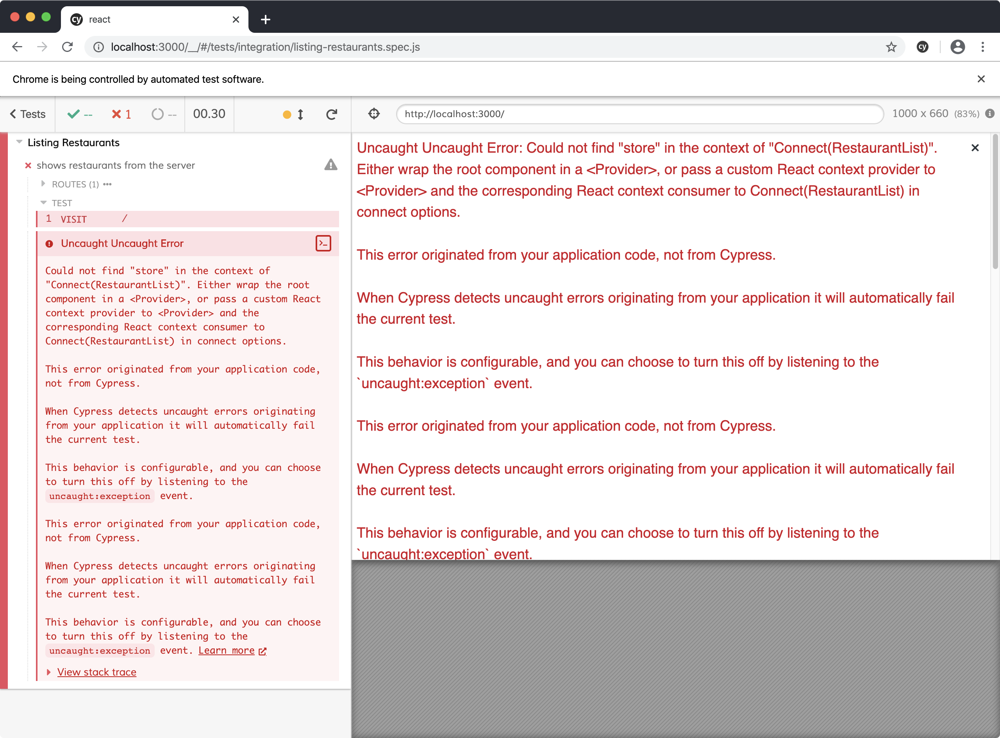

# 2 - Vertical Slice

In this chapter, we'll build our first application feature. We'll follow the practice of outside-in test driven development: write a failing end-to-end test, watch it fail, then build out the functionality with unit tests using multiple inner red-green-refactor cycles. We'll also see the principle of "write the code you wish you had" in action.

Our next story in Trello is:

- [ ] List Restaurants

We chose this story as our first story because it allows us to build out a **vertical slice** of our application. It touches all layers of our code: it has a user interface aspect (the list screen), a data layer aspect (where the restaurants are loaded and stored), and an API client aspect (the HTTP request to load the restaurants). It also minimizes other work: we aren't building authentication now, and we aren't handling restaurant loading edge cases yet in this story. The point of a vertical slice is to get something in all layers of your application built out, to ensure they all work together.

## Setup

We'll do all our work from this feature on a branch. Create a new one:

```sh
$ git checkout -b list-restaurants
```

To get a clean start, let's delete out the sample content Create React App created with our app. Delete the following files and folders:

- `cypress/integration/smoke.spec.js`
- `src/App.css`
- `src/App.test.js`
- `src/index.css`
- `src/logo.svg`
- `src/serviceWorker.js`

Make the following changes to `src/index.js`:

```diff
 import React from 'react';
 import ReactDOM from 'react-dom';
-import './index.css';
 import App from './App';
-import * as serviceWorker from './serviceWorker';

 ReactDOM.render(<App />, document.getElementById('root'));
-
-// If you want your app to work offline and load faster, you can change
-// unregister() to register() below. Note this comes with some pitfalls.
-// Learn more about service workers: https://bit.ly/CRA-PWA
-serviceWorker.unregister();
```

Replace the contents of `App.js` with the following minimal content:

```jsx
import React from 'react';

const App = () => (
  <div>
    Hello, world.
  </div>
);

export default App;
```

In `public/index.html`, find the `<title>` tag and see that the page has the default title "React App". Update it:

```diff
   Learn how to configure a non-root public URL by running `npm run build`.
   -->
-  <title>React App</title>
+  <title>Opinion Ate</title>
 </head>
```

Commit these changes to git:

```sh
$ git add .
$ git commit -m "Delete sample content"
```

## Reviewing the Backend

For this tutorial, our backend web service has already been built. Let's get it set up and see how we can load our restaurant data from it. We've set up a Node.js API you can run locally; that way you can edit data without authentication or stepping on other users' data.

Go to the [`codingitwrong/agilefrontend-api` project](https://github.com/CodingItWrong/agilefrontend-api) on GitHub. Clone the project, or just download and expand the zip file.

In the `agilefrontend-api` directory, run the following commands:

```sh
$ yarn install
$ yarn setup
$ yarn start
```

This will set up a SQLite database with some test data, and start the API server. You'll see:

```sh
yarn run v1.22.0
$ node server.js
info: serving app on http://127.0.0.1:3333
```

Go to `http://localhost:3333/restaurants` in a browser. You should see the following JSON data (formatted differently depending on your browser and extensions, and of course the dates will differ):

```json
[
  {
    "id": 1,
    "name": "Pasta Place",
    "created_at": "2020-02-27 07:43:58",
    "updated_at": "2020-02-27 07:43:58"
  },
  {
    "id": 2,
    "name": "Salad Place",
    "created_at": "2020-02-27 07:43:58",
    "updated_at": "2020-02-27 07:43:58"
  }
]
```

So this is the web service endpoint our story will need to connect to. Now, to build the frontend.

## End-to-End Test

When performing outside-in TDD, our first step is to **create an end-to-end test describing the feature we want users to be able to do.**

In the `cypress/integration` folder, create a `listing-restaurants.spec.js` file and add the following:

```js
describe('Listing Restaurants', () => {
  it('shows restaurants from the server', () => {
    const sushiPlace = 'Sushi Place';
    const pizzaPlace = 'Pizza Place';

    cy.server({force404: true});

    cy.route({
      method: 'GET',
      url: 'http://localhost:3333/restaurants',
      response: [
        {id: 1, name: sushiPlace},
        {id: 2, name: pizzaPlace},
      ],
    });

    cy.visit('/');
    cy.contains(sushiPlace);
    cy.contains(pizzaPlace);
  });
});
```

First, we create variables with a few restaurant names, because we'll use them several times.

Then, we call `cy.server()`. This sets up Cypress to stub calls to the backend. By default Cypress will allow any calls that are *not* stubbed through to the backend, but the `force404: true` option means that Cypress will return a `404 Not Found` status for them instead. We don't want our E2E tests to ever hit the real backend, so this option is good.

Then, we call `cy.route()` to stub a specific backend request; in this case, the `http://localhost:3333/restaurants` we just tested out. When the app sends a `GET` request to it, we will return the specified response. We pass the method an array of two restaurant objects. Cypress will convert that array of objects into a JSON string and return that from the stubbed network call. Notice that we don't need to include the `created_at` and `updated_at` fields, because our app won't be using them.

Next, we visit the root of our app at `/`. We confirm that the page contains both restaurant names. This will show that the app successfully retrieved them from the backend and displayed them.

After we’ve created our test, the next step in TDD is to **run the test and watch it fail.** This test will fail (be “red”) at first because we haven’t yet implemented the functionality.

To run our test, run the app with `yarn start` and leave it running, then, in another terminal, run `yarn cypress`.
After a few seconds the Cypress app should open. In Cypress, click `listing-restaurants.spec.js`. Chrome should open, and the test should run. It is able to visit the root of our app, but when it attempts to find "Sushi Place" on the page, it fails.


Let's go ahead and commit this E2E test. Although it won't pass until the end of the branch, committing it now allows us to have focused commits going forward.

```sh
$ git add .
$ git commit -m "Specify app should list restaurants"
```

It's time for us to write the code to make this pass. Let's think about how we want to structure our code. We're going to have three layers:

- Components that display the user interface.
- A Redux store that stores our data and lets us interact with it.
- An API client that allows us to make requests to the backend.

With outside-in testing, we build the outside first, which in this case is our user interface components. And a common principle is to **write the code you wish you had.** What does that mean in our case? Well, when we created our app, we were given an `<App />` component. Do we want to put our user interface directly in there? No, it's best to save the `<App />` component for app-wide concerns such as a title bar that we'll add soon. Instead, it would be great if we had a `<RestaurantScreen />` component that would contain everything specific to our restaurants. We wish we had it, so let's add it to `App.js`:

```diff
 import React from 'react';
+import RestaurantScreen from './components/RestaurantScreen';

 const App = () => (
   <div>
-    Hello, world.
+    <RestaurantScreen />
   </div>
 );

 export default App;
```

Next, let's actually create the `RestaurantScreen` component we used here.
In `src`, create a `components` folder, then inside it create a `RestaurantScreen.js` file.
For the moment let's add just enough content to make it a valid component. Add the following:

```jsx
import React from 'react';

const RestaurantScreen = () => (
  <div>
    <h1>Restaurants</h1>
  </div>
);

export default RestaurantScreen;
```

If we rerun our E2E test we'll see the "Restaurants" text displayed, but we aren't any closer to passing the text. What do we do next?

Well, what do we want to do on this screen? For this story, we want to display a restaurant list. But we also have an upcoming story where we want to add new restaurants. Those are two different responsibilities we want this screen to have. So let's create child components for each. For now, we'll just create the restaurant list.

Let's start by writing the code we wish we had again. In `RestaurantScreen.js`:

```diff
 import React from 'react';
+import RestaurantList from './RestaurantList';

 const RestaurantScreen = () => (
   <div>
     <h1>Restaurants</h1>
+    <RestaurantList />
   </div>
 );

 export default RestaurantScreen;
```

Now let's implement that component. Create a `RestaurantList.js` file in `src/components` and again add the minimal content:

```js
import React from 'react';

export const RestaurantList = () => <div>RestaurantList</div>;

export default RestaurantList;
```

We do both a named and default export, because later our default export will be the `RestaurantList` connected to Redux, but we will also want the unconnected component for testing.

## Stepping Down to a Unit Test

Now we finally have `RestaurantList` where we'll put our UI for this story. So far our components haven't done much: `App` just renders `RestarauntScreen`, and `RestaurantScreen` just renders `RestaurantList`. But `RestaurantList` will do more. It needs to:

- Request for the restaurants to be loaded
- Display the restaurants once they're returned

Instead of adding the behavior directly, let’s **step down from the “outside” level of end-to-end tests to an “inside” component test.** This allows us to more precisely specify the behavior of each piece. This unit test will also be helpful in a future story as we add more edge cases to this component. End-to-end testing every edge case would be slow, and make it harder to tell what exactly was being tested.

Before we step down to a unit test, though, let's commit the changes we have. They're a nice, small unit of work: we've added the structure of components that we'll add the behavior to next.

```sh
$ git add .
$ git commit -m "Add RestaurantScreen and RestaurantList"
```

Now, to write the unit test. In `src/components`, create a `__tests__` folder, then inside that create a file `RestaurantList.spec.js`.
Now, we'll write a test for the first bit of functionality we need, to load the restaurants. We'll start with the structure of the test suite:

```js
describe('RestaurantList', () => {
  it('loads restaurants on first render', () => {
  });
});
```

Because we are writing a unit test, we don't want to connect our component to our real Redux store. Instead, we want to create mock functions that are passed in the way Redux dispatch functions will be; then we can run expectations on those mock functions. Our component will ask our store to load the restaurants, so that means we need a `loadRestaurants` function:

```diff
 it('loads restaurants on first render', () => {
+  const loadRestaurants = jest.fn().mockName('loadRestaurants');
 });
```

We use `jest.fn()` to create a Jest mock function, which will allow us to check that the `loadRestaurants` action was called. We chain a call to `.mockName()` onto it to give our function a name; this will make our error messages more readable.

Now, we're ready to render our component:

```diff
+import React from 'react';
+import {render} from '@testing-library/react';
+import {RestaurantList} from '../RestaurantList';

 describe('RestaurantList', () => {
   it('loads restaurants on first render', () => {
     const loadRestaurants = jest.fn().mockName('loadRestaurants');
+
+    render(<RestaurantList loadRestaurants={loadRestaurants} />);
   });
 });
```

We import the `RestaurantList` component, making sure to use the named import because that will continue to be the unconnected component. Then we use React Testing Library's `render()` function to render it. We pass the `loadRestaurants` function as a prop.

Finally, we're ready to run an expectation to confirm that the component loads restaurants on first render. We just check that our mock function was called:

```diff
 it('loads restaurants on first render', () => {
   const loadRestaurants = jest.fn().mockName('loadRestaurants');

   render(<RestaurantList loadRestaurants={loadRestaurants} />);
+
+  expect(loadRestaurants).toHaveBeenCalled();
 });
```

Now we're ready to run our unit test. Run `yarn test` and leave it running for the remainder of this section. Jest will run our unit test, and we'll get the following error:

```sh
 FAIL  src/components/__tests__/RestaurantList.spec.js
  RestaurantList
    ✕ loads restaurants on first render (19ms)

  ● RestaurantList › loads restaurants on first render

    expect(loadRestaurants).toHaveBeenCalled()


    Expected number of calls: >= 1
    Received number of calls:    0

       9 |     render(<RestaurantList loadRestaurants={loadRestaurants} />);
      10 |
    > 11 |     expect(loadRestaurants).toHaveBeenCalled();
         |                             ^
      12 |   });
      13 | });
```

Our test says we expected the `loadRestaurants()` function to have been called at least once, but it wasn't called. This makes sense: we haven't hooked up the first-render functionality yet. Now that our test is red, it's time to make it green.

To call a function once when our component renders, we'll use an effect. First, let's adjust the `RestaurantList` function to use a block:

```diff
-export const RestaurantList = () => <div>RestaurantList</div>;
+export const RestaurantList = () => {
+  return <div>RestaurantList</div>;
+}
```

Now, we run the `loadRestaurants` prop in a `useEffect`:

```diff
-import React from 'react';
+import React, {useEffect} from 'react';

-export const RestaurantList = () => {
+export const RestaurantList = ({loadRestaurants}) => {
+  useEffect(() => {
+    loadRestaurants();
+  }, [loadRestaurants]);
+
   return <div>RestaurantList</div>;
 };
```

The dependency array we pass to `useEffect` consists only of `loadRestaurants`, so the effect will run once each time `loadRestaurants` changes. In our test (and in our real application) it will never change, so the effect just runs once when the component first renders.

Save the file and Jest will automatically rerun our unit test. Sure enough, our test is green. We've passed our first unit test! Let's commit the unit test and production code that makes it pass in one commit:

```sh
$ git add .
$ git commit -m "Load restaurants upon first rendering RestaurantList"
```

This gives us one of the behaviors we want our `RestaurantList` to have: loading the restaurants when it is first rendered. Now it's time to write a test for the second behavior: displaying the restaurants. Let's add another `it()` block inside the `describe()`, with the following contents:

```js
it('displays the restaurants', () => {
  const noop = () => {};
  const restaurants = [
    {id: 1, name: 'Sushi Place'},
    {id: 2, name: 'Pizza Place'},
  ];

  const {queryByText} = render(
    <RestaurantList loadRestaurants={noop} restaurants={restaurants} />,
  );
});
```

So far it's pretty similar to our previous test. There are just a few differences:

- Instead of a Jest mock function, we set up a `noop` function that does nothing ("no operation").
- We define a `restaurants ` variable that contains an array of two restaurant objects.
- We destructure the property `queryByText` from the return value of `render()`, because we'll need it in a moment.

Now, instead of running an expectation that `loadRestaurants` was called, we use the destructured `queryByText` function to check what is rendered out:

```diff
   const {queryByText} = render(
     <RestaurantList loadRestaurants={noop} restaurants={restaurants} />,
   );
+
+  expect(queryByText('Sushi Place')).not.toBeNull();
+  expect(queryByText('Pizza Place')).not.toBeNull();
 });
```

`queryByText` finds an element containing the passed-in text. We pass in the name of each of the two restaurants. If found, `queryByText` returns a reference to the element; if not found, it returns `null`. So, to confirm they are found, we check that return result is *not* null.

Why did we split this unit test out from the first one? There is a common unit testing principle to **check one behavior per test in component tests.** In our first test we checked the loading behavior, and in this test we are checking the restaurant-display behavior. Having separate test cases for each behavior of the component makes it easy to understand what it does, and easy to see what went wrong if one of the assertions fails. This principle is sometimes phrased "run one expectation per test", but in this test we have two expectations. We're following the spirit of the principle, though, because those two expectations are very closely related: they're checking for two analogous bits of text on the page.

You may recall that this isn’t what we did in the end-to-end test, though. Generally you should **check _multiple_ behaviors per test in end-to-end tests.** Why? End-to-end tests are slower, so the overhead of the repeating the steps would significantly slow down our suite as it grows.

When we save the file, our test runs, and it's red, as we expect. We get the following error:

```sh
  ● RestaurantList › displays the restaurants

    expect(received).not.toBeNull()

    Received: null

      23 |     );
      24 |
    > 25 |     expect(queryByText('Sushi Place')).not.toBeNull();
         |                                            ^
```

So no element with the text "Sushi Place" is found. At this point, we could hard-code an element with that text, but it's better to go ahead and pull it from the props:

```diff
-export const RestaurantList = ({loadRestaurants}) => {
+export const RestaurantList = ({loadRestaurants, restaurants}) => {
   useEffect(() => {
     loadRestaurants();
   }, [loadRestaurants]);

-  return <div>RestaurantList</div>;
+  return (
+    <ul>
+      {restaurants.map(restaurant => (
+        <li key={restaurant.id}>{restaurant.name}</li>
+      ))}
+    </ul>
+  );
 };
```

When we save the file, our test of the output passes, but now our first test fails:

```sh
● RestaurantList › loads restaurants on first render

  TypeError: Cannot read property 'map' of undefined

     8 |   return (
     9 |     <ul>
  > 10 |       {restaurants.map(restaurant => (
```

We're `map`ping over the `restaurants`, but in our first test we didn't pass in a `restaurants` prop. Let's update the test to pass in an empty array, since that test doesn't care about the restaurants:

```diff
 it('loads restaurants on first render', () => {
   const loadRestaurants = jest.fn().mockName('loadRestaurants');
+  const restaurants = [];

-  render(<RestaurantList loadRestaurants={loadRestaurants} />);
+  render(
+    <RestaurantList
+      loadRestaurants={loadRestaurants}
+      restaurants={restaurants}
+    />,
+  );

   expect(loadRestaurants).toHaveBeenCalled();
 });
```

Save and now both tests are passing. We've now successfully defined both behaviors of our `RestaurantList`!

Go ahead and commit your changes again. From here on out, we won't remind you to make small commits as we go, but I'd encourage you to do so.

In the TDD cycle, **whenever the tests go green, look for opportunities to refactor.** There's a lot of duplication in our two tests. Now that we see which parts are shared, let's extract that duplication. First, let's set up some shared data:

```diff
 describe('RestaurantList', () => {
+  const restaurants = [
+    {id: 1, name: 'Sushi Place'},
+    {id: 2, name: 'Pizza Place'},
+  ];
+  let loadRestaurants;
+  let context;
+
+  beforeEach(() => {
+    loadRestaurants = jest.fn().mockName('loadRestaurants');
+
+    context = render(
+      <RestaurantList
+        loadRestaurants={loadRestaurants}
+        restaurants={restaurants}
+      />,
+    );
+  });
+
   it('loads restaurants on first render', () => {
```

Although not *all* of these variables are needed for *both* tests, it's okay to set them up for both. This sets up a component in a good default state, so each test can stay focused on what it wants to assert.

Now we can remove the duplicated code from the individual tests:

```diff
 it('loads restaurants on first render', () => {
-  const loadRestaurants = jest.fn().mockName('loadRestaurants');
-  const restaurants = [];
-
-  render(
-    <RestaurantList
-      loadRestaurants={loadRestaurants}
-      restaurants={restaurants}
-    />,
-  );
-
   expect(loadRestaurants).toHaveBeenCalled();
 });

 it('displays the restaurants', () => {
-  const noop = () => {};
-  const restaurants = [
-    {id: 1, name: 'Sushi Place'},
-    {id: 2, name: 'Pizza Place'},
-  ];
-
-  const {queryByText} = render(
-    <RestaurantList loadRestaurants={noop} restaurants={restaurants} />,
-  );
-
+  const {queryByText} = context;
+
   expect(queryByText('Sushi Place')).not.toBeNull();
   expect(queryByText('Pizza Place')).not.toBeNull();
 });
```

Save the file and our tests should still pass. With this, our tests are much shorter. Almost all they contain is the expectations. This is good because it keeps our tests focused and very easy to read.

## Stepping Back Up

We've now specified the behavior of our `RestaurantList` component, and our unit test is complete. The next step in outside-in TDD is to **step back up to the end-to-end test and see our next failure.** Rerun the test in Chrome and we see:

```sh
Uncaught Uncaught TypeError: Cannot read property 'map' of undefined
```


This should make sense from what we just built: we called the `map` function on the `restaurants` array, but in our application code we aren't yet passing a `restaurants` array. How do we want our component to get that array? We want it to be provided by the Redux store. It's time to write the code we wish we had, and hook our restaurant list up to Redux.

Add `redux` and `react-redux` dependencies. We'll go ahead and add `redux-devtools-extension` too:

```sh
$ yarn add redux react-redux redux-devtools-extension
```

Next, connect the `RestaurantList` component to the appropriate state. This is what will ultimately fix our Cypress error:

```diff
 import React, {useEffect} from 'react';
+import {connect} from 'react-redux';

 export const RestaurantList = ({loadRestaurants, restaurants}) => {
...
 };

+const mapStateToProps = state => ({
+  restaurants: state.restaurants.records,
+});
+
-export default RestaurantList;
+export default connect(mapStateToProps)(RestaurantList);
```

If you've used Redux before you know we have more setup steps to do. But let's rerun the E2E test to let it drive us to do so. The error we get is:

```sh
Uncaught Uncaught Error: Could not find "store" in the context of "Connect(RestaurantList)". Either wrap the root component in a <Provider>, or pass a custom React context provider to <Provider> and the corresponding React context consumer to Connect(RestaurantList) in connect options.
```



This error is because we haven't hooked up our application to a Redux store. Let's do that now:

```diff
 import React from 'react';
+import {Provider} from 'react-redux';
+import store from './store';
 import RestaurantScreen from './components/RestaurantScreen';

 const App = () => (
-  <div>
+  <Provider store={store}>
     <RestaurantScreen />
-  </div>
+  </Provider>
 );
```

We'll need to define that store as well. Under `src/`, create a `store` folder, then an `index.js` inside it. Add the following contents:

```js
import {createStore} from 'redux';
import {devToolsEnhancer} from 'redux-devtools-extension';
import rootReducer from './reducers';

const store = createStore(
  rootReducer,
  devToolsEnhancer(),
);

export default store;
```

Now we'll need a root reducer. Create a `src/store/reducers.js` file. Add the following contents:

```js
import {combineReducers} from 'redux';
import restaurants from './restaurants/reducers';

export default combineReducers({restaurants});
```

Right now it’s a bit unnecessary that we're combining a _single_ reducer into a larger one, but this sets our app up for other reducers for the future.

Now we need to create that restaurant reducer. Create a `src/store/restaurants` folder, then a `reducers.js` file inside it. Add the following contents:

```js
import {combineReducers} from 'redux';

const records = () => [];

export default combineReducers({
  records,
});
```

We go ahead and use `combineReducers` since we will ultimately have multiple restaurant reducers, for values like loading and error flags. For now, we just need the one `records` reducer to fix the E2E test error. We have it return a hard-coded empty array.

This should fix our E2E test error, so rerun the Cypress test. Now we get a new error:

```sh
Uncaught Uncaught TypeError: loadRestaurants is not a function
```


How do we want the `loadRestaurants` function to be provided to the component? We want it to be an asynchronous Redux action. To make that work, it's time to add `redux-thunk`:

```sh
$ yarn add redux-thunk
```

Hook it up in `src/store/index.js`:

```diff
 import {createStore} from 'redux';
+import thunk from 'redux-thunk';
 import {devToolsEnhancer} from 'redux-devtools-extension';
 import rootReducer from './reducers';

-const store = createStore(rootReducer, devToolsEnhancer());
+const store = createStore(
+  rootReducer,
+  compose(applyMiddleware(thunk), devToolsEnhancer()),
+);

 export default store;
```

In `RestaurantList.js`, map the action into the component:

```diff
 import {connect} from 'react-redux';
+import {loadRestaurants} from '../store/restaurants/actions';

 export const RestaurantList = ({loadRestaurants, restaurants}) => {
...
 const mapStateToProps = state => ({
   restaurants: state.restaurants.records,
 });

+const mapDispatchToProps = {loadRestaurants};
+
-export default connect(mapStateToProps)(RestaurantList);
+export default connect(mapStateToProps, mapDispatchToProps)(RestaurantList);
```

Next, we need to add that actions module. In `src/store/restaurants`, create `actions.js`. We want to write the minimal code to fix the current E2E test error, so let's just export a `loadRestaurants` thunk that does nothing:

```js
export const loadRestaurants = () => () => {};
```

Rerun the E2E test. We now no longer get any application code errors; instead, we are back to the failure that the text "Sushi Place" is never shown. But we've made progress. Our component is now dispatching the `loadRestaurants` async action, and reading the `restaurants` from the store; our async action just isn't loading those records from the API yet. That's logic we need to implement, and that means it's time to step back down to a unit test, this time for our Redux store.

## Unit Testing the Store

To test our store, we're going to create a real Redux store, configure it with our reducer, then dispatch our actions against it. After we write our test, we'll look at the advantages this approach gives us.

Under `src/store/`, create a `__tests__` folder. Inside it, create a `restaurants.spec.js` file. Add the following structure:

```js
describe('restaurants', () => {
  describe('loadRestaurants action', () => {
    it('stores the restaurants', async () => {
    });
  });
});
```

We create a `describe` block for our `loadRestaurants` action, which right now just has one test: that it stores the restaurants. Note that the test function is `async`, to allow for our stubbed network request. Now let's fill that test out.

We will need some records to be returned by our mocked API:

```diff
 it('stores the restaurants', async () => {
+  const records = [
+    {id: 1, name: 'Sushi Place'},
+    {id: 2, name: 'Pizza Place'},
+  ];
 });
```

As we said earlier, our app will consist of three layers:

- The UI components
- The Redux store
- The API client

So we won't make an HTTP request directly in our Redux store.
Instead, we'll delegate to an API object that we pass in. Let's design the interface of that object now:

```diff
 it('stores the restaurants', async () => {
   const records = [
     {id: 1, name: 'Sushi Place'},
     {id: 2, name: 'Pizza Place'},
   ];

+  const api = {
+    loadRestaurants: () => Promise.resolve(records),
+  };
 });
```

Giving the `api` object a descriptive `loadRestaurants()` methods seems good. We are stubbing out the API here in the test, so we'll just implement that method to return a Promise that resolves to our hard-coded records.

Now, to set up our Redux store. We'll use a real Redux store to run our tests through. That way we are testing our thunks, action creators, and reducers in integration. MORE ON THIS

Start with the initial state of the reducer:

```diff
   const api = {
     loadRestaurants: () => Promise.resolve(records),
   };
+
+  const initialState = {
+    records: [],
+  };
 });
```

Now we’ll create the store itself. Unlike in the full application, we will only pass in the restaurant reducer. The full application may have other reducers, but we are keeping our test narrowed to just the restaurant reducer.

```diff
+import {createStore, applyMiddleware} from 'redux';
+import thunk from 'redux-thunk';
+import restaurantsReducer from '../restaurants/reducers';
+
 describe('restaurants', () => {
...
       const initialState = {
         records: [],
       };
+
+      const store = createStore(
+        restaurantsReducer,
+        initialState,
+        applyMiddleware(thunk.withExtraArgument(api)),
+      );
     });
```

We didn't use the `.withExtraArgument()` method for `redux-thunk` earlier. It allows you to pass an additional argument at setup time that will be available to all thunk functions. This allows us to inject our API. We could also use Jest's module mocking to do this, but this makes the dependency a bit more explicit.

Now that our store is set, we can dispatch the `loadRestaurants` action, then check the state of the store afterward:

```diff
 import restaurantsReducer from '../restaurants/reducers';
+import {loadRestaurants} from '../restaurants/actions';

 describe('restaurants', () => {
...
         applyMiddleware(thunk.withExtraArgument(api)),
       );
+
+      await store.dispatch(loadRestaurants());
+
+      expect(store.getState().records).toEqual(records);
     });
```

The test fails, showing an empty array as the received value:

```sh
expect(received).toEqual(expected) // deep equality

- Expected
+ Received

- Array [
-   Object {
-     "id": 1,
-     "name": "Sushi Place",
-   },
-   Object {
-     "id": 2,
-     "name": "Pizza Place",
-   },
- ]
+ Array []
```

Now we're ready to implement our `loadRestaurants` thunk to retrieve the records from the `api` and dispatch an action to store them.

First, update the `loadRestaurants` function in `actions.js`:

```diff
-export const loadRestaurants = () => () => {};
+export const STORE_RESTAURANTS = 'STORE_RESTAURANTS';
+
+export const loadRestaurants = () => (dispatch, getState, api) => {
+  api.loadRestaurants().then(records => {
+    dispatch(storeRestaurants(records))
+  });
+};
+
+const storeRestaurants = records => ({
+  type: STORE_RESTAURANTS,
+  records,
+});
```

We define a new `STORE_RESTAURANTS` action name. Then, in the function `loadRestaurants()` returns, we call `.loadRestaurants()` on the passed-in `api` that we configured when we set up the store. When it resolves, we dispatch a new `storeRestaurants()` action, passing it the records. We define a `storeRestaurants` action creator to create the correct action object.

Save the file and the test failure is the same, because our reducer doesn’t store the restaurants. Update the `records` reducer:

```diff
 import {combineReducers} from 'redux';
+import {STORE_RESTAURANTS} from './actions';

-const records = () => [];
+const records = (state = [], action) => {
+  switch (action.type) {
+    case STORE_RESTAURANTS:
+      return action.records;
+    default:
+      return state;
+  }
+};

 export default combineReducers({
   records,
 });
```

With this, our test passes.

Now that our test is passing and our code is complete, we can see the benefits that come from testing the store from the outside. Our test interacts with the store the way the rest of our application does: by dispatching async actions and then observing state changes. Just like the rest of our application, our test doesn't know or care about the `STORE_RESTAURANTS` action; it treats it as an implementation detail. This gives us greater flexibility to refactor our store; for example, we could change the way the actions that `loadRestaurants` dispatches are set up. Our tests would continue to pass as long as the action name and state stayed the same, which is fittingly exactly the contract that the rest of our application requires as well.

Another benefit of testing the store from the outside is ensuring that all the pieces work together. If we were testing the `loadRestaurants` async action, `storeRestaurants` action creator, and reducer separately from one another, they might work individually, but not work together. For example, maybe the names of properties in the action object returned by `storeRestaurants` aren't the same names as the properties the reducer looks for in a `STORE_RESTAURANTS` action. Our test exercises the async action, action creator, and reducer in integration, ensuring that if they aren't working together, a unit test will fail. If we weren't testing this way, only an E2E test would catch this problem--and then only if the problem is in one of the main flows that our E2E test covers, not our edge cases.

## Creating the API Client

Now that our unit test is passing, it's time to step back up to the E2E test. It fails with a new error:

```sh
Uncaught Uncaught TypeError: Cannot read property 'loadRestaurants' of undefined
```

Scroll down in the application window and you'll see that it's actually the `api.loadRestaurants()` method call that's undefined:


Our component and store are built; now we just need to build our API. You may be surprised to hear that we aren't going to unit test it at all. Let's look at the implementation, then we'll discuss why.

We'll use the popular `axios` library to make our HTTP requests. Add it to your project:

```sh
$ yarn add axios
```

::: warning
One reason to use `axios` is that Cypress's network request mocking doesn't currently work for `fetch()` requests, only for the older `XMLHttpRequest` API. `axios` uses `XMLHttpRequest` under the hood while providing a nicer interface than either it or `fetch()` in my opinion, so it's a great choice for any web application, but especially one tested with Cypress.
:::

Now create an `api.js` file under `src`, and provide the following implementation:

```js
import axios from 'axios';

const client = axios.create({
  baseURL: 'http://localhost:3333/',
});

const api = {
  loadRestaurants() {
    return client.get('/restaurants').then(response => response.data);
  },
};

export default api;
```

First we import `axios`, then call its `create()` method to create a new Axios instance configured with our server's base URL. We provide the default `localhost` URL that our server will run on. Then we create an `api` object that we're going to export with our own interface. We give it a `loadRestaurants()` method. In that method, we call the Axios client's `get()` method to make an HTTP `GET` request to the path `/restaurants` under our base URL. Axios resolves to a `response` value that has a `data` field on it with the response body. In cases like ours where the response will be JSON data, Axios will handle parsing it to return a JavaScript data structure. So by returning `response.data` our application will receive the data the server sends.

Now, why aren't we unit testing this API? We could set it up to pass in a fake Axios object and mock out the `get()` method on it. But there is a unit testing principle: **don't mock what you don't own.** There are a few reasons for this:

- If you mock third party code but you get the functionality wrong, then your tests will pass against your mock, but won't work against the real third-party library. This is especially risky when the behavior of the library changes from how it worked when you first wrote the test.
- Some of the value of unit tests is in allowing you to design the API of your dependencies, but since you can't control the API of the third-party library, you don't get the opportunity to affect the API. (Pull requests to open-source projects notwithstanding!)

So how can you test code with third-party dependencies if you can't mock them? The alternative is to do what we did here: **wrap the third-party code with your *own* interface that you do control, and mock that.** In our case, we decided that we should expose a `loadRestaurants()` method that returns our array of restaurants directly, not nested in a `response` object. That module that wraps the third-party library should be as simple as possible, with as little logic as possible—ideally without any conditionals. That way, you won't even feel the need to test it. Consider our application here. Yes, we could write a unit test that if Axios is called with the right method, it resolves with an object with a data property, and confirm that our code returns the value of that data property. But at that point the test is almost just repeating the production code. This code is simple enough that we can understand what it does upon inspection. And our Cypress test will test our code in integration with the third party library, ensuring that it successfully makes the HTTP request.

With all that said, we're ready to wire up our API to our store to see if it all works. Update `src/store/index.js`:

```diff
 import rootReducer from './reducers';
+import api from '../api';

 const store = createStore(
   rootReducer,
-  compose(applyMiddleware(thunk), devToolsEnhancer()),
+  compose(applyMiddleware(thunk.withExtraArgument(api)), devToolsEnhancer()),
 );
```

Rerun the E2E test one more time. The test should confirm that "Sushi Place" and "Pizza Place" are loaded and displayed on the page. Our E2E test is passing!


Now let's see our app working against the real backend. Start the API by running `yarn start` in its folder.

Now go to your React app at `http://localhost:3000`.
You should see the default "Pasta Place" and "Salad Place" records.


We successfully implemented our first feature with outside-in Test-Driven Development!

If you have any uncommitted changes, commit them to git. Push up your branch to the origin and open a pull request. Wait for CI to complete, then merge the pull request. Now we can mark off our story in Trello:

- [x] List Restaurants
