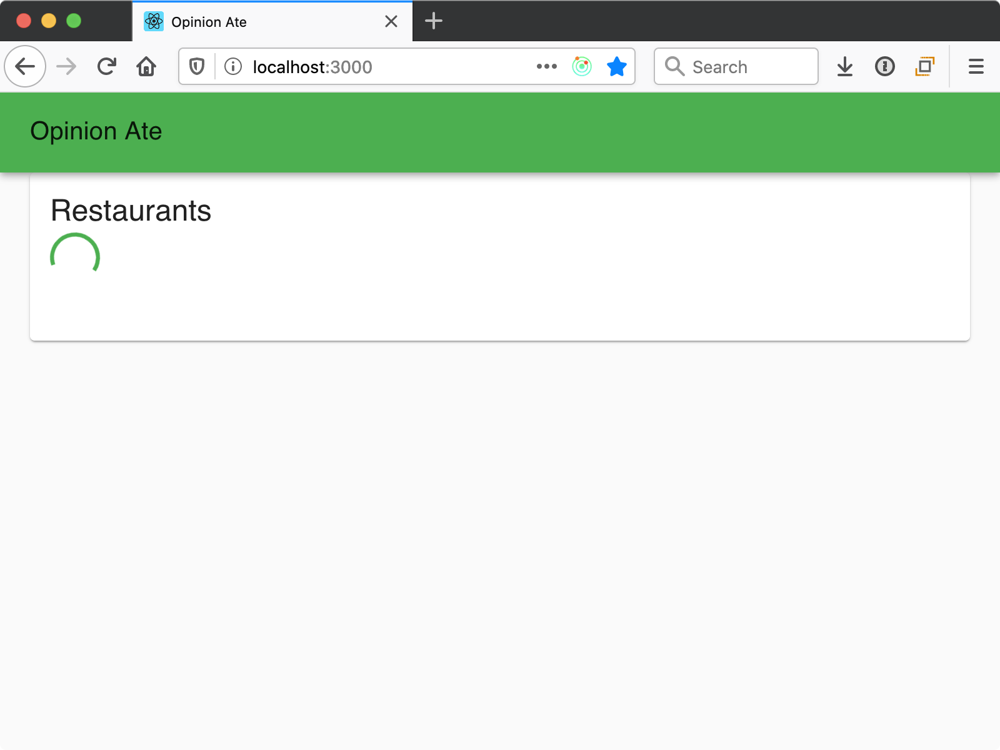
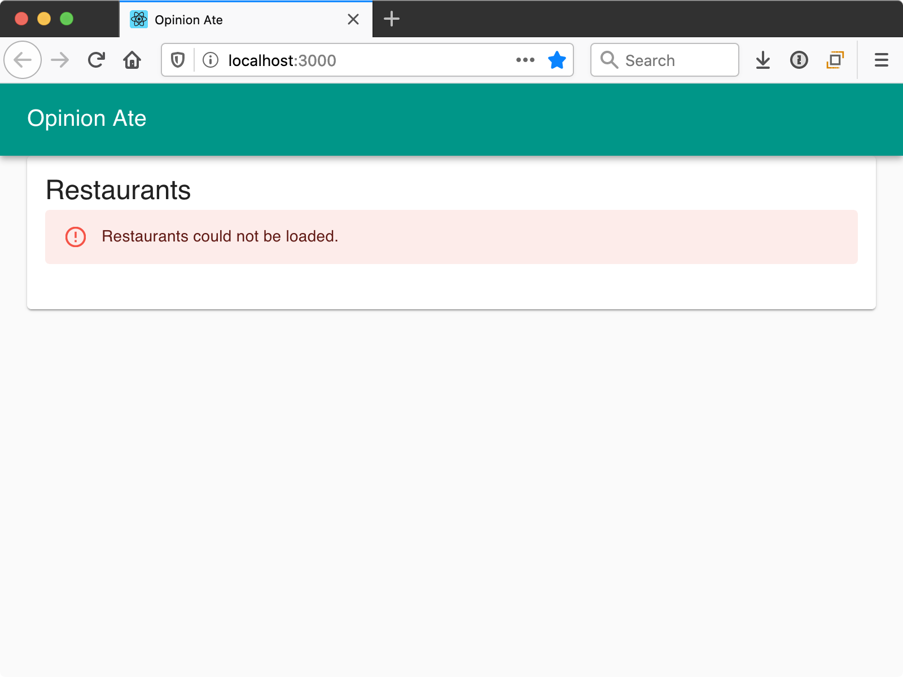

# 4 - Edge Cases

In this chapter we'll look at how to test-drive edge case functionality using unit tests.

Our next story in Trello is:

- [ ] Show Loading and Error States

We kept out first story, loading restaurants, minimal so that we could build out a vertical slice quickly and get all the parts of our app talking together. But now our next story is to make that restaurant loading more robust, providing a loading indicator and an error message in case of problems.

You could theoretically write an E2E test for this functionality, confirming the loading indicator and error message appear at the appropriate times. But if you write too many E2E tests, your application's test suite will get slow. Over time, you'll run it less and less frequently locally, and it will slow down your ability to merge PRs on CI.

To prevent this from happening, the Test Pyramid is a concept that recommends writing fewer end-to-end tests and more unit tests. In the case of Outside-In TDD, the way this works is you write E2E tests for the main features of your application, as well as the unit tests to help implement them. Then, for more detailed or edge-case functionality, you only write the unit tests. In our case, the loading indicator and error message can be considered more detailed functionality. So we are still going to TDD it, but only at the unit level.

## Loading Indicator
First, the loading indicator. Although we aren't writing an E2E test, we can still start from the "outside" in a sense: our `RestaurantList` component. Let's write a test of the loading indicator functionality for it.

Right now in `RestaurantList.spec.js` we are mounting our component in a `beforeEach` block. This has worked so far, but now we need to set up the props slightly differently for different tests. We want a test where a loading flag is set.

To do this, let's refactor our tests for more flexibility.
First, let's extract all the contents of the `beforeEach` into a new function, called `renderWithProps`:

```diff
   let context;

+  const renderWithProps = () => {
+    loadRestaurants = jest.fn().mockName('loadRestaurants');
+
+    context = render(
+      <RestaurantList
+        loadRestaurants={loadRestaurants}
+        restaurants={restaurants}
+      />,
+    );
+  };
+
   beforeEach(() => {
-    loadRestaurants = jest.fn().mockName('loadRestaurants');
-
-    context = render(
-      <RestaurantList
-        loadRestaurants={loadRestaurants}
-        restaurants={restaurants}
-      />,
-    );
+    renderWithProps();
   });
```

Save the file and the tests should still pass. When refactoring like this, we want to run the tests after each small step, so that if something breaks we know right away.

Next, let's remove the `beforeEach` block and call `renderWithProps` at the start of each our our tests instead:

```diff
-  beforeEach(() => {
-    renderWithProps();
-  });
-
   it('loads restaurants on mount', () => {
+    renderWithProps();
     expect(loadRestaurants).toHaveBeenCalled();
   });

   it('displays the restaurants', () => {
+    renderWithProps();
     const {queryByText} = context;
```

Save and confirm the tests pass.

As our final refactoring, let's change the `renderWithProps` function to allow passing in the props the component should use, with defaults:

```diff
-  const renderWithProps = () => {
-    loadRestaurants = jest.fn().mockName('loadRestaurants');
-
-    context = render(
-      <RestaurantList
-        loadRestaurants={loadRestaurants}
-        restaurants={restaurants}
-      />,
-    );
+  const renderWithProps = (propOverrides = {}) => {
+    const props = {
+      loadRestaurants: jest.fn().mockName('loadRestaurants'),
+      restaurants,
+      ...propOverrides,
+    };
+    loadRestaurants = props.loadRestaurants;
+
+    context = render(<RestaurantList {...props} />);
   };
```

Here’s what’s going on:

- `renderWithProps` takes an optional `propOverrides` argument.
- We set a `props` variable to an object, providing default values for the `loadRestaurants` and `restaurants` properties, but using the object spread operator to set any passed-in properties, overriding the defaults.
- Whatever the final value of the `loadRestaurants` property is, we set that in a variable so it can be accessed in the tests.
- We `render` the component, passing it all the props.

Now we're ready to write our new test for when the store is in a loading state. Let's pass in a new prop for whether the restaurants are loading:

```js
  it('displays the loading indicator while loading', () => {
    renderWithProps({loading: true});
    const {queryByTestId} = context;
    expect(queryByTestId('loading-indicator')).not.toBeNull();
  });
```

Note that instead of calling `queryByText()` here, we call `queryByTestId()`. Our element, a loading indicator, won’t have text content, so instead we use a test ID to identify it. We confirm that it's not null, showing that the element is present.

In good TDD style, our test fails, because the element isn't present.

Sticking with the approach of making the smallest possible change to make the test pass, let's just add the loading indicator to show *all* the time.
Material-UI has a `CircularProgress` spinner that will work great. Add it to `RestaurantList.js` with the correct test ID:

```diff
 import ListItemText from '@material-ui/core/ListItemText';
+import CircularProgress from '@material-ui/core/CircularProgress';
 import {loadRestaurants} from '../store/restaurants/actions';
...
   return (
+    <>
+      <CircularProgress data-testid="loading-indicator" />
       <List>
         {restaurants.map(restaurant => (
           <ListItem key={restaurant.id}>
             <ListItemText>{restaurant.name}</ListItemText>
           </ListItem>

         ))}
       </List>
+    </>
   );
```

The test passes.

This isn't good, though, right? We don't want the loading indicator to *always* show! Shouldn't we go ahead and put a conditional on it?

No, and here's why: if we add the conditional now, *it's not tested*. Because our tests pass whether or not there is a conditional in place. It's good that we want the conditional. But we also need to implement the tests that will confirm the conditional is working correctly. So after we make the tests pass in the easiest way possible, and we find there is more functionality we need, we should think: what test would confirm the conditional is working properly?

In our case, we *also* need a test to confirm that the conditional is *not* shown when *not* loading. Let's add that now:

```js
  it('does not display a loading indicator while not loading', () => {
    renderWithProps({loading: false});
    const {queryByTestId} = context;
    expect(queryByTestId('loading-indicator')).toBeNull();
  });
```

This test fails, of course. And now that we have two tests, this will force us to implement the conditional to get them both to pass:

```diff
 import ListItemText from '@material-ui/core/ListItemText';

-export const RestaurantList = ({loadRestaurants, restaurants}) => {
+export const RestaurantList = ({loadRestaurants, restaurants, loading}) => {
...
   return (
     <>
-      <CircularProgress data-testid="loading-indicator" />
+      {loading && <CircularProgress data-testid="loading-indicator" />}
       <List>
```

Save the file and all tests pass.

Now, let's think about refactoring. We're getting a lot of tests in our `RestaurantList.spec.js`. And a few of them are related. Both the "don't display loading indicator" test and the "display restaurants" test relate to the situation when the loading is done. We can use a `describe` block to represent this. Wrap the two of them in a:

```js
describe('when loading succeeds', () => {
//...
});
```

Save and confirm the tests still pass.

Now, for the "does not display a loading indicator" test, we pass `loading: false` to the store. But conceptually that's the default state of the store, so let's set up `renderWithProps` to pass that as a default prop:

```diff
     const props = {
       loadRestaurants: jest.fn().mockName('loadRestaurants'),
+      loading: false,
       restaurants,
       ...propOverrides,
     };
```

Now we don't need to pass a prop override in the test of the loading indicator hiding:

```diff
     it('does not display the loading indicator while not loading', () => {
-      renderWithProps({loading: false});
+      renderWithProps();
```

Now our two "when loading succeeds" tests have the same call to `renderWithProps()`. It's small, so we could leave it in the individual tests. But we could also pull it out to a `beforeEach`. Let's do that now:

```diff
   describe('when loading succeeds', () => {
+     beforeEach(() => {
+       renderWithProps();
+     });
+
     it('does not display the loading indicator while not loading', () => {
-      renderWithProps();
       const {queryByTestId} = context;
       expect(queryByTestId('loading-indicator')).toBeNull();
     });

     it('displays the restaurants', () => {
-      renderWithProps();
       const {queryByText} = context;
```

Save and the tests should pass.

Note that we have one more test that calls `renderWithProps()` with no argument: the test that it "loads restaurants on mount."
Should we group that test together to remove duplication? I wouldn't recommend it. Although the call is the same, conceptually the situation is different. That test is considering when loading restaurants is kicked off, and the other is considering what happens when the loading completes. It just so happens that the state of the store is the same in both cases. But conceptually it's describing a different situation.

Now we need to drive out the loading flag in the store itself.
Open `src/store/__tests__/restaurants.spec.js`.
We'll have the same separation of tests during loading, so let's proactively group our existing "stores the restaurants" test in a describe:

```js
describe('when loading succeeds', () => {
  it('stores the restaurants', async () => {
//...
  });
});
```

Now let's add a new group for while loading is happening, at the same level as "when loading succeeds":

```js
describe('while loading', () => {
});
```

Inside that describe block, add the test:

```js
      it('sets a loading flag', () => {
        const api = {
          loadRestaurants: () => new Promise(() => {}),
        };

        const initialState = {};

        const store = createStore(
          restaurantsReducer,
          initialState,
          applyMiddleware(thunk.withExtraArgument(api)),
        );

        store.dispatch(loadRestaurants());

        expect(store.getState().loading).toEqual(true);
      });
```

Here's what's going on:

- We define a stubbed API with a `loadRestaurants` method that returns a Promise. The function passed to the promise never calls its arguments, so the Promise never resolves or rejects. This is okay, because for this test we want to test what happens *before* the Promise resolves.
- We set up a store with the restaurants reducer with that API.
- We dispatch the `loadRestaurants` async action. This time we don't need to `await` it, because we want to check the state immediately upon it returning, *before* it resolves.
- We check the state of the `loading` flag to confirm that it's `true` after we initiate a load.

Our test fails, as we expect:

```sh
 ● restaurants › loadRestaurants action › while loading › sets a loading flag

    expect(received).toEqual(expected) // deep equality

    Expected: true
    Received: undefined

      22 |         );
      23 |         await store.dispatch(loadRestaurants());
    > 24 |         expect(store.getState().loading).toEqual(true);
         |                                          ^
```

The `loading` flag isn't even defined yet.

Following the principle of making the test green in the easiest way possible, we set up a `loading` child reducer of the restaurants reducer that always returns `true`:

```diff
 };

+const loading = () => true;
+
 export default combineReducers({
   records,
+  loading,
 });
```

As before, we know this won't be our final implementation, but we want to write tests that drive us to handle all the scenarios.

When we save the file, the test passes.

So why is it not enough to have a `loading` flag that is always `true`? Well, we want it to be `false` once loading is complete. We already have one test for when loading is complete. Let's extract out the setup code we will need for both tests.

First, the `records` array is never modified by the test, so we can just define it at the top level:

```diff
     describe('when loading succeeds', () => {
+      const records = [
+        {id: 1, name: 'Sushi Place'},
+        {id: 2, name: 'Pizza Place'},
+      ];

       it('stores the restaurants', async () => {
-        const records = [
-          {id: 1, name: 'Sushi Place'},
-          {id: 2, name: 'Pizza Place'},
-        ];
         const api = {
```

Next, we will need to access the `store` from both tests, so make it a `let` variable defined outside the individual test:

```diff
       ];

+      let store;
+
       it('stores the restaurants', async () => {
         const api = {
           loadRestaurants: () => Promise.resolve(records),
         };

         const initialState = {
           records: [],
         };

-        const store = createStore(
+        store = createStore(
           restaurantsReducer,
```

Finally, we move the code that sets up the `api`, the `store`, and dispatches the action to a `beforeEach` block:

```diff
       let store;

+      beforeEach(async () => {
+        const api = {
+          loadRestaurants: () => Promise.resolve(records),
+        };
+
+        const initialState = {
+          records: [],
+        };
+
+        store = createStore(
+          restaurantsReducer,
+          initialState,
+          applyMiddleware(thunk.withExtraArgument(api)),
+        );
+
+        await store.dispatch(loadRestaurants());
+      });
+
       it('stores the restaurants', async () => {
-        const api = {
-          loadRestaurants: () => Promise.resolve(records),
-        };
-
-        const initialState = {
-          records: [],
-        };
-
-        store = createStore(
-          restaurantsReducer,
-          initialState,
-          applyMiddleware(thunk.withExtraArgument(api)),
-        );
-
-        await store.dispatch(loadRestaurants());
-
         expect(store.getState().records).toEqual(records);
       });
```

Now we can simplify our async code. Since the `beforeEach` function only has one promise it waits on, and it's the final statement, we can just return the promise instead of `await`ing it, and then the function no longer needs to be an `async` function:

```diff
-      beforeEach(async () => {
+      beforeEach(() => {
        const api = {
          loadRestaurants: () => Promise.resolve(records),
        };
...
-        await store.dispatch(loadRestaurants());
+        return store.dispatch(loadRestaurants());
       });
```

And the test no longer has any asynchrony, so we can remove the `async` keyword from the function as well:

```diff
-      it('stores the restaurants', async () => {
+      it('stores the restaurants', () => {
         expect(store.state.restaurants.records).toEqual(records);
       });
```

Now we can add another test in that describe block to check the loading state:

```js
      it('clears the loading flag', () => {
        expect(store.getState().loading).toEqual(false);
      });
```

Our test fails, as we expect, and now we need to actually clear the loading flag. We can do this in the `loading` reducer:

```diff
-const loading = () => true;
+const loading = (state = true, action) => {
+  switch (action.type) {
+    case STORE_RESTAURANTS:
+      return false;
+    default:
+      return state;
+  }
+};
```

Save the file and our test passes.

Is our implementation complete? Well, the `loading` flag starts as `true`.
Right now we dispatch the `loadRestaurants` action as soon as our app starts, so that's *almost* correct. But it makes more sense for the `loadRestaurants` action to actually start the loading.
So it would be best if `loading` starts as `false`. We don't just want to make that change, though—we want to specify it! In this case we want to specify the starting state of the store. Add a new `describe` block directly inside the top-level "restaurants" block:

```js
  describe('initially', () => {
    it('does not have the loading flag set', () => {
      const initialState = {};

      const store = createStore(
        restaurantsReducer,
        initialState,
        applyMiddleware(thunk),
      );

      expect(store.getState().loading).toEqual(false);
    });
  });
```

In this case we don't need to pass an `api` to `thunk` at all, because we won't be calling it. We create a store with empty initial state, and assert that the starting value of `loading` is `false`.

Our test fails, as we expect. Let's change the initial `loading` flag:

```diff
-const loading = (state = true, action) => {
+const loading = (state = false, action) => {
   switch (action.type) {
```

Now our test of the initial state passes, but our test for while loading fails. Previously the way that the app ensured the `loading` flag was set while loading was the fact that it was *initially* set. Now that it's initially cleared, we need to *change* the value when `loadRestaurants` is called. We can do this by adding a new action that is dispatched immediately in the `loadRestaurants` thunk, before the API is called:

```diff
+export const START_LOADING = 'START_LOADING';
 export const STORE_RESTAURANTS = 'STORE_RESTAURANTS';

 export const loadRestaurants = () => (dispatch, getState, api) => {
+  dispatch(startLoading());
   api.loadRestaurants().then(records => dispatch(storeRestaurants(records)));
 };

+const startLoading = () => ({type: START_LOADING});
+
 const storeRestaurants = records => ({
```

Then, in the `loading` reducer, returning a state of `true` when `START_LOADING` happens:

```diff
 import {combineReducers} from 'redux';
-import {STORE_RESTAURANTS} from './actions';
+import {START_LOADING, STORE_RESTAURANTS} from './actions';
...
 const loading = (state = false, action) => {
   switch (action.type) {
+    case START_LOADING:
+      return true;
     case STORE_RESTAURANTS:
       return false;
```

Save the files, and all our tests pass. We now have a loading flag that starts `false`, is set to `true` when loading begins, and is set back to `false` when loading ends.

Our unit tests are passing, and all we need to do now is hook up the `loading` state to our component. In `RestaurantList.js`:

```diff
 const mapStateToProps = state => ({
   restaurants: state.restaurants.records,
+  loading: state.restaurants.loading,
 });
```

With this, our loading functionality should be complete. Run the app with `yarn serve`, then load it in the browser. Our local API is set up with a hard-coded one second delay before returning the restaurant list. So you should see the loading spinner for one second before the results appear. Our loading flag is working!



Run our E2E tests and note that they still pass. They don't care whether or not a loading flag is shown; they just ensure that the data is eventually shown.

## Error Flag
The other edge case we want to handle is displaying an error in case the API call fails. This will be implemented using a very similar process to the loading flag. If you like, you can try to go through the process yourself, then compare your approach and this approach afterward. Just remember to always start with a failing test, and write only the minimum code to pass the test!

Note that we listed the loading flag and error flag as separate stories. Instead of implementing both flags in the component, then implementing both in the store, we got one flag working entirely. This ensures that we could ship the loading flag to our customers even before the error flag is ready.

Start with the test for the component. We are describing a new situation, when loading fails, so let's put our test in a new `describe` block:

```js
  describe('when loading fails', () => {
    beforeEach(() => {
      renderWithProps({loadError: true});
    });

    it('displays the error message', () => {
      const {queryByText} = context;
      expect(queryByText('Restaurants could not be loaded.')).not.toBeNull();
    });
  });
```

We decide we want to indicate the error state with a flag named `loadError`, so we set it up as a prop set to `true`.
We check for a new loading error element on the page. Our test fails because the element is not found.

Fix it the simplest way possible by hard-coding the error message to show.
Material-UI’s `lab` package has an `Alert` component that will work well:

```diff
 import CircularProgress from '@material-ui/core/CircularProgress';
+import Alert from '@material-ui/lab/Alert';
 import {loadRestaurants} from '../store/restaurants/actions';

 export const RestaurantList = ({loadRestaurants, restaurants, loading}) => {
...
       {loading && <CircularProgress data-testid="loading-indicator" />}
+      <Alert severity="error">Restaurants could not be loaded.</Alert>
       <List>
```

Note that we're asserting the text of the message in our test.

Save the file and our test passes. Now, specify that the error does _not_ show when loading succeeds:

```diff
   describe('when loading succeeds', () => {
     beforeEach(() => {
       renderWithProps();
     });

     it('does not display the loading indicator while not loading', () => {
       const {queryByTestId} = context;
       expect(queryByTestId('loading-indicator')).toBeNull();
     });

+    it('does not display the error message', () => {
+      const {queryByText} = context;
+      expect(queryByText('Restaurants could not be loaded.')).toBeNull();
+    });
+
     it('displays the restaurants', () => {
```

Make this test pass by making the display of the error alert conditional on the `loadError` prop that we set up in our test:

```diff
-export const RestaurantList = ({loadRestaurants, restaurants, loading}) => {
+export const RestaurantList = ({
+  loadRestaurants,
+  restaurants,
+  loading,
+  loadError,
+}) => {
  useEffect(() => {
...
       {loading && <CircularProgress data-testid="loading-indicator" />}
-      <Alert severity="error">Restaurants could not be loaded.</Alert>
+      {loadError && (
+        <Alert severity="error">Restaurants could not be loaded.</Alert>
+      )}
       <List>
```

Now both tests pass. Our component is working; on to the store.

In `restaurants.spec.js`, create a new `describe` block after "when loading succeeds" for the error scenario. Let's go ahead and do the setup in a `beforeEach` block, assuming we will need to have other expectations too:

```js
    describe('when loading fails', () => {
      let store;

      beforeEach(() => {
        const api = {
          loadRestaurants: () => Promise.reject(),
        };

        const initialState = {};

        store = createStore(
          restaurantsReducer,
          initialState,
          applyMiddleware(thunk.withExtraArgument(api)),
        );

        return store.dispatch(loadRestaurants());
      });

      it('sets an error flag', () => {
        expect(store.getState().loadError).toEqual(true);
      });
    });
```

We decide that when an API call fails, the promise `api.loadRestaurants()` returns will reject. This is common practice for JavaScript HTTP clients.

When we run our test, it fails, but we also get a warning:

```sh
(node:53012) UnhandledPromiseRejectionWarning: undefined
(node:53012) UnhandledPromiseRejectionWarning: Unhandled promise rejection. This error originated either by throwing inside of an async function without a catch block, or by rejecting a promise which was not handled with .catch(). To terminate the node process on unhandled promise rejection, use the CLI flag `--unhandled-rejections=strict` (see https://nodejs.org/api/cli.html#cli_unhandled_rejections_mode). (rejection id: 2)
(node:53012) [DEP0018] DeprecationWarning: Unhandled promise rejections are deprecated. In the future, promise rejections that are not handled will terminate the Node.js process with a non-zero exit code.
 FAIL  src/store/__tests__/restaurants.spec.js
  ● restaurants › loadRestaurants action › when loading fails › sets an error flag

    expect(received).toEqual(expected) // deep equality

    Expected: true
    Received: undefine
```

So in addition to our expectation not passing, Jest is warning that we have an unhandled promise rejection. Since it's a good practice to handle promise rejections in general, let's set up our action to catch a rejected promise. We won't do anything with the catch for now; maybe our tests will drive us to do something in there later.

```diff
 export const loadRestaurants = () => (dispatch, getState, api) => {
   dispatch(startLoading());
-   api.loadRestaurants().then(records => dispatch(storeRestaurants(records)));
+   api
+     .loadRestaurants()
+     .then(records => dispatch(storeRestaurants(records)))
+     .catch(() => {});
 };
```

This fixes the warning, and now we just have the failing expectation:

```sh
  ● restaurants › loadRestaurants action › when loading fails › sets an error flag

    expect(received).toEqual(expected) // deep equality

    Expected: true
    Received: undefined

       95 |
       96 |       it('sets an error flag', async () => {
    >  97 |         expect(store.getState().loadError).toEqual(true);
          |                                            ^
       98 |       });
```

We fix this failing test the simplest way possible, adding a `loadError` reducer that always returns `true`:

```diff
     default:
       return state;
   }
 };

+const loadError = () => true;
+
 export default combineReducers({
   records,
   loading,
+  loadError,
 });

```

Save and the tests pass.

Now we specify that the `loadError` flag should actually start out as `false`, and _only_ be set to true upon a failing load. First, extract the setup in the "initially" block:

```diff
   describe('initially', () => {
+    let store;
+
+    beforeEach(() => {
+      const initialState = {};
+
+      store = createStore(
+        restaurantsReducer,
+        initialState,
+        applyMiddleware(thunk),
+      );
+    });
+
     it('does not have the loading flag set', () => {
-      const initialState = {};
-
-      const store = createStore(
-        restaurantsReducer,
-        initialState,
-        applyMiddleware(thunk),
-      );
-
       expect(store.getState().loading).toEqual(false);
     });
   });
```

Then add a test for the `loadError` flag:

```diff
   describe('initially', () => {
...
     it('does not have the loading flag set', () => {
       expect(store.getState().loading).toEqual(false);
     });
+
+    it('does not have the error flag set', () => {
+      expect(store.getState().loadError).toEqual(false);
+    });
   });
```

The test fails. Make it pass while keeping the other tests passing, by setting the `loadError` to have initial state of `false`, then set to true when a new loading error action is dispatched. In `actions.js`:

```diff
 export const STORE_RESTAURANTS = 'STORE_RESTAURANTS';
+export const RECORD_LOADING_ERROR = 'RECORD_LOADING_ERROR';

 export const loadRestaurants = () => (dispatch, getState, api) => {
   dispatch(startLoading());
   api
     .loadRestaurants()
     .then(records => dispatch(storeRestaurants(records)))
-    .catch(() => {});
+    .catch(() => dispatch(recordLoadingError()));
 };
…
   type: STORE_RESTAURANTS,
   records,
 });
+
+const recordLoadingError = () => ({type: RECORD_LOADING_ERROR});
```

And in `reducers.js`:

```diff
-import {START_LOADING, STORE_RESTAURANTS} from './actions';
+import {
+  START_LOADING,
+  STORE_RESTAURANTS,
+  RECORD_LOADING_ERROR,
+} from './actions';
...
-const loadError = () => true;
+const loadError = (state = false, action) => {
+  switch (action.type) {
+    case RECORD_LOADING_ERROR:
+      return true;
+    default:
+      return state;
+  }
+};
```

Save the file and all tests should pass.

We also want to make sure that if the restaurants are loaded again later, the error flag is cleared out, since a new request is being made. This test should go in the "loadRestaurants action > while loading" group, so extract the setup from the "sets the loading flag" test:

```diff
     describe('while loading', () => {
+      let store;
+
+      beforeEach(() => {
+        const api = {
+          loadRestaurants: () => new Promise(() => {}),
+        };
+
+        const initialState = {};
+
+        store = createStore(
+          restaurantsReducer,
+          initialState,
+          applyMiddleware(thunk.withExtraArgument(api)),
+        );
+
+        store.dispatch(loadRestaurants());
+      });
+
       it('sets a loading flag', () => {
-        const api = {
-          loadRestaurants: () => new Promise(() => {}),
-        };
-
-        const initialState = {};
-
-        const store = createStore(
-          restaurantsReducer,
-          initialState,
-          applyMiddleware(thunk.withExtraArgument(api)),
-        );
-
-        store.dispatch(loadRestaurants());
-
         expect(store.getState().loading).toEqual(true);
       });
     });
```

Now, update the `initialState` in our `beforeEach` block to set `loadError` to `true`:

```diff
         const api = {
           loadRestaurants: () => new Promise(() => {}),
         };

-        const initialState = {};
+        const initialState = {loadError: true};

         store = createStore(
```

Save and the tests should still pass.

Now we're finally ready to set up our expectation that the `loadError` should be reset to `false` after starting a load operation. Add the following test after the "sets a loading flag" test:

```js
      it('clears the error flag', () => {
        expect(store.getState().loadError).toEqual(false);
      });
```

Save the file and the new test should fail.
Fix it by updating the `loadError` reducer to return `false` upon the `START_LOADING` action:

```diff
 const loadError = (state = false, action) => {
   switch (action.type) {
+    case START_LOADING:
+      return false;
     case RECORD_LOADING_ERROR:
       return true;
     default:
       return state;
   }
 };
```

Now that we are handling the error state, there's one more bit of functionality we could add: currently the `loading` flag is not cleared when the request errors. Let's add a test for that:

```diff
     describe('when loading fails', () => {
...
       it('sets an error flag', () => {
         expect(store.state.restaurants.loadError).toEqual(true);
       });
+
+      it('clears the loading flag', () => {
+        expect(store.getState().loading).toEqual(false);
+      });
     });
```

To make it pass, just return `false` from the `loading` reducer upon `RECORD_LOADING_ERROR`:

```diff
 const loading = (state = false, action) => {
   switch (action.type) {
     case START_LOADING:
       return true;
     case STORE_RESTAURANTS:
+    case RECORD_LOADING_ERROR:
       return false;
     default:
       return state;
   }
 };
```

With this, our tests pass. Our code has error state functionality added, and now we just need to wire up our `RestaurantList` component to our new Redux state value:

```diff
 const mapStateToProps = state => ({
   restaurants: state.restaurants.records,
   loading: state.restaurants.loading,
+  loadError: state.restaurants.loadError,
 });
```

We've now finished adding the error state. To see it in action, stop your API server. Reload the web app and you should see a nice red "Restaurants could not be loaded" error box.



Start the API server again, then reload the page. You should see the loading spinner, then our results.

If you have any uncommitted changes, commit them to git. Push up your branch to the origin and open a pull request. Wait for CI to complete, then merge the pull request. Now we can mark off our story in Trello:

- [x] Show Loading and Error States
