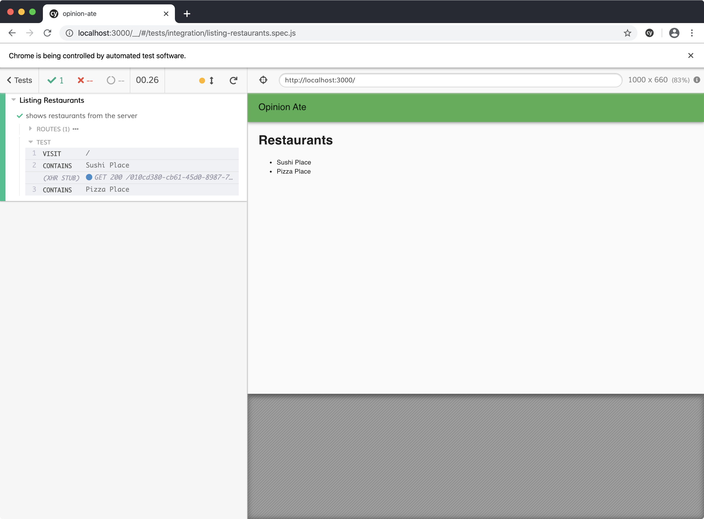
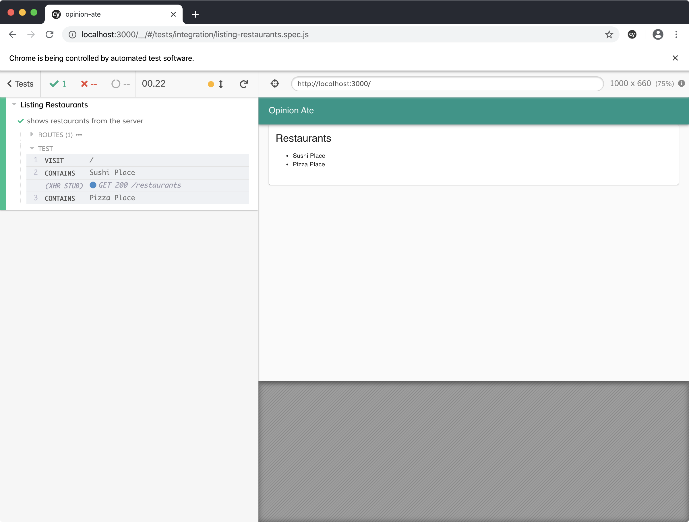
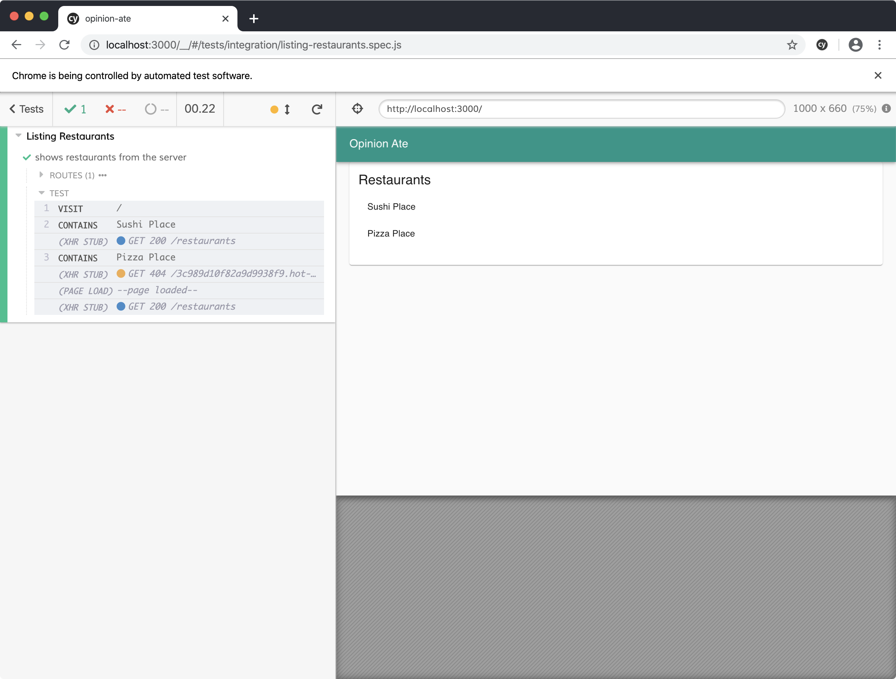

# 4 - Refactoring Styles

In this chapter we'll see one example of the kind of refactoring you can do when you have the thorough test coverage that TDD provides: restyling your application. We'll update our application from using plain unstyled HTML elements to using styled elements provided by a component library. TDD allows us to separate the process of getting the application working from the process of making it look good.

Our next story in Trello is "Style App with Material Design"; drag it to "In Progress".

And we need it: by following TDD and writing only the minimal code to pass the tests, we certainly don't have much in the way of visual design:


But one of the benefits of the thorough test suite that TDD provides is that you can make changes to the look and feel of your app with confidence that the functionality still works.

First, let's confirm our tests are passing. Run `yarn test`. You may get the message:

```sh
No tests found related to files changed since last commit.
Press `a` to run all tests, or run Jest with `--watchAll`.

Watch Usage
 › Press a to run all tests.
 › Press f to run only failed tests.
 › Press q to quit watch mode.
 › Press p to filter by a filename regex pattern.
 › Press t to filter by a test name regex pattern.
 › Press Enter to trigger a test run.
```

Press `a` to run all the tests. They should pass. Keep the unit test process running.

In another terminal, run `yarn start`, and in a third, run `yarn cypress`. Click `listing-restaurants.spec.js` and make sure it passes.

Now that we know all our tests pass, we're ready to update the look-and-feel of the app.
We're going to use Material-UI, a popular React component library that follows Google's Material Design.

Create a new branch for this story:

```sh
$ git checkout -b material-design
```

Install the core Material-UI package:

```sh
$ yarn add @material-ui/core
```

Now we're ready to begin styling our app. We'll begin by styling the `App` component to give it a title bar and some theme-standard layout.


In `App.js`, keep the `<RestaurantScreen />` component but wrap it with different Material-UI components:

```diff
 import React from 'react';
 import {Provider} from 'react-redux';
+import {createMuiTheme} from '@material-ui/core/styles';
+import green from '@material-ui/core/colors/green';
+import {ThemeProvider} from '@material-ui/styles';
+import CssBaseline from '@material-ui/core/CssBaseline';
+import AppBar from '@material-ui/core/AppBar';
+import Toolbar from '@material-ui/core/Toolbar';
+import Typography from '@material-ui/core/Typography';
+import Container from '@material-ui/core/Container';
 import store from './store';
 import RestaurantScreen from './components/RestaurantScreen';

+const theme = createMuiTheme({
+  palette: {
+    primary: green,
+  },
+});
+
 const App = () => (
   <Provider store={store}>
+    <ThemeProvider theme={theme}>
+      <CssBaseline />
+      <AppBar position="static">
+        <Toolbar>
+          <Typography variant="h6">Opinion Ate</Typography>
+        </Toolbar>
+      </AppBar>
+      <Container>
         <RestaurantScreen />
+      </Container>
+    </ThemeProvider>
  </Provider>
 );
```

Rerun the E2E test. They still pass, and notice we now have a nice green toolbar, and there's some padding on the left and right on the content area.



Here's what these Material-UI components do to achieve this look:

- `createMuiTheme()` allows us to configure a theme, including setting the `primary` color of our app to `green`.
- `ThemeProvider` is the root Material-UI component that lets it set up some things that affect your whole app, including taking the `theme`.
- `CssBaseline` applies default page-wide CSS styles.
- `AppBar` and `Toolbar` together provide the top title bar.
- `Typography` provides proper styling for the text at certain spots in the app, including in the toolbar. Material-UI components relate to one another like this, so it's always best to check the docs for full examples of what components to nest inside one another.
- `Container` centers your content horizontally to provide some padding, as well as keeping the content from getting too wide in really wide browser windows.

Next let's style `RestaurantScreen`. A common UI element in Material Design is a card, a box around some content. Let's style the `RestaurantScreen` to be a card:

```diff
 import React from 'react';
+import Card from '@material-ui/core/Card';
+import CardContent from '@material-ui/core/CardContent';
+import Typography from '@material-ui/core/Typography';
 import RestaurantList from './RestaurantList';

 const RestaurantScreen = () => (
-  <div>
-    <h1>Restaurants</h1>
+  <Card>
+    <CardContent>
+      <Typography variant="h5">Restaurants</Typography>
       <RestaurantList />
-  </div>
+    </CardContent>
+  </Card>
 );
```

Reload the E2E test and notice there's a box around the content now.



Here's what the components do:

- `Card` is the wrapper for the card and provides the outline.
- `CardContent` provides appropriate padding around the content area of a card.
- We saw `Typography` earlier for styling text. In this case, the correct variant for a card title is `h5`.

Finally, let's style the list of the restaurants. Material Design has a list concept that will look nice:

```diff
 import React, {useEffect} from 'react';
 import {connect} from 'react-redux';
+import List from '@material-ui/core/List';
+import ListItem from '@material-ui/core/ListItem';
+import ListItemText from '@material-ui/core/ListItemText';
 import {loadRestaurants} from '../store/restaurants/actions';

 export const RestaurantList = ({loadRestaurants, restaurants}) => {
...
   return (
-    <ul>
+    <List>
       {restaurants.map(restaurant => (
-        <li key={restaurant.id}>{restaurant.name}</li>
+        <ListItem key={restaurant.id}>
+          <ListItemText>{restaurant.name}</ListItemText>
+        </ListItem>
       ))}
-    </ul>
+    </List>
   );
```

Rerun the E2E test to see the changes:



Here's what the components do:

- `List` wraps a list and provides appropriate outer styling.
- `ListItem` is the wrapping component for the list item.
- `ListItemText` is the primary title in the list item.

Our E2E and unit tests still pass.
We've successfully styled our app relying on the tests to confirm all the functionality still works.

If you have any uncommitted changes, commit them to git. Push up your branch to the origin and open a pull request. Wait for CI to complete, then merge the pull request. Now we can drag our story to "Done" in Trello: "Style App with Material Design".

## What's Next
In this chapter we improved the look-and-feel of our first feature. But there are some functionality improvements it could benefit from as well. In the next chapter we'll add support for edge cases related to loading and error states.

:::tip
Questions about this chapter? Running into trouble? Come chat with us on the [Gitter Community for Outside-In Dev](https://gitter.im/outsideindev/community)!
:::
