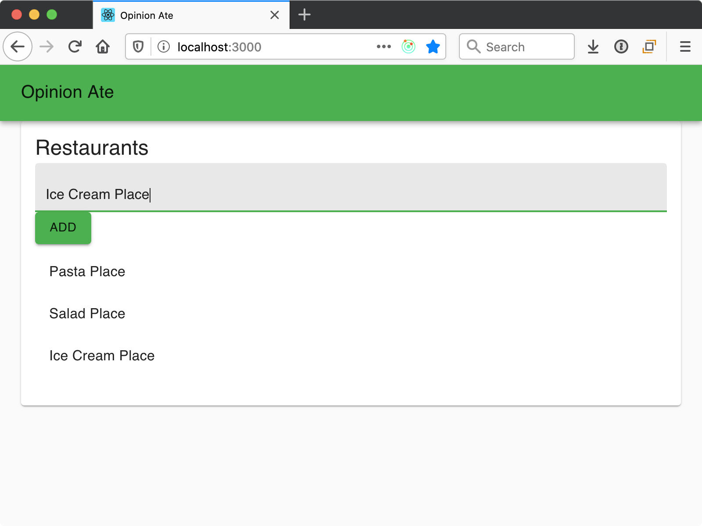
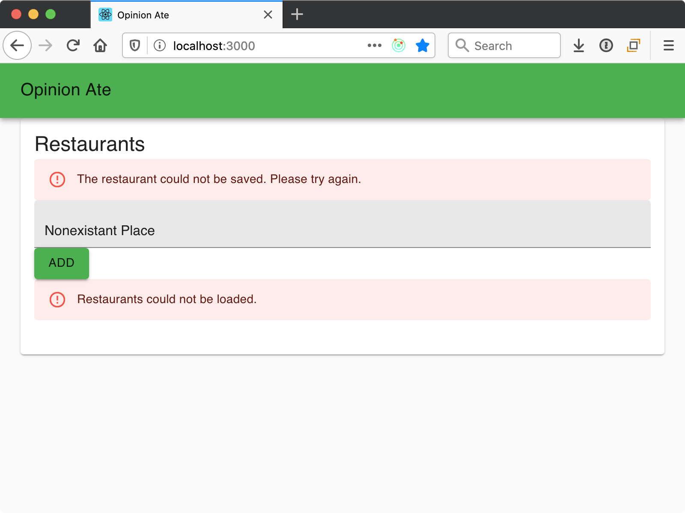
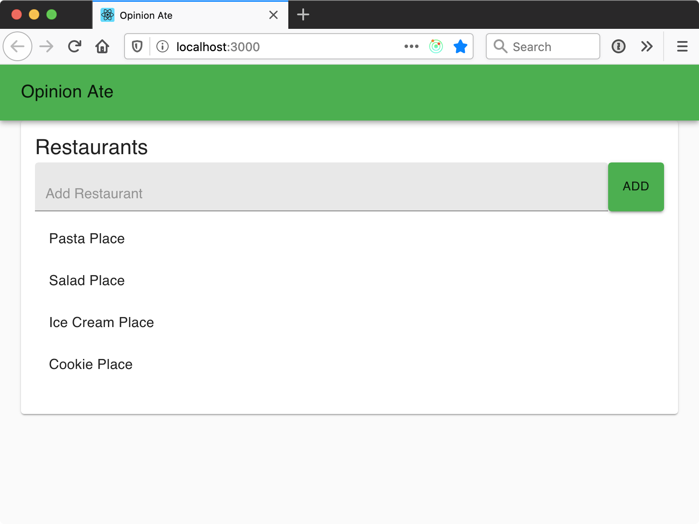
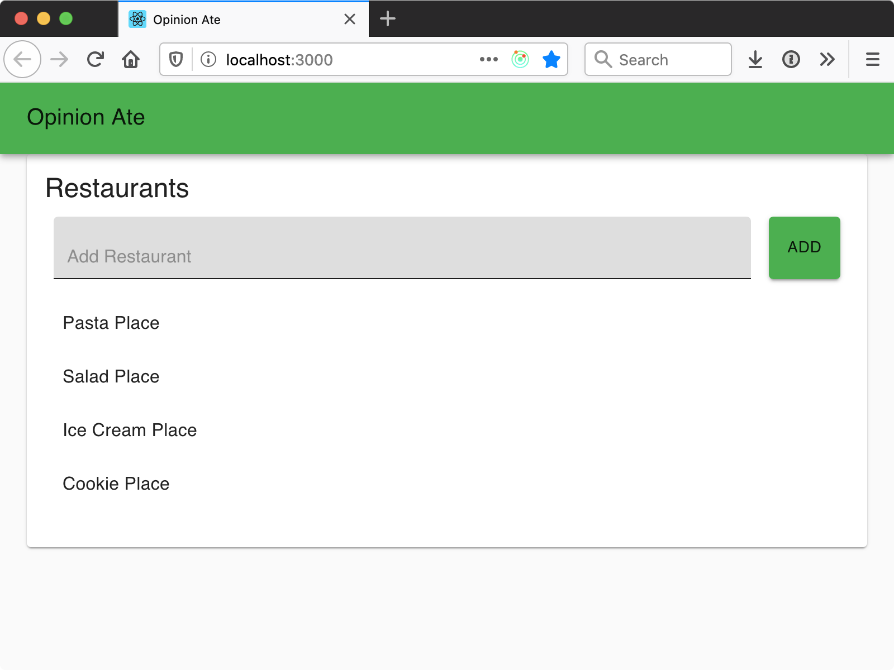

# 6 - Writing Data

In this chapter we'll move on to our next new feature. We'll follow the process of outside-in TDD once again, with an outer and inner red-green-refactor loop. We'll also see some of the situations that come up when testing forms and when saving data to an API.

Our next story in Trello is "Add Restaurants"; drag it to "In Progress".

## End-to-End Test

Create a new branch for this story:

```sh
$ git checkout -b creating-a-restaurant
```

To follow the outside-in TDD loop, we start by creating an E2E test that specifies our feature.
Create a file `cypress/integration/creating-a-restaurant.spec.js` and add the following:

```js
describe('Creating a Restaurant', () => {
  it('allows adding restaurants', () => {
    const restaurantId = 27;
    const restaurantName = 'Sushi Place';

    cy.server({force404: true});

    cy.route({
      method: 'GET',
      url:
        'https://outside-in-dev-api.herokuapp.com/YOUR-API-KEY/restaurants',
      response: [],
    });

    cy.route({
      method: 'POST',
      url:
        'https://outside-in-dev-api.herokuapp.com/YOUR-API-KEY/restaurants',
      response: {
        id: restaurantId,
        name: restaurantName,
      },
    }).as('addRestaurant');

    cy.visit('/');

    cy.get('[placeholder="Add Restaurant"]').type(restaurantName);
    cy.contains('Add').click();

    cy.wait('@addRestaurant').its('requestBody').should('deep.equal', {
      name: restaurantName,
    });

    cy.contains(restaurantName);
  });
});
```

As before, fill in your API key in place of `YOUR-API-KEY`.

As in our previous E2E test, we are stubbing the GET request to load the restaurants—but this time we're returning an empty array, as we don't need any restaurants for the test.

We also configure Cypress to handle a POST request, which is the request we'll use to create a restaurant. From it, we return an object that is the new restaurant that is created. We also chain a call to `.as()` on it to give it the name `addRestaurant`—we'll see why in a moment.

We visit the home page, and this time we interact with the page:

- We find an element with a placeholder of "Add Restaurant" (so, presumably a text input), and we type a restaurant name into it.
- We find an element "Add" and click it.

Next, we call `cy.wait()`. This waits for an HTTP request to be sent. We aren't doing this because the test would fail if we don't wait for the request; we're just "waiting" for it so we can get access to the request to make an assertion on it. We pass the name of the request we want to wait for, prepending an `@` to it. Specifically, we wait for our `addRestaurant` request to complete. Then we check that the restaurant name is correctly sent in the body of the request. It's not enough to stub out the request: we need to confirm our app is sending the *right* data to the server too.

Finally, we confirm that the restaurant name is shown on the page, showing that the restaurant has been added to the list.

Start your app with `yarn start`, then start Cypress with `yarn cypress`. Choose the "Creating a Restaurant" test.
It fails, showing the first bit of functionality we need to implement:

> CypressError: Timed out retrying after 4000ms: Expected to find element: '[placeholder="Add Restaurant"]', but never found it.

We need an "Add Restaurant" text input. What component should it be in? We discussed earlier that `RestaurantScreen` would hold both the restaurant list and new restaurant form. The text input should live on the New Restaurant Form, so it's time to create that component.
Create the file `src/components/NewRestaurantForm.js`, and add the following:

```js
import TextField from '@material-ui/core/TextField';

export const NewRestaurantForm = () => {
  return (
    <form>
      <TextField placeholder="Add Restaurant" fullWidth variant="filled" />
    </form>
  );
};

export default NewRestaurantForm;
```

Note the use of Material-UI's `TextField` component. Also note that we're using the block form of the arrow function. We will need other statements in there besides the returned JSX.

Next, add the form to the `RestaurantScreen` component:

```diff
 import RestaurantList from './RestaurantList';
+import NewRestaurantForm from './NewRestaurantForm';

 const RestaurantScreen = () => (
   <Card>
     <CardContent>
       <Typography variant="h5">Restaurants</Typography>
+      <NewRestaurantForm />
       <RestaurantList />
```

Rerun the E2E tests and they should get past finding and typing into the Add Restaurant input. The next error is:

> CypressError: Timed out retrying after 4000ms: Expected to find content: 'Add' but never did.

To fix this error, we add a button to `NewRestaurantForm` but don't wire it up to anything yet:

```diff
 import TextField from '@material-ui/core/TextField';
+import Button from '@material-ui/core/Button';

 export const NewRestaurantForm = () => {
   return (
     <form>
       <TextField placeholder="Add Restaurant" fullWidth variant="filled" />
+      <Button variant="contained" color="primary">
+        Add
+      </Button>
     </form>
   );
```

Rerun the E2E tests and we get this failure:

> CypressError: Timed out retrying after 5000ms: cy.wait() timed out waiting 5000ms for the 1st request to the route: 'addRestaurant'. No request ever occurred.

So now we need to send the request is our backend service. This is missing logic, so we will want to step down to unit tests to add it. How will it work?

- The `NewRestaurantForm` component will dispatch an asynchronous Redux action.
- The action will call a function in our API client.
- The API client will make an HTTP `POST` request.

## Unit Testing the Component

Starting from the outside as usual, we'll start with the `NewRestaurantForm` component. We want to reproduce the failure from the E2E test at the unit level. We should specify, when you click the send button, it should call a function prop—which in production will be wired to an action in our store. Now, the E2E test failure didn't tell us that we need to send along the restaurant name entered in the form, but we can go ahead and specify that that should be passed to the store, too.

Create the file `src/components/__tests__/NewRestaurantForm.spec.js` and start out by setting up the component and a mock function in a `beforeEach` block:

```js
import {render, screen} from '@testing-library/react';
import userEvent from '@testing-library/user-event';
import {NewRestaurantForm} from '../NewRestaurantForm';

describe('NewRestaurantForm', () => {
  const restaurantName = 'Sushi Place';

  let createRestaurant;

  beforeEach(() => {
    createRestaurant = jest.fn().mockName('createRestaurant');
    render(<NewRestaurantForm createRestaurant={createRestaurant} />);
  });
});
```

Next, let's try to proactively organize our test file. Since we're taking the approach of having one behavior per test, it's likely that we will ultimately have multiple tests for each situation. So let's group situations with a `describe` block with a `beforeEach`, even there there will only be one expectation at first. Add the following:

```js
describe('when filled in', () => {
  beforeEach(async () => {
    await userEvent.type(
      screen.getByPlaceholderText('Add Restaurant'),
      restaurantName,
    );
    userEvent.click(screen.getByTestId('new-restaurant-submit-button'));
  });

  it('calls createRestaurant with the name', () => {
    expect(createRestaurant).toHaveBeenCalledWith(restaurantName);
  });
});
```

We describe the situation when the form is filled in. We enter a restaurant name into a text field, then click the submit button. Note that `userEvent.type()` requires `await`ing afterward, but `userEvent.click()` does not.

Note that instead of finding the submit button by text, we find it by test ID. If we had a plain HTML `<button>` element, we could retrieve it either by text or test ID. But using Material-UI's `<Button>` component, using `getByText` will retrieve a `<span>` element instead, and clicking it does not seem to result in submitting the form. So in this case, we use the test ID, which retrieves the underlying `<button>` instead.

In `RestaurantList` we didn't pass any additional data with our action, so we just had to confirm that the action function was called. But here, we need to ensure the restaurant name is passed as an argument to the action function, so we need to use the `.toHaveBeenCalledWith()` matcher. We pass one argument to it, confirming that the correct `restaurantName` is passed through.

Save the file and we get a failing test, as we expect:

```sh
● NewRestaurantForm › when filled in › calls createRestaurant with the name

  TestingLibraryElementError: Unable to find an element by:
  [data-testid="new-restaurant-submit-button"]
```

Add the test ID to the button to find it:

```diff
 <form>
   <TextField placeholder="Add Restaurant" fullWidth variant="filled" />
-  <Button variant="contained" color="primary">
+  <Button
+    variant="contained"
+    color="primary"
+    data-testid="new-restaurant-submit-button"
+  >
     Add
   </Button>
 </form>
```

Now we get an assertion failure:

```sh
  ● NewRestaurantForm › when filled in › calls createRestaurant with the name

    expect(createRestaurant).toHaveBeenCalledWith(...expected)

    Expected: "Sushi Place"

    Number of calls: 0

      23 |
      24 |     it('calls createRestaurant with the name', () => {
    > 25 |       expect(createRestaurant).toHaveBeenCalledWith(restaurantName);
         |                                ^
```

The test failure reports the action wasn't called at all. This is because our button isn't currently hooked up to anything. The typical way to set this up in HTML forms is to make the button a `submit` button, so it submits the form:

```diff
 <form>
   <TextField placeholder="Add Restaurant" fullWidth variant="filled" />
   <Button
+    type="submit"
     variant="contained"
     color="primary"
     data-testid="new-restaurant-submit-button"
   >
     Add
   </Button>
 </form>
```

Now, write just enough production code to get past the current test failure, let's just call the action without any arguments:

```diff
 import Button from '@material-ui/core/Button';

-export const NewRestaurantForm = () => {
+export const NewRestaurantForm = ({createRestaurant}) => {
   return (
-    <form>
+    <form onSubmit={() => createRestaurant()}>
       <TextField placeholder="Add Restaurant" fullWidth variant="filled" />
```

We set up an `onSubmit` prop for the form tag, passing an arrow function that calls `createRestaurant`. We don't just pass the `createRestaurant` function directly because that would result in passing the browser event object to `createRestaurant`, what we don't want. This way there are no arguments.

Save the file and now we get this test error:

```sh
Error: Not implemented: HTMLFormElement.prototype.submit
    at module.exports (/Users/josh/apps/agilefrontend/react/node_modules/jsdom/
    lib/jsdom/browser/not-implemented.js:9:17)
```

This is because the HTML form is attempting to submit using the default browser mechanism. By default, HTML forms make their own request to the server when they're submitted, refreshing the page. This is because HTML forms predate using JavaScript to make HTTP requests. This reload restarts our frontend app, losing our progress.

To prevent this page reload from happening, we need to call the `preventDefault()` method on the event sent to the `onSubmit` event. We can do this by extracting a handler function:

```diff
 export const NewRestaurantForm = ({createRestaurant}) => {
+  const handleSubmit = e => {
+    e.preventDefault();
+    createRestaurant();
+  };
+
   return (
-    <form onSubmit={() => createRestaurant(name)}>
+    <form onSubmit={handleSubmit}>
       <TextField placeholder="Add Restaurant" fullWidth variant="filled" />
```

Save the file and the test failure has changed:

```sh
  ● NewRestaurantForm › when filled in › calls createRestaurant with the name

    expect(createRestaurant).toHaveBeenCalledWith(...expected)

    Expected: "Sushi Place"
    Received: called with 0 arguments

    Number of calls: 1


      25 |
      26 |     it('calls createRestaurant with the name', () => {
    > 27 |       expect(createRestaurant).toHaveBeenCalledWith(restaurantName);
         |                                ^
```

The function didn't receive the argument it expected: it wanted "Sushi Place", but it didn't receive any arguments. To pass the restaurant name, first we're going to need to set up a state item for the name:

```diff
+import {useState} from 'react';
 import TextField from '@material-ui/core/TextField';
 import Button from '@material-ui/core/Button';

 export const NewRestaurantForm = ({createRestaurant}) => {
+  const [name, setName] = useState('');
+
   const handleSubmit = e => {
```

Then, we'll make `TextField` a controlled component, reading its value from the `name` state item and writing changes back using `setName`:

```diff
 return (
   <form onSubmit={handleSubmit}>
-    <TextField placeholder="Add Restaurant" fullWidth variant="filled" />
+    <TextField
+      value={name}
+      onChange={e => setName(e.target.value)}
+      placeholder="Add Restaurant"
+      fullWidth
+      variant="filled"
+    />
    <Button
```

Finally, now that the entered text is stored in `name`, we'll pass that as the argument to `createRestaurant()`:

```diff
 export const NewRestaurantForm = ({createRestaurant}) => {
   const handleSubmit = e => {
     e.preventDefault();
-    createRestaurant();
+    createRestaurant(name);
   };
```

Save the file and the test passes.

## Stepping Back Up

We'll circle back to test-drive edge case functionality to the form later. But now that we have completed the functionality the E2E test drove us to, let's step back up to the E2E test to see what functionality we need to implement next. Rerun the E2E test and see the following failure:

```sh
TypeError: createRestaurant is not a function
```

`createRestaurant` is not defined because we aren't passing it in to `NewRestaurantForm` as a prop. This is just a structural error, not a logic error, so let's fix this error directly instead of stepping down to a unit test yet.

We want the `createRestaurant` prop to be passed in by Redux as an action, so let's wire it up:

```diff
 import {useState} from 'react';
+import {connect} from 'react-redux';
 import TextField from '@material-ui/core/TextField';
 import Button from '@material-ui/core/Button';
+import {createRestaurant} from '../store/restaurants/actions';

 export const NewRestaurantForm = ({createRestaurant}) => {
...
 };

-export default NewRestaurantForm;
+const mapStateToProps = null;
+const mapDispatchToProps = {createRestaurant};
+
+export default connect(mapStateToProps, mapDispatchToProps)(NewRestaurantForm);
```

Next, define a `createRestaurant` action in `src/store/restaurants/actions.js`. Because we know this will be an async action, we can go ahead and implement it that way:

```js
export const createRestaurant = () => () => {};
```

Rerun the E2E test, and it fails on a new error:

> CypressError: Timed out retrying after 5000ms: cy.wait() timed out waiting 5000ms for the 1st request to the route: 'addRestaurant'. No request ever occurred.

Now our component is correctly calling our `createRestaurant` async action, but that function isn't doing anything. We need it to make the appropriate call to the API, then dispatch an action that results in the reducer adding the new restaurant to the list. That's a logic error, so it's time to step down to a unit test to drive out our store functionality.

## Unit Testing the Store

In `src/store/__tests__/restaurants.spec.js`, below the "loadRestaurants action" group, add a "createRestaurant action" group, and write a test to confirm the API is called:

```js
describe('createRestaurant action', () => {
  const newRestaurantName = 'Sushi Place';

  let api;
  let store;

  beforeEach(() => {
    api = {
      createRestaurant: jest.fn().mockName('createRestaurant'),
    };

    const initialState = {};

    store = createStore(
      restaurantsReducer,
      initialState,
      applyMiddleware(thunk.withExtraArgument(api)),
    );
  });

  it('saves the restaurant to the server', () => {
    store.dispatch(createRestaurant(newRestaurantName));
    expect(api.createRestaurant).toHaveBeenCalledWith(newRestaurantName);
  });
});
```

We'll need to add a second expectation shortly so we go ahead and set up the test in a `beforeEach`.

We also need to import `createRestaurant`:

```diff
 import restaurantsReducer from '../restaurants/reducers';
-import {loadRestaurants} from '../restaurants/actions';
+import {loadRestaurants, createRestaurant} from '../restaurants/actions';

 describe('restaurants', () => {
```

Save the file, and the test fails because the API method was not called:

```sh
  ● restaurants › createRestaurant action › saves the restaurant to the server

    expect(createRestaurant).toHaveBeenCalledWith(...expected)

    Expected: "Sushi Place"

    Number of calls: 0
```

Update the `createRestaurant` thunk to call it:

```diff
-export const createRestaurant = () => () => {};
+export const createRestaurant = () => (dispatch, getState, api) => {
+  api.createRestaurant();
+};
```

This changes the test failure. Now the method is called, but not with the right arguments:

```sh
● restaurants › createRestaurant action › saves the restaurant to the server

    expect(createRestaurant).toHaveBeenCalledWith(...expected)

    Expected: "Sushi Place"
    Received: called with 0 arguments

    Number of calls: 1
```

Our restaurant name is passed in as the first argument of the action, so we can pass it along to the API method:

```diff
-export const createRestaurant = () => (dispatch, getState, api) => {
+export const createRestaurant = name => (dispatch, getState, api) => {
-  api.createRestaurant();
+  api.createRestaurant(name);
 };
```

Save the file and the test passes. Now we need to specify one more thing that happens when the `create` action is dispatched: the returned restaurant from the API, including the ID that the API gives the record, is appended to the restaurant list in the state. To write that test, we're going to need to add a little to the setup as well:

```diff
 describe('createRestaurant action', () => {
   const newRestaurantName = 'Sushi Place';
+  const existingRestaurant = {id: 1, name: 'Pizza Place'};
+  const responseRestaurant = {id: 2, name: newRestaurantName};

   let api;
   let store;

   beforeEach(() => {
     api = {
       createRestaurant: jest.fn().mockName('createRestaurant'),
     };

-    const initialState = {};
+    const initialState = {records: [existingRestaurant]};

     store = createStore(
```

This adds a restaurant to the pre-existing list of restaurants in the store. Save the file and the tests should still pass.

Now we're ready to specify that the returned restaurant is added to the store. Let's add it in a "describe" block:

```js
describe('when save succeeds', () => {
  beforeEach(() => {
    api.createRestaurant.mockResolvedValue(responseRestaurant);
    store.dispatch(createRestaurant(newRestaurantName));
  });

  it('stores the returned restaurant in the store', () => {
    expect(store.getState().records).toEqual([
      existingRestaurant,
      responseRestaurant,
    ]);
  });
});
```

We ensure that the existing restaurant is still in the store, and the restaurant record returned from the server is added after it. Save the file and the test fails:

```sh
● restaurants › createRestaurant action › when save succeeds › stores the
returned restaurant in the store

  expect(received).toEqual(expected) // deep equality

  - Expected  - 4
  + Received  + 0

    Array [
      Object {
        "id": 1,
        "name": "Pizza Place",
      },
  -   Object {
  -     "id": 2,
  -     "name": "Sushi Place",
  -   },
    ]
```

The store only contains the restaurant it was initialized with, not the new one the server returned. Let's update the action to handle the returned value:

```diff
 export const RECORD_LOADING_ERROR = 'RECORD_LOADING_ERROR';
+export const ADD_RESTAURANT = 'ADD_RESTAURANT';

 export const loadRestaurants = () => (dispatch, getState, api) => {
...
 export const createRestaurant = name => (dispatch, getState, api) => {
-  api.createRestaurant(name);
+  api.createRestaurant(name).then(record => {
+    dispatch(addRestaurant(record));
+  });
 };
+
+const addRestaurant = record => ({
+  type: ADD_RESTAURANT,
+  record,
+});
```

After `createRestaurant()` resolves, we take the record the API returns to us and dispatch a new `addRestaurant()` action. Now let's respond to that action in the reducer:

```diff
   RECORD_LOADING_ERROR,
+  ADD_RESTAURANT,
 } from './actions';
...
 const records = (state = [], action) => {
   switch (action.type) {
     case STORE_RESTAURANTS:
       return action.records;
+    case ADD_RESTAURANT:
+      return [...state, action.record];
     default:
       return state;
   }
 };
```

When `ADD_RESTAURANT` is dispatched we set records to a new array including the previous array, plus the new record on the end.

This makes our latest test pass, but our previous "saves the restaurant to the server" test now fails:

```sh
● restaurants › createRestaurant action › saves the restaurant to the server

  TypeError: Cannot read properties of undefined (reading 'then')

    13 |
    14 | export const createRestaurant = name => (dispatch, getState, api) => {
  > 15 |   api.createRestaurant(name).then(record => dispatch(addRestaurant(record)));
       |   ^
    16 | };
```

Now that we are chaining `.then()` onto the call to `api.createRestaurant()`, our previous test fails because we didn't configure the mock function to resolve. Do that:

```diff
 it('saves the restaurant to the server', () => {
+  api.createRestaurant.mockResolvedValue(responseRestaurant);
   store.dispatch(createRestaurant(newRestaurantName));
   expect(api.createRestaurant).toHaveBeenCalledWith(newRestaurantName);
 });
```

Save and all unit tests pass. Now our store should be set.

## Creating the API Method

Let's step back up to the E2E level and see if the E2E test has progressed. Rerun it and we still get the same failure:

> CypressError: Timed out retrying: cy.wait() timed out waiting 5000ms for the 1st request to the route: 'addRestaurant'. No request ever occurred.

What's the cause this time? Open the browser tools in Cypress and check the console tab. You should see an error:

```sh
TypeError: api.createRestaurant is not a function
```

Our component is successfully dispatching the action to the store, which is successfully calling `api.createRestaurant()`, but we haven't implemented it yet. Let's do that now. Remember, we don't unit test our API, so we can implement this method directly, driven by the E2E test. Let's start by fixing the immediate error by defining an empty `createRestaurant()` method:

```diff
 const api = {
   loadRestaurants() {
     return client.get('/restaurants').then(response => response.data);
   },
+  createRestaurant() {},
 };
```

Now we get another console error:

```sh
TypeError: Cannot read properties of undefined (reading 'then')
```

We still aren't making the HTTP request that kicked off this whole sequence. Fixing this will move us forward better, so let's actually make the HTTP request in the API:

```diff
   },
-  createRestaurant() {},
+  createRestaurant() {
+    return client.post('/restaurants', {});
+  },
 };
```

Now the `POST` request is made, and we get an error on the assertion we made about the request's body:

> ASSERT expected {} to deeply equal { name: Sushi Place }

So we aren't passing the restaurant name in the `POST` body. That's easy to fix by passing it along from the argument to the method:

```diff
-createRestaurant() {
+createRestaurant(name) {
-  return client.post('/restaurants', {});
+  return client.post('/restaurants', {name});
 },
```

Cypress confirms we're sending the `POST` request to the server correctly, and we've finally moved on to the next E2E assertion failure:

> CypressError: Timed out retrying: Expected to find content: 'Sushi Place' but never did.

We aren't displaying the restaurant on the page. This is because we aren't yet returning it properly from the resolved value. The Axios promise resolves to an Axios response object, but we want to resolve to the record. We can do this by getting the response body:

```diff
 createRestaurant(name) {
-  return client.post('/restaurants', {name});
+  return client.post('/restaurants', {name}).then(response => response.data);
 },
```

Rerun the E2E test and it passes, and we see Sushi Place added to the restaurant list. Our feature is complete!

Try out creating a restaurant for real. Reload the page to make sure it's really saved to the server.



## Clearing the Text Field
Now let's look into those edge cases:

* The form should clear out the text field after you save a restaurant.
* If the form is submitted with an empty restaurant name, it should show a validation error, and not submit to the server.
* If the save fails an error message should be shown, and the restaurant name should not be cleared.

First, let's implement the form clearing out the text field after saving. In `NewRestaurantForm.spec.js`, add a new test:

```diff
   it('calls createRestaurant with the name', () => {
     expect(createRestaurant).toHaveBeenCalledWith(restaurantName);
   });
+
+  it('clears the name', () => {
+    expect(screen.getByPlaceholderText('Add Restaurant').value).toEqual('');
+  });
 });
```

Save the test, and we get a test failure confirming that the text field is not yet cleared:

```sh
  ● NewRestaurantForm › when filled in › clears the name

    expect(received).toEqual(expected) // deep equality

    Expected: ""
    Received: "Sushi Place"

      27 |
      28 |     it('clears the name', () => {
    > 29 |       expect(screen.getByPlaceholderText('Add Restaurant').value).toEqual('');
         |                                                                 ^
```

Where in the component should we clear the text field? Well, we have another story that the name should _not_ be cleared if the web service call fails. If that's the case, then we should not clear the text field until the store action resolves successfully.
Make this change in `NewRestaurantForm.js`:

```diff
 const handleSubmit = e => () {
   e.preventDefault();
-  createRestaurant(name);
+  createRestaurant(name).then(() => {
+    setName('');
+  });
 },
```

Save the file and the test fails, and we get a lot of scary console output. Let's handle one thing at a time. The easier one to fix is:

```sh
Error: Uncaught [TypeError: Cannot read properties of undefined (reading 'then')]
```

Our mocked `api.createRestaurant` doesn't return a promise; let's update it to return a resolved one:

```diff
 beforeEach(async () => {
+  createRestaurant.mockResolvedValue();
   await userEvent.type(
```

Save and the test now passes; what's left is a warning:

```sh
Warning: An update to NewRestaurantForm inside a test was not wrapped in act(...).

When testing, code that causes React state updates should be wrapped into act(...):

act(() => {
  /* fire events that update state */
});

/* assert on the output */

This ensures that you're testing the behavior the user would see in the browser.
```

What exactly is going on here is complex and beyond the scope of this tutorial. Specifically in this case, the React component state is being updated asynchronously, and React is warning us that we may have timing issues.

In this specific case, the easiest fix is to use the `flush-promises` npm package. Add it to your project:

```sh
$ yarn add --dev flush-promises@1.0.2
```

Then add it to your test:

```diff
-import {render, screen} from '@testing-library/react';
+import {act, render, screen} from '@testing-library/react';
 import userEvent from '@testing-library/user-event';
+import flushPromises from 'flush-promises';
 import {NewRestaurantForm} from '../NewRestaurantForm';
...
       userEvent.click(getByTestId('new-restaurant-submit-button'));
+
+      return act(flushPromises);
     });
```

We call `act()` at the end of our `beforeEach` block, passing it the `flushPromises` function. This means that React will call that function and wait for it to resolve, responding to component changes that may have happened appropriately. We return the result of `act`, so that Jest will wait on *that* before running individual tests.

Save the file and our test finally passes cleanly!

We have a little bit to unit test in the store as well: `NewRestaurantForm` is relying on the `create` action returning a promise that resolves when the server request completes. To test this, first let's add a test to the "when save succeeds" block:

```diff
 describe('createRestaurant action', () => {
...
   let api;
   let store;
+  let promise;

   beforeEach(() => {
...
   describe('when save succeeds', () => {
     beforeEach(() => {
       api.createRestaurant.mockResolvedValue(responseRestaurant);
-      store.dispatch(createRestaurant(newRestaurantName));
+      promise = store.dispatch(createRestaurant(newRestaurantName));
     });

     it('stores the returned restaurant in the store', () => {
       expect(store.getState().records).toEqual([
         existingRestaurant,
         responseRestaurant,
       ]);
     });

+    it('resolves', () => {
+      return expect(promise).resolves.toBeUndefined();
+    });
```

Here's what's going on in this test:

- We use the `.resolves` helper to confirm that the promise resolves instead of rejecting.
- Although we don't care about the value the promise resolves with, Jest requires a matcher to be used after `.resolves`. To allow us to resolve without a value, we check that the resolved value is `undefined`.
- We need Jest to wait on the promise to settle before it considers the test complete, so, as elsewhere, we return the promise we want Jest to wait on.

The test fails:

```sh
● restaurants › createRestaurant action › when save succeeds › resolves

  expect(received).resolves.toBeUndefined()

  Matcher error: received value must be a promise

  Received has value: undefined
```

So right now the return value of `store.dispatch()` is `undefined`. But if we return the promise chain from our async action function, Redux will return that from `store.dispatch()`. Let's do that:

```diff
 export const createRestaurant = name => (dispatch, getState, api) => {
-  api.createRestaurant(name).then(record => {
+  return api.createRestaurant(name).then(record => {
     dispatch(addRestaurant(record)));
   });
 };
```

Save and the test passes. Our component and store should now be set to work together to clear the name field.
If you add a new restaurant in the browser, now you'll see the name field cleared out afterward:


## Validation Error

Now let's implement the validation error when the restaurant name is empty. We'll start with the component test. Create a new `describe` block for this situation, below the "when filled in" describe block. We'll start with just one of the expectations, to confirm a validation error is shown:

```js
describe('when empty', () => {
  beforeEach(async () => {
    createRestaurant.mockResolvedValue();

    userEvent.click(screen.getByTestId('new-restaurant-submit-button'));

    return act(flushPromises);
  });

  it('displays a validation error', () => {
    expect(screen.queryByText('Name is required')).not.toBeNull();
  });
});
```

Note that we don't type into the text field; this ensures it will keep the default value, which is the empty string.

Save the file and the test fails, because the validation error message is not found:

```sh
  ● NewRestaurantForm › when empty › displays a validation error

    expect(received).not.toBeNull()

    Received: null

      50 |     it('displays a validation error', () => {
      51 |       const {queryByText} = context;
    > 52 |       expect(queryByText('Name is required')).not.toBeNull();
         |                                                   ^
```

Let's fix this error in the simplest way possible by adding the validation error unconditionally:

```diff
 import Button from '@material-ui/core/Button';
+import Alert from '@material-ui/lab/Alert';
 import {createRestaurant} from '../store/restaurants/actions';
...
   return (
     <form onSubmit={handleSubmit}>
+      <Alert severity="error">Name is required</Alert>
       <TextField
```

The tests pass. Now how can we write a test to drive out hiding that validation error in other circumstances? Well, we can check that it's not shown when the form is first rendered.

In preparation, let's move the validation error text we're searching for to a constant directly under our top-level `describe`:

```diff
 describe('NewRestaurantForm', () => {
   const restaurantName = 'Sushi Place';
+  const requiredError = 'Name is required';
+
   let createRestaurant;
...
     it('displays a validation error', () => {
       const {queryByText} = context;
-      expect(queryByText('Name is required')).not.toBeNull();
+      expect(queryByText(requiredError)).not.toBeNull();
     });
```

Save and confirm the tests still pass.

Next, add a new `describe` above the "when filled in" one:

```js
describe('initially', () => {
  it('does not display a validation error', () => {
    expect(screen.queryByText(requiredError)).toBeNull();
  });
});
```

The test fails because we are always showing the error right now:

```sh
  ● NewRestaurantForm › initially › does not display a validation error

    expect(received).toBeNull()

    Received: <div class="MuiAlert-message">Name is required</div>

      20 |     it('does not display a validation error', () => {
      21 |       const {queryByText} = context;
    > 22 |       expect(queryByText(requiredError)).toBeNull();
         |                                          ^
```

Time to add some logic around this error.
We'll add state to indicate whether it should be shown:

```diff
 export const NewRestaurantForm = ({createRestaurant}) => {
   const [name, setName] = useState('');
+  const [validationError, setValidationError] = useState(false);

   const handleSubmit = e => {
...
   return (
     <form onSubmit={handleSubmit}>
-      <Alert severity="error">Name is required</Alert>
+      {validationError && <Alert severity="error">Name is required</Alert>}
       <TextField
```

Now, what logic should we use to set the `validationError` flag? Our tests just specify that initially the error is not shown, and after submitting an invalid form it's shown—that's all. The simplest logic to pass this test is to always show the validation error after saving:

```diff
 const handleSubmit = e => {
   e.preventDefault();
+  setValidationError(true);
   createRestaurant(name).then(() => {
```

Save the file and all tests pass.

It may feel obvious to you that this is not the correct final logic, so this should drive us to consider what test we are missing. What should behave differently? Well, when we submit a form with a name filled in, the validation error should not appear. Let's add that test to the "when filled in" `describe` block:

```js
it('does not display a validation error', () => {
  expect(screen.queryByText(requiredError)).toBeNull();
});
```

We can pass this test by adding a conditional around setting the `validationError` flag:

```diff
 const handleSubmit = e => {
   e.preventDefault();
-  setValidationError(true);
+
+  if (!name) {
+    setValidationError(true);
+  }
+
   createRestaurant(name).then(() => {
```

Save the file and all tests pass.

Now, is there any other time we would want to hide or show the validation error? Well, if the user submits an empty form, gets the error, then adds the missing name and submits it again, we would want the validation error cleared out. Let's create this scenario as another `describe` block, below the "when empty" one:

```js
describe('when correcting a validation error', () => {
  beforeEach(async () => {
    createRestaurant.mockResolvedValue();

    userEvent.click(screen.getByTestId('new-restaurant-submit-button'));

    await userEvent.type(
      screen.getByPlaceholderText('Add Restaurant'),
      restaurantName,
    );
    userEvent.click(screen.getByTestId('new-restaurant-submit-button'));

    return act(flushPromises);
  });

  it('clears the validation error', () => {
    expect(screen.queryByText(requiredError)).toBeNull();
  });
});
```

Note that we repeat both sets of `beforeEach` steps from the other groups, submitting the empty form and then submitting the filled-in one. We want our unit tests to be independent, so they can be run without depending on the result of other tests. If this repeated code got too tedious we could extract it to helper functions that we could call in each `describe` block.

Save the test file and we get the `act()` warning again:

```sh
Warning: An update to NewRestaurantForm inside a test was not wrapped in act(...).
```

This usually happens when we move on from interacting with our component too early. In this case, it's because after the first time we click our submit button, we start interacting with the component again right away. Instead, we need to add another `await act(flushPromises)` at that point:

```diff
 userEvent.click(getByTestId('new-restaurant-submit-button'));
+await act(flushPromises);

 await userEvent.type(
   getByPlaceholderText('Add Restaurant'),
   restaurantName,
 );
 userEvent.click(getByTestId('new-restaurant-submit-button'));

 return act(flushPromises);
```

Save the test file and the warning is gone, and we just have a test failure:

```sh
  ● NewRestaurantForm › when correcting a validation error › clears the
  validation error

    expect(received).toBeNull()

    Received: <div class="MuiAlert-message">Name is required</div>

      80 |     it('clears the validation error', () => {

      81 |       const {queryByText} = context;
    > 82 |       expect(queryByText(requiredError)).toBeNull();
         |                                          ^
```

We can fix this by clearing the `validationError` flag upon a successful submission:

```diff
 if (!name) {
   setValidationError(true);
+} else {
+  setValidationError(false);
 }
```

Note that we aren't waiting for the web service to return to clear it out, the way we clear out the name field. We know right away that the form is valid, so we can clear it before the web service call is made.

Save and the tests pass. Now that we have an `each` branch to that conditional, let's invert the boolean to make it easier to read. Refactor it to:

```js
if (name) {
  setValidationError(false);
} else {
  setValidationError(true);
}
```

Save and the tests should still pass.

Now we can handle the other expectation for when we submit an empty form: it should not dispatch the action to save the restaurant to the server. Add a new test in the "when empty" `describe` block:

```js
it('does not call createRestaurant', () => {
  expect(createRestaurant).not.toHaveBeenCalled();
});
```

We can fix this error by moving the call to `createRestaurant()` inside the true branch of the conditional:

```diff
   if (name) {
     setValidationError(false);
+    createRestaurant(name).then(() => {
+      setName('');
+    });
   } else {
     setValidationError(true);
   }
-
-  createRestaurant(name).then(() => {
-    setName('');
-  });
 };
```

Save the file and the test passes. If you try to submit the form with an empty restaurant name in the browser, you'll see:


## Server Error

Our third edge case is when the web service call fails. We want to display a server error.

We'll want to check for the message in a few different places, so let's set it up as a constant in the uppermost `describe` block:

```diff
 describe('NewRestaurantForm', () => {
   const restaurantName = 'Sushi Place';
   const requiredError = 'Name is required';
+  const serverError = 'The restaurant could not be saved. Please try again.';

   let createRestaurant;
```

Since this is a new situation, let's set this up as yet another new `describe` block:

```js
describe('when the store action rejects', () => {
  beforeEach(async () => {
    createRestaurant.mockRejectedValue();

    await userEvent.type(
      screen.getByPlaceholderText('Add Restaurant'),
      restaurantName,
    );
    userEvent.click(screen.getByTestId('new-restaurant-submit-button'));

    return act(flushPromises);
  });

  it('displays a server error', () => {
    expect(screen.queryByText(serverError)).not.toBeNull();
  });
});
```

This is the same as the successful submission case, but in the setup we call the `mockRejectedValue()` method of the mock function `restaurantsModule.actions.create`. This means that when this function is called, it will reject. In our case we don't actually care about what error it rejects with, so we don't have to provide a rejected value.

Save the file and we get an expectation failure:

```sh
  ● NewRestaurantForm › when the store action rejects › displays an error message

    expect(received).not.toBeNull()

    Received: null

      104 |       expect(queryByText(serverError)).not.toBeNull();
          |                                            ^
```

As usual, we'll first solve this by hard-coding the element into the component:

```diff
 return (
   <form onSubmit={handleSubmit}>
+    <Alert severity="error">
+      The restaurant could not be saved. Please try again.
+    </Alert>
     {validationError && <Alert severity="error">Name is required</Alert>}
```

Save and we get a bit of a strange error:

```sh
  ● NewRestaurantForm › when the store action rejects › displays an error message

    thrown: undefined
```

The message isn't very helpful, but "thrown" is a clue. What's happening is that our call to `createRestaurants()` is rejecting, but we aren't handling it. Let's handle it with an empty `catch()` function, just to silence this warning; we'll add behavior to that `catch()` function momentarily.

```diff
 if (name) {
   setValidationError(false);
-  createRestaurant(name).then(() => {
-    setName('');
-  });
+  createRestaurant(name)
+    .then(() => {
+      setName('');
+    })
+    .catch(() => {});
 } else {
```

Save and the test passes. Now, when do we want that message to *not* show? For one thing, when the component first renders. Add another test to the "initially" describe block:

```js
it('does not display a server error', () => {
  expect(screen.queryByText(serverError)).toBeNull();
});
```

Save and the test fails.

We'll add another bit of state to track whether the error should show, starting hidden, and shown if the store action rejects:

```diff
 export const NewRestaurantForm = ({createRestaurant}) => {
   const [name, setName] = useState('');
   const [validationError, setValidationError] = useState(false);
+  const [serverError, setServerError] = useState(false);

   const handleSubmit = e => {
...
       createRestaurant(name)
         .then(() => {
           setName('');
         })
-        .catch(() => {});
+        .catch(() => {
+          setServerError(true);
+        });
     } else {
...
   return (
     <form onSubmit={handleSubmit}>
-      <Alert severity="error">
-        The restaurant could not be saved. Please try again.
-      </Alert>
+      {serverError && (
+        <Alert severity="error">
+          The restaurant could not be saved. Please try again.
+        </Alert>
+      )}
       {validationError && <Alert severity="error">Name is required</Alert>}
```

Save and the tests pass.

Let's also write a test to confirm that the server error is not shown after the server request returns successfully. In the "when filled in" describe block, add an identical test:

```js
it('does not display a server error', () => {
  expect(screen.queryByText(serverError)).toBeNull();
});
```

Save and the test passes. This is another instance where the test doesn't drive new behavior, but it's helpful for extra assurance that the code is behaving the way we expect.

We also want to hide the server error message each time we retry saving the form. This is a new situation, so let's create a new `describe` block for it:

```js
describe('when retrying after a server error', () => {
  beforeEach(async () => {
    createRestaurant.mockRejectedValueOnce().mockResolvedValueOnce();

    await userEvent.type(
        screen.getByPlaceholderText('Add Restaurant'),
        restaurantName,
      );
    userEvent.click(screen.getByTestId('new-restaurant-submit-button'));
    userEvent.click(screen.getByTestId('new-restaurant-submit-button'));
    return act(flushPromises);
  });

  it('clears the server error', () => {
    expect(screen.queryByText(serverError)).toBeNull();
  });
});
```

Save the file and you'll get the expected test failure:

```sh
  ● NewRestaurantForm › when retrying after a server error › clears the server error

    expect(received).toBeNull()

    Received: <div class="MuiAlert-message">The restaurant could not be saved. Pleas
e try again.</div>

      126 |
      127 |     it('clears the server error', () => {
    > 128 |       expect(screen.queryByText(serverError)).toBeNull();
          |                                             ^
```

We should be able to make this test pass by just clearing the `serverError` flag when attempting to save:

```diff
 if (name) {
   setValidationError(false);
+  setServerError(false);
   createRestaurant(name)
```

Save the file, but surprisingly, the test failure doesn't change! Why is that? It turns out the culprit is clicking the submit button twice in a row. We want to wait for the first web request to return and update the state, _then_ send the second one.

We can fix this by waiting for promises to flush after the first click, as well as after the second:

```diff
   await userEvent.type(
       screen.getByPlaceholderText('Add Restaurant'),
       restaurantName,
     );
   userEvent.click(screen.getByTestId('new-restaurant-submit-button'));
+  await act(flushPromises);
+
   userEvent.click(screen.getByTestId('new-restaurant-submit-button'));
   return act(flushPromises);
```

Save and the test should pass.

Now we have just one more component test to make: that the restaurant name is not cleared when the server rejects. This should already be working because of how we implemented the code, but it would be frustrating for the user if they lost their data, so this is an especially important case to test. Add another expectation to the "when the store action rejects" `describe` block:

```js
it('does not clear the name', () => {
  expect(screen.getByPlaceholderText('Add Restaurant').value).toEqual(
    restaurantName,
  );
});
```

Save and the test passes, confirming that the user's data is safe.

Now we need to add one more store test as well: `NewRestaurantForm` is relying on the `createRestaurant` action returning a promise that rejects when there is a server error. Let's make sure this is happening. Add the following "describe" block inside "createRestaurant action" below "when save succeeds":

```js
describe('when save fails', () => {
  it('rejects', () => {
    api.createRestaurant.mockRejectedValue();
    promise = store.dispatch(createRestaurant(newRestaurantName));
    return expect(promise).rejects.toBeUndefined();
  });
});
```

The test passes right away. Because our store returned the promise chain returned from the API, the rejection is passed along to the caller of `store.dispatch()`. But this is part of the contract of the action that the component is relying on, so it's good to document it in a test.

Now let's run our app in the browser and see it handle a server error. As you did in the last chapter, open `src/api.js` and put an incorrect API key in the `baseURL` value. Load up the frontend and you will see the error message for loading the restaurants—but we want to try out what happens when there is an error *saving* the restaurants. Enter a restaurant name and click "Add". You should see another red server error message, this time for saving:



Restore the correct API key value in `src/api.js`, reload the frontend, and make sure the app is working again.

That was a lot of edge cases, but we've added a lot of robustness to our form!

Imagine if we had tried to handle all of these cases in E2E tests. We either would have had a lot of slow tests, or else one long test that ran through an extremely long sequence. Instead, our E2E tests cover our main functionality, and our unit tests cover all the edge cases thoroughly.

Rerun your E2E tests to make sure they still pass.

## Refactoring Visuals

Now that all our functionality has been driven out for the feature, let's think about refactoring.
We used Material-UI components to make our form elements look good, but we didn't give any attention to the layout—we just put them one after another.
In single-text-input forms like this one, it can look nice to put the submit button to the right of the text area.

Material-UI offers a `Box` component that can be used for layout and spacing. Let's wrap the `TextField` and `Button` in a `Box`:

```diff
 import {connect} from 'react-redux';
+import Box from '@material-ui/core/Box';
 import TextField from '@material-ui/core/TextField';
...
   {validationError && <Alert severity="error">Name is required</Alert>}
+  <Box display="flex">
     <TextField
       value={name}
       onChange={e => setName(e.target.value)}
       placeholder="Add Restaurant"
       fullWidth
       variant="filled"
     />
     <Button
       type="submit"
       variant="contained"
       color="primary"
       data-testid="new-restaurant-submit-button"
     >
       Add
     </Button>
+  </Box>
 </form>
```

This applies flexbox layout to the `Box`, organizing its contents in a row by default.

Pull up your app and see how it looks.



This helps, but there is no spacing between the text input and button. To add that margin is actually a little tricky in Material-UI; here's how we do it:

```diff
 import {connect} from 'react-redux';
+import {makeStyles} from '@material-ui/core/styles';
 import Box from '@material-ui/core/Box';
...
 import {createRestaurant} from '../store/restaurants/actions';

+const useStyles = makeStyles(theme => ({
+  root: {
+    '& > *': {
+      margin: theme.spacing(1),
+    },
+  },
+}));

 export const NewRestaurantForm = ({createRestaurant}) => {
+  const classes = useStyles();
   const [name, setName] = useState('');
...
   {validationError && <Alert severity="error">Name is required</Alert>}
-    <Box display="flex">
+    <Box display="flex" className={classes.root}>
       <TextField
```

`makeStyles()` allows creating and applying CSS styles to an element. The style we specify is that for every element (`*`) directly under (`>`) the element the style is applied to (`&`), add a margin of the smallest spacing increment the theme provides (`margin: theme.spacing(1)`). This creates a set of styles we named `root`. `makeStyles()` returns a hook function, that we can then call inside the component to get some `classes`. We apply the `root` class we created to the `Box` component. Save the file, and your app should automatically reload and display some nice spacing in between the elements.



Most importantly, rerun the E2E tests and confirm that our app still works.

If you have any uncommitted changes, commit them to git. Push up your branch to the origin and open a pull request. Wait for CI to complete, then merge the pull request. Now we can drag our story to "Done" in Trello: "Add Restaurants".

## What's Next

With this we've completed our second feature, including edge cases and styling. We've also reached the end of this exercise! In the next chapter we'll look back at what we did over the course of the exercise and the benefits the outside-in development process gave us.

:::tip
Questions about this chapter? Running into trouble? Come chat with us on the [Gitter Community for Outside-In Dev](https://gitter.im/outsideindev/community)!
:::
