# 2 - Project Setup

In this chapter, we'll set up our project and process. This won't involve writing any app-specific functionality. Instead, what we'll do is:

- Make a list of our stories to work on
- Get our development machine dependencies installed
- Get Vue installed and running
- Get linting and autoformatting working
- Get E2E and component tests running
- Get our tests running on CI
- Get our application automatically deploying to a hosting service

That's a lot, but we want to get it in place before we write our first line of production code to ensure we have support in place for our agile process. And it won't take too long because we'll use powerful tools to help us get there. Once that's all in place, we'll be ready to start implementing our application's features.

## Making a List of Stories
Agile developers often use the term "stories" to refer to units of work. This term emphasizes the fact that agile developers stay focused on delivering units of work that are useful to the user. Rather than "building out the data model" (which would not make for a very compelling tale!), a story would be more likely to be something like "users can see a list of restaurants they've entered."

Before we start our work, we want a way to track it. In this guide it'll just be you working by yourself, so you could just keep a to-do list on paper or a to-do app if you like. But when doing agile development in a team environment, it's a good idea to have a shared tracker. Trello is a great flexible tool that is useful for tracking work.

If you want to try out Trello as part of this guide, go to <https://trello.com> and sign up for a free account. Create a new board and name it "Agile Frontend Dev". Create three columns: "To Do", "In Progress", and "Done". In the "To Do" column, add a card for each of the following stories:

* Set Up Development Environment
* Create App
* Set Up Autoformatting
* Set Up Tests On CI
* Set Up Automatic Deployment
* Fill In Readme
* List Restaurants
* Style App with Material Design
* Show Loading and Error States
* Add Restaurants

## Setting Up Development Environment
Our first task is "Set Up Development Environment". In Trello, drag that card to the "In Progress" column.

Here are the tools we'll need to install:

- Git
- Node
- Yarn
- Vue CLI
- Recommended editor: VS Code with Vetur extension

### Git
Version control is essential for most developers, but even more so for agile developers. You need to be able to track the small steps you take to make sure they aren't lost. Although we won't get into it in this guide, focused and well-explained commit messages are essential for communicating to your teammates as well. [Git](https://git-scm.com/) is probably the most popular version control tool right now, and we'll use GitHub for pull requests and CI purposes as well.

### Node
Like most frontend build tools, Vue CLI runs on top of [Node.js](https://nodejs.org/en/), so you'll need node installed locally.

### Yarn
[Yarn](https://yarnpkg.com/) is an alternative `npm` client. Generally I find it to be faster, more predictable, and more reliable than using the default `npm` client. I use `yarn` for all my projects.

If you'd prefer to use `npm`, you can still follow this guide, you'll just need to replace any `yarn` commands with the equivalent `npm` commands.

### Vue CLI
[Vue CLI](https://cli.vuejs.org/) is a robust tooling layer that allows you to create, run, and build Vue single-page applications. Rather than having to set up your own configuration of a bundler like Webpack, Vue CLI abstracts over it and gives you the settings most applications need.

Install it:

```sh
$ npm install -g @vue/cli
```

### VS Code

You can build Vue applications with any editor you like, but some have more facilities for working with Vue than others. [Visual Studio Code](https://code.visualstudio.com/) is popular for JavaScript development in general, and its Vetur extension has a bunch of useful Vue features: particularly autocompletion, syntax highlighting, and autoformatting in `.vue` files.

With this, we can drag the "Set Up Development Environment" to the "Done" column in Trello.

## Creating the App
Our next story is "Create App"; drag it to "In Progress".

Create a new Vue app:

```sh
$ vue create opinion-ate
```

You'll be asked for a preset; choose "Manually select features".

You'll be prompted with a list of features to choose. Use the arrow keys and spacebar to select:

* Babel
* Vuex
* Linter / Formatter
* Unit Testing
* E2E Testing

When you're done, press Return. You'll be given followup questions for some of these. Choose:

* `Pick a linter / formatter config`: choose `ESLint + Prettier`, then `Lint on save`. Prettier automatically formats your code when you save the file. Code consistency is a big help for productivity and catching bugs.
* `Pick a unit testing solution:` choose `Jest`.
* `Pick a E2E testing solution:` choose `Cypress (Chrome only)`. (Note that Cypress 4 has added support for testing in Firefox and MS Edge as well! Vue CLI should be updated to use Cypress 4 soon.)
* `Where do you prefer placing config for Babel, ESLint, etc.?` I choose `In dedicated config files`, but it doesn't make a difference for this tutorial.
* `Save this as a preset for future projects?` You can enter `N`; we shouldn't need it again.

Vue CLI will start the installation process, and when it completes, your application will be created and ready to use.

Open your `package.json` and note the scripts we have available:

- `serve` to run the app locally
- `build` to create a release build of the app
- `test:unit` to run unit tests, including Vue component tests
- `test:e2e` to run end-to-end tests
- `lint` to run code linting

Let's try it out. Run `yarn serve`. You'll see something like the following:

```
 DONE  Compiled successfully in 2578ms


  App running at:
  - Local:   http://localhost:8080/
  - Network: http://10.0.1.16:8080/

  Note that the development build is not optimized.
  To create a production build, run yarn build.
```

Open the `Local` URL in the browser and you should see a page welcoming you to your Vue app.

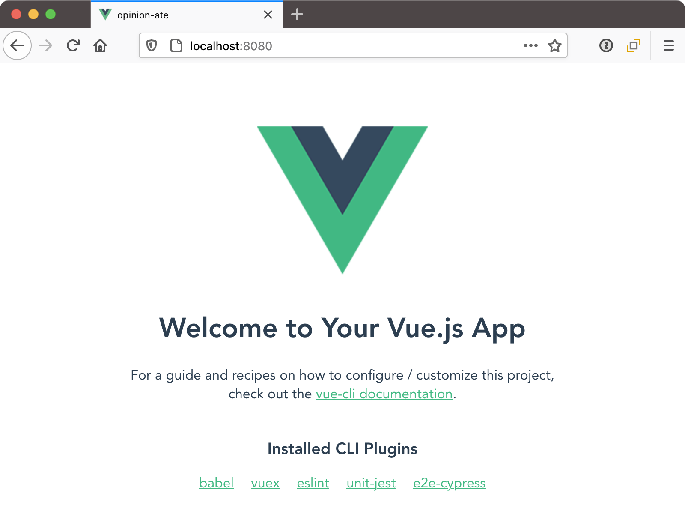

With this, we can move our "Create App" task in Trello to "Done".

## Setting Up Autoformatting

Next is "Set Up Autoformatting"; drag it to "In Progress".

Prettier doesn't have a lot of configuration options, but you can adjust a little. And a `.prettierrc.js` file at the root of your project and add the following:

```js
module.exports = {
  arrowParens: 'avoid',
  bracketSpacing: false,
  singleQuote: true,
  trailingComma: 'all',
};
```

These options configure Prettier with some helpful options to match common JavaScript practice. It also makes our diffs a bit simpler to read, which is not only helpful for this guide, but is also helpful for code reviews in your own projects.

Now, set up ESLint integration with your editor by installing the [VS Code ESLint extension](https://marketplace.visualstudio.com/items?itemName=dbaeumer.vscode-eslint).

To confirm it works, open `src/App.vue`. You should see yellow underlines at a few different places:

- Double quotes should be replaced with single quotes
- Inside object literals, every property on its own line should have a comma after it, even the last one

Save the file, and these changes should be made for you automatically.

We can update all our files to be formatted this way by running `yarn lint --fix`.

Let's go ahead and commit these configuration changes to linting and formatting. Small, focused commits make it easier for other developers to review, and keep us accountable to really understanding what is changing in our code. Vue CLI initializes our app with a git repo, so we can just add the changes:

```sh
$ git add .
$ git commit -m "Set up linting and autoformatting"
```

With this, we can drag "Set Up Autoformatting" to "Done".

## Running Tests on CI

Next is "Set Up Tests on CI"; drag it to "In Progress".

Vue CLI automatically sets up some example tests for us. Before we run them on CI, let's confirm they work for us locally. Open `tests/unit/example.spec.js`. Note that it's testing the `HelloWorld` component. Now run `yarn test:unit`.

You should see the following:

```
yarn run v1.21.1
$ vue-cli-service test:unit
 PASS  tests/unit/example.spec.js
  HelloWorld.vue
    ✓ renders props.msg when passed (20ms)

Test Suites: 1 passed, 1 total
Tests:       1 passed, 1 total
Snapshots:   0 total
Time:        2.037s
Ran all test suites.
✨  Done in 4.50s.
```

Now we'll try our end-to-end tests. Open `tests/e2e/specs/test.js`. Note that we are loading the app and confirming we can see a welcome message. Now run `yarn test:e2e`. You'll see the Cypress application launch. Its window will show a list of "Integration Tests" with just one item: `test.js`.

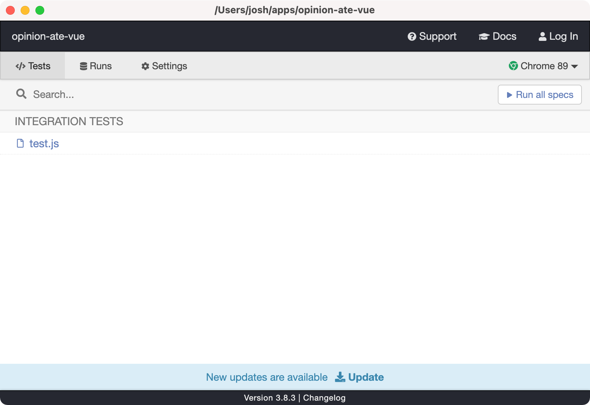

Click on `test.js`. A new instance of Chrome will open and you'll see the Cypress test runner interface. On the left is "My First Test" and a series of steps, which should pass. On the right is our app.

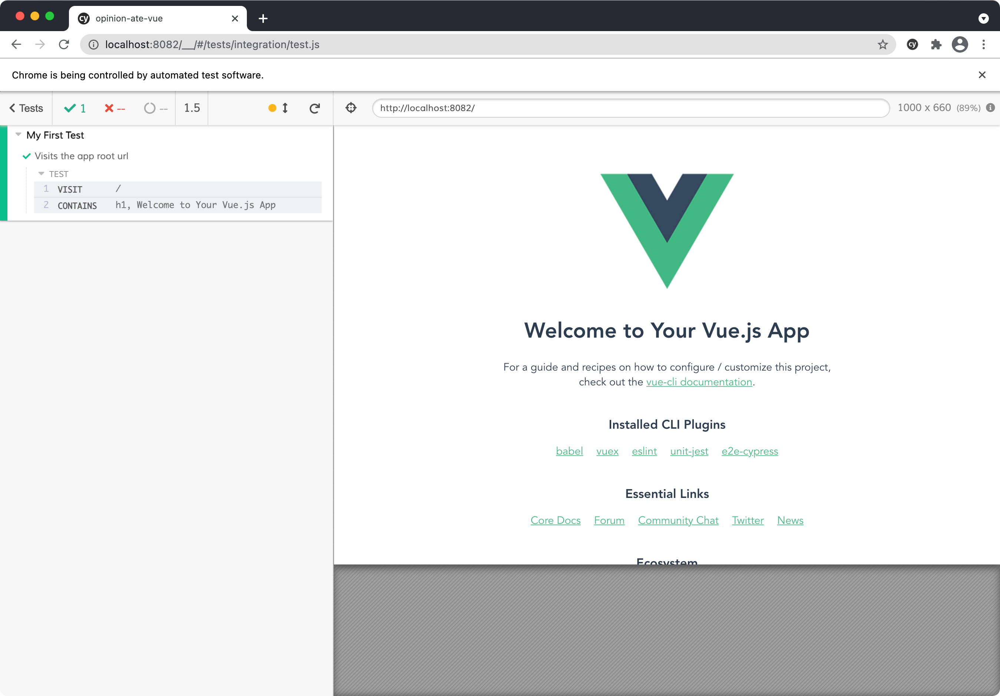

There's one more mode we can run our Cypress tests in: headless mode. Run `yarn test:e2e --headless`. You'll see tests run in the console and say in the end that they passed. This runs our whole test suite without a GUI, and will be useful in a moment.

When Vue CLI creates our project, it initializes a git repo and adds our code to it. Let's push it up to GitHub. On [github.com](https://github.com), create a new GitHub repo.

Next, add it as the `origin` remote and push up the repo:

```sh
$ git remote add origin https://github.com/your-user-name/your-repo-name.git
$ git push --set-upstream origin master
```

In many development approaches, the next thing we would do would be to start building application functionality. After that, we might release to production. Later we might decide to try to add testing and continuous integration.

But we're going to go the opposite route in this guide. We're going to set up CI and deployment from the very start, before we write a line of production code.

There are a number of great CI services, including [Travis CI](https://travis-ci.com/), [CircleCI](https://circleci.com/), and [GitHub Actions](https://github.com/features/actions). We're going to go with GitHub Actions due to the fact that every GitHub repo is set up for Actions automatically.

When we start our feature work we'll do it in branches. Let's go ahead and configure GitHub Actions in a branch as well, to get used to the workflow. Create a new `ci` branch:

```sh
$ git checkout -b ci
```

In your project, create a `.github/workflows` folder, then create a `test.yml` file inside it. Add the following contents:

```yml
name: Test
on: [push]

jobs:
  test:
    name: Test
    runs-on: ubuntu-16.04
    steps:
      - uses: actions/checkout@v1
      - name: Install Dependencies
        run: yarn install --frozen-lockfile
      - name: Unit Tests
        run: yarn test:unit
      - name: E2E tests
        run: yarn test:e2e --headless
```

Here's what's going on in this file:

- We name the workflow "Test".
- We configure it to run any time code is pushed to the server. This means both PR branches and merges to the `master` branch will be tested.
- We configure a single job for the workflow, also named "Test".
- We configure it to run on a specific version of the Ubuntu distribution of Linux. You can also run on `ubuntu-latest`, but new versions of Ubuntu have broken Cypress in the past, so fixing the version ensures it will continue to keep working.
- Now, we define the series of steps to run for the job. First, we use the GitHub Action `actions/checkout` to check out our code.
- We install our Yarn dependencies. The `--frozen-lockfile` flag is good to use on CI servers: it ensures Yarn won't install versions different from what is in the lockfile.
- We run our unit tests.
- We run our E2E tests. We pass the `--headless` flag so Cypress won't attempt to show the GUI or wait for us to choose a test; it will run all the E2E tests.

Commit this `test.yml` file, then push up your changes to GitHub:

```sh
$ git add .
$ git commit -m "Set up test action"
$ git push -u origin ci
```

GitHub will give you a URL to create a pull request. Open it in the browser, and click "Create pull request".

Notice the yellow "Some checks haven't completed yet" warning, with "Test/Test" under it. That's our GitHub Action running.

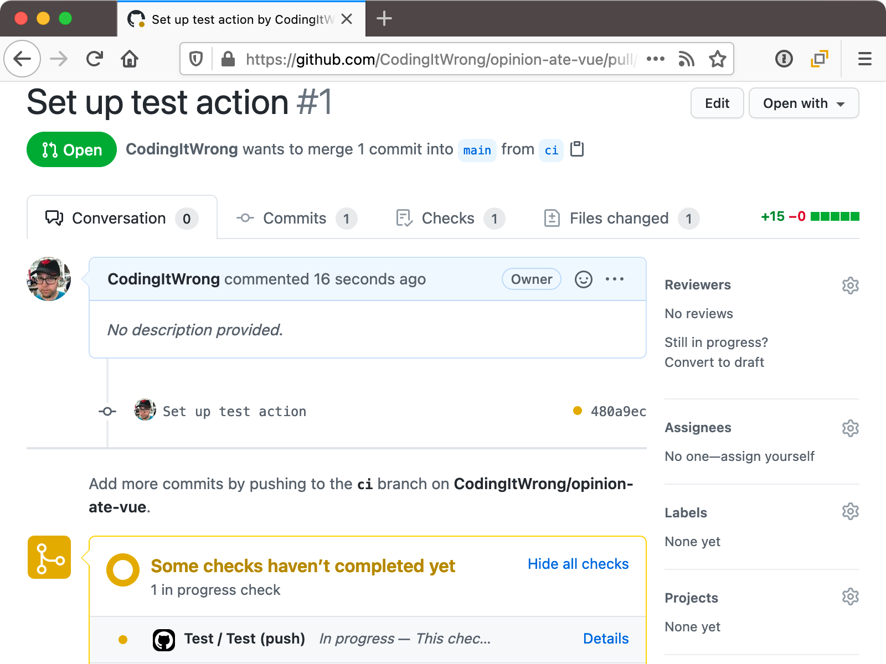

Click the "Details" link next to it. You'll see our unit and E2E tests running.

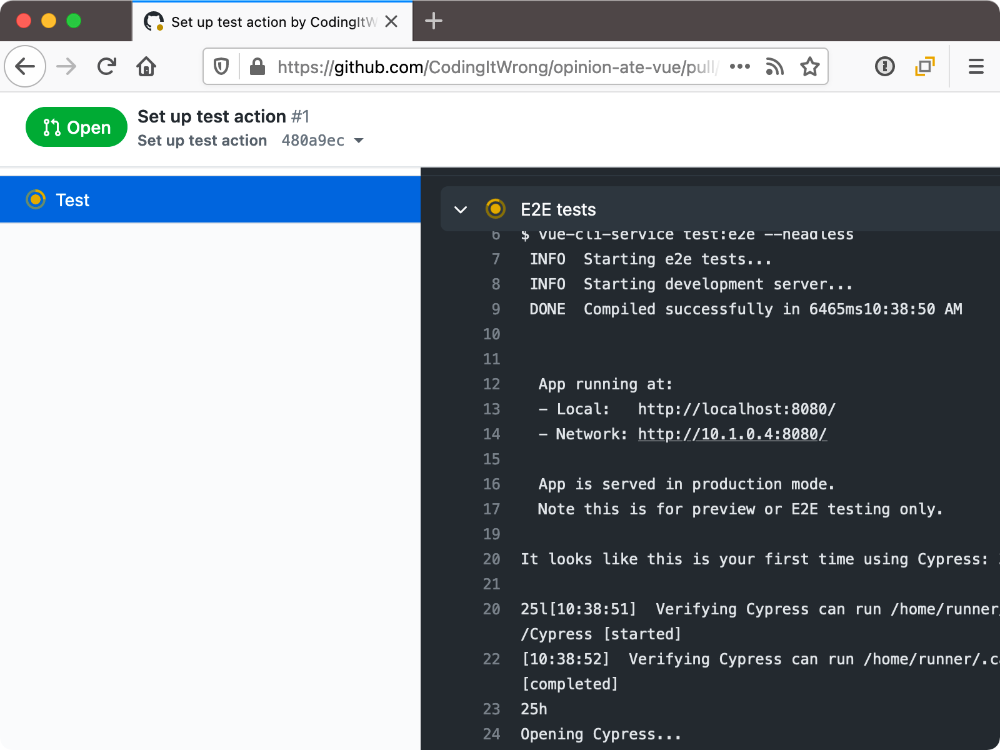

When the test run succeeds, the action will be marked as passed. If you go back to the Conversation tab of your PR, you'll see a green "All checks have passed".

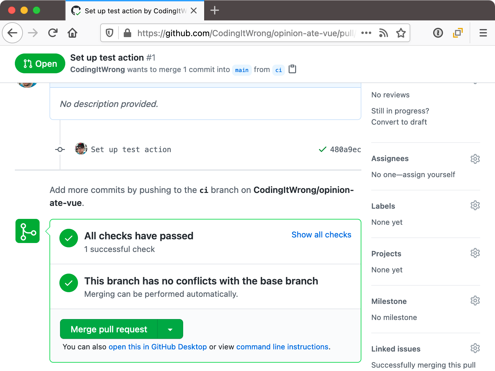

Go ahead and click "Merge pull request", then "Confirm merge", then "Delete branch".

In your local project, switch back to `master` and pull down the latest changes that we merged in from the branch:

```sh
$ git checkout master
$ git pull
```

With this, we can drag the "Set Up Tests On CI" task to "Done" in Trello.

## Setting Up Automatic Deployment
Our next task is "Set Up Automatic Deployment"; drag it to "In Progress" in Trello.

We're going to go ahead and deploy our application to production. Yes, even though it doesn't do anything yet!

First let's see how a production build works locally. Run `yarn build`. The files are written to a `dist` folder in your project. Open it and see static assets including HTML, JS, and CSS files. Due to the way the file paths work, you can't just open the HTML file in the browser, but they'll work when deployed to a server.

There are many ways to deploy frontend apps. One easy one is services like Netlify that are set up to run your frontend build process for you. Netlify has a free Starter plan for individual users. You don't need to provide a credit card, but just keep an eye out for emails about approaching your monthly limit of build minutes: if you go over the limit you'll need to pay for more minutes or your sites will be shut down.

Create a Netlify account from [Netlify's Sign Up page](https://app.netlify.com/signup). Since we will need to give it access to GitHub anyway, it might make sense to sign up with your GitHub account.

Once you're signed in, click "New site from Git". Click the "GitHub" button. A list of all your repos will appear. Search for your repo and click it.

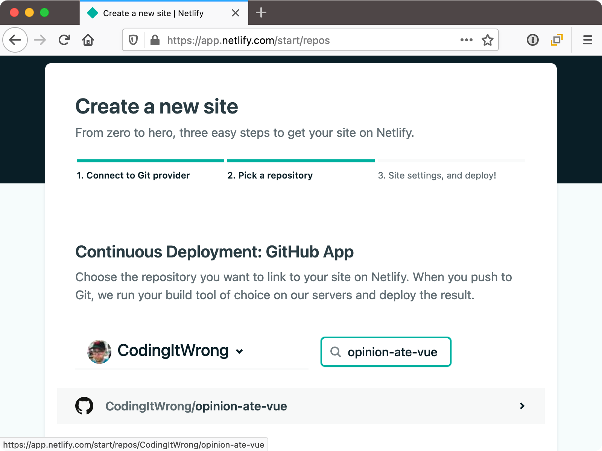

Leave "Branch to deploy" as `master`. Under "Basic build settings", for the "Build command", enter `yarn build` just like we ran locally. Then enter `dist` for the Publish directory. This means that Netlify will run that command, then take the files in that directory and deploy them.

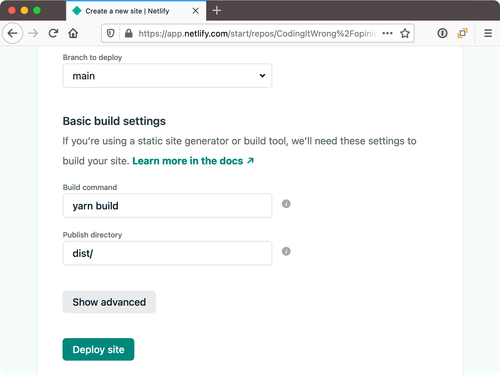

That's all we need to configure, so click "Deploy site".

You will be sent to the Overview page for your new site. In yellow you'll see "Site deploy in progress".

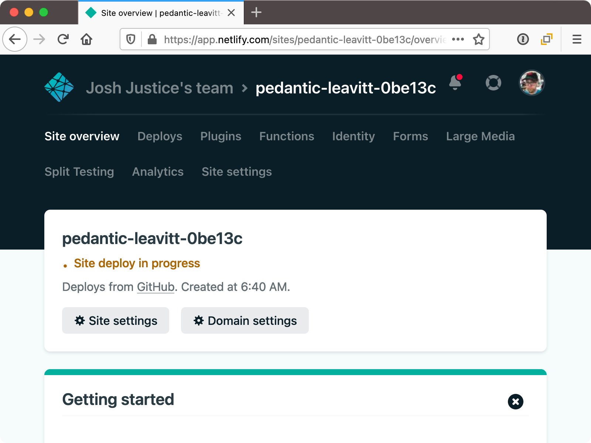

Click that text and you'll be taken to the Deploys page. In a list at the bottom you'll see "Production: master@HEAD Building":


Click "Production: master@HEAD Building". You'll see a console log of output as the site is being built. Eventually you'll see "Site is live":


(Your timestamps will be different depending on how unreasonably early you wake up.)

Click "< Deploys" to go back to the Deploys tab. If you waited for the deployment to complete, at the top in green you'll see the name of your site, with an automatically-assigned set of nonsense words and characters:


Click the green link in your browser. You should get the "Welcome to your Vue.js App" page.

Now let's rename that site to be a bit easier to remember. Go back to Netlify, then click the Overview tab, then "Site settings" button. Under General > Site details > Site information, click "Change site name".

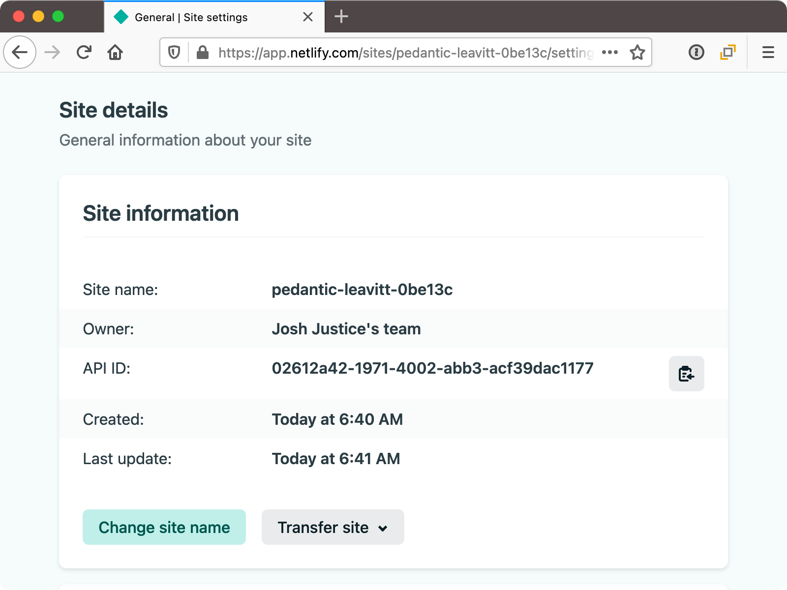

In the dialog that appears, enter any site name you like and click Save.


At the top of this screen, under "Settings for", your site URL appears in gray.

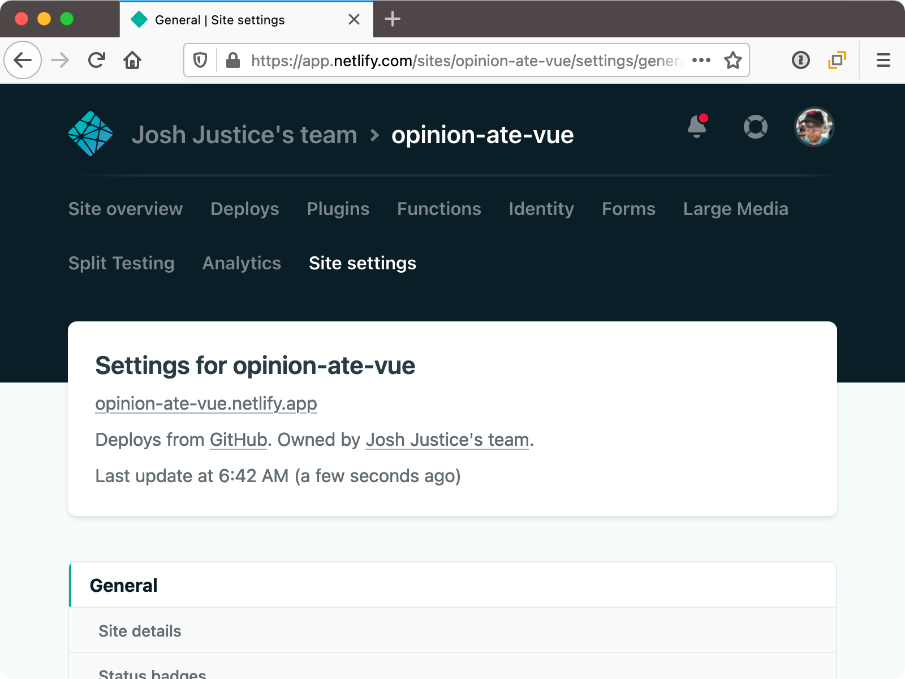

Click on your new site URL to confirm your site is working at that URL.

We're now set to run our app's tests on CI and deploy to production. What would have taken even the most experienced developer days to set up in the past was trivial thanks to the smart defaults provided by Vue CLI, GitHub Actions, and Netlify.

With this, we can drag "Set Up Automatic Deployment" to "Done" in Trello.

## Filling In the Readme
Our final setup task before we begin developing features is "Fill In Readme". Drag it to "In Progress" in Trello.

Writing down helpful information to help future developers (including yourself) work on the app is important. Open `README.md` and see what Vue CLI created for us by default. It's a nice minimal readme that lists the NPM scripts available, without a lot of filler text. If these commands weren't in here, I would recommend that we add them: how to install, run, build, and test.

Let's add a description of the project and link to production, filling in your Netlify domain:

```diff
 # opinion-ate
+
+An app for tracking reviews of dishes at different restaurants.
+
+Production: <https://your-netlify-domain.netlify.com>

 ## Project setup
```

Also, if someone uses `npm` instead of `yarn` they won't get the right dependencies. Let's make a note about this:

```diff
 ## Project setup
+Dependencies are locked with a `yarn.lock` file, so please use `yarn` and not
+`npm` for installing them.
+
```

Commit these README changes to git and push them up to GitHub.

With this, we can drag "Fill In Readme" to "Done" in Trello.

## What's Next
Now all our setup is done and we are ready to work on our first feature! In the next chapter we'll see how to build a feature using the outside-in TDD loop.

:::tip
Questions about this chapter? Running into trouble? Come chat with us on the [Gitter Community for Outside-In Dev](https://gitter.im/outsideindev/community)!
:::
