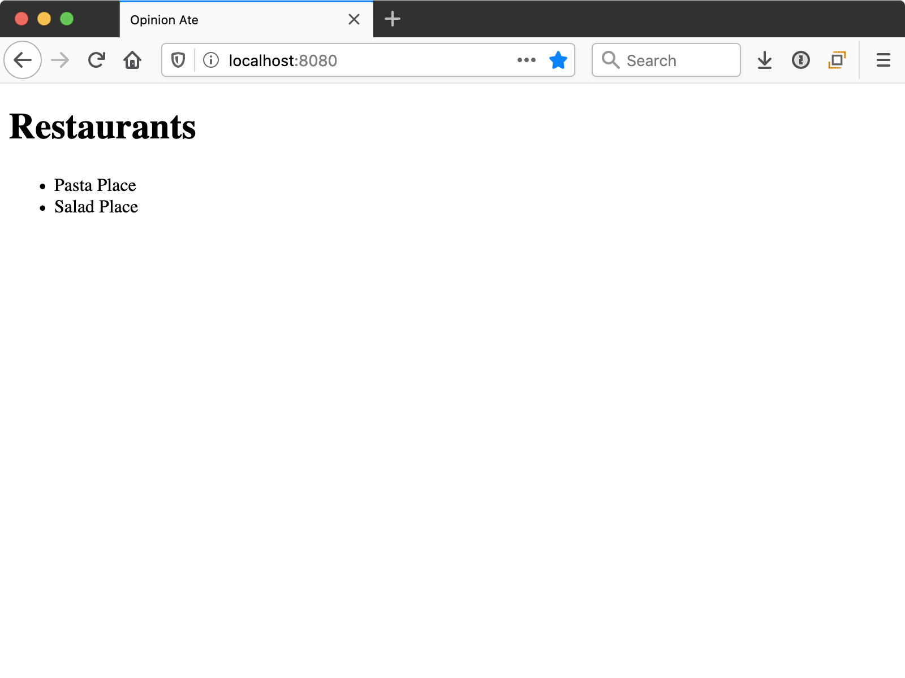

# 3 - Vertical Slice

In this chapter, we'll build our first application feature. We'll follow the practice of outside-in test driven development: write a failing end-to-end test, watch it fail, then build out the functionality with unit tests using multiple inner red-green-refactor cycles. We'll also see the principle of "write the code you wish you had" in action.

Our next story in Trello is "List Restaurants"; drag it to "In Progress".

We chose this story as our first story because it allows us to build out a **vertical slice** of our application. It touches all layers of our code: it has a user interface aspect (the list screen), a data layer aspect (where the restaurants are loaded and stored), and an API client aspect (the HTTP request to load the restaurants). It also minimizes other work: we aren't building authentication now, and we aren't handling restaurant loading edge cases yet in this story. The point of a vertical slice is to get something in all layers of your application built out, to ensure they all work together.

## Setup

We'll do all our work from this feature on a branch. Create a new one:

```sh
$ git checkout -b list-restaurants
```

To get a clean start, let's delete out the sample content Vue CLI created with our app. Delete the following files and folders:

- `src/assets/`
- `src/components/HelloWorld.vue`
- `tests/e2e/specs/test.js`
- `tests/unit/example.spec.js`

Replace the contents of `src/App.vue` with the following minimal content:

```html
<template>
  <div id="app">
    Hello, world.
  </div>
</template>

<script>
export default {
  name: 'App',
};
</script>
```

In `public/index.html`, find the `<title>` tag. The `<%= htmlWebpackPlugin.options.title %>` content dynamically fills in the name we specified when we created the app, `opinion-ate`. Let's replace that with a hard-coded title capitalized to match our brand. Update it:

```diff
   <link rel="icon" href="<%= BASE_URL %>favicon.ico">
-  <title><%= htmlWebpackPlugin.options.title %></title>
+  <title>Opinion Ate</title>
 </head>
```

Commit these changes to git:

```sh
$ git add .
$ git commit -m "Delete sample content"
```

## Reviewing the Backend

For this tutorial, our backend web service has already been built. Let's take a look at it and see how we can load our restaurant data from it. It's accessible at <https://api.outsidein.dev>. Rather than using username-and-password based authentication as we might do for a real system, for simplicity you'll just set up an API key instead. This will allow you to access your own personal data on the server, so you can edit it without stepping on other users' data.

Go to <https://api.outsidein.dev> in a browser. Click the "Create API Key" button. You'll be given a new API key that is a random sequence of letters and numbers. Copy it and save it someplace safe—you won't be able to get back to it again.

Next, go to `https://api.outsidein.dev/YOUR-API-KEY/restaurants` in a browser, filling in your API key in place of `YOUR-API-KEY`. You should see the following JSON data with default restaurants created when your API key was created. It may be formatted differently depending on your browser and extensions, and of course the dates will differ:

```json
[
  {
    "id": 1,
    "name": "Pasta Place",
    "created_at": "2020-03-30T23:54:52.000Z"
  },
  {
    "id": 2,
    "name": "Salad Place",
    "created_at": "2020-03-30T23:54:52.000Z"
  }
]
```

So this is the web service endpoint our story will need to connect to. You can also `POST` JSON data to that endpoint to create a new restaurant; feel free to try that out if you like.

Now, to build the frontend.

## End-to-End Test

When performing outside-in TDD, our first step is to **create an end-to-end test describing the feature we want users to be able to do.**

In the `tests/e2e/specs` folder, create a `listing-restaurants.spec.js` file and add the following:

```js
describe('Listing Restaurants', () => {
  it('shows restaurants from the server', () => {
    const sushiPlace = 'Sushi Place';
    const pizzaPlace = 'Pizza Place';

    cy.server({force404: true});

    cy.route({
      method: 'GET',
      url: 'https://api.outsidein.dev/YOUR-API-KEY/restaurants',
      response: [
        {id: 1, name: sushiPlace},
        {id: 2, name: pizzaPlace},
      ],
    });

    cy.visit('/');
    cy.contains(sushiPlace);
    cy.contains(pizzaPlace);
  });
});
```

As before, fill in your API key in place of `YOUR-API-KEY`.

First, we create variables with a few restaurant names, because we'll use them several times.

Then, we call `cy.server()`. This sets up Cypress to stub calls to the backend. By default Cypress will allow any calls that are *not* stubbed through to the backend, but the `force404: true` option means that Cypress will return a `404 Not Found` status for them instead. We don't want our E2E tests to ever hit the real backend, so this option is good.

Then, we call `cy.route()` to stub a specific backend request; in this case, the `https://api.outsidein.dev/YOUR-API-KEY/restaurants` we just tested out. When the app sends a `GET` request to it, we will return the specified response. We pass the method an array of two restaurant objects. Cypress will convert that array of objects into a JSON string and return that from the stubbed network call. Notice that we don't need to include the `created_at` field, because our app won't be using it.

Next, we visit the root of our app at `/`. We confirm that the page contains both restaurant names. This will show that the app successfully retrieved them from the backend and displayed them.

After we've created our test, the next step in TDD is to **run the test and watch it fail.** This test will fail (be "red") at first because we haven't yet implemented the functionality.

To run our test, run `yarn test:e2e`.
After a few seconds the Cypress app should open. In Cypress, click `listing-restaurants.spec.js`. Chrome should open, and the test should run. It is able to visit the root of our app, but when it attempts to find "Sushi Place" on the page, it fails.


Let's go ahead and commit this E2E test. Although it won't pass until the end of the branch, committing it now allows us to have focused commits going forward.

```sh
$ git add .
$ git commit -m "Specify app should list restaurants"
```

It's time for us to write the code to make this pass. Let's think about how we want to structure our code. We're going to have three layers:

- Components that display the user interface.
- A Vuex module that stores our data and lets us interact with it.
- An API client that allows us to make requests to the backend.

With outside-in testing, we build the outside first, which in this case is our user interface components. And a common principle is to **write the code you wish you had.** What does that mean in our case? Well, when we created our app, we were given an `<App />` component. Do we want to put our user interface directly in there? No, it's best to save the `<App />` component for app-wide concerns such as a title bar that we'll add soon. Instead, it would be great if we had a `<RestaurantScreen />` component that would contain everything specific to our restaurants. We wish we had it, so let's add it to `App.vue`:

```diff
 <template>
   <div id="app">
-    Hello, world.
+    <RestaurantScreen />
   </div>
 </template>

 <script>
+import RestaurantScreen from '@/components/RestaurantScreen';
+
 export default {
   name: 'App',
+  components: {RestaurantScreen},
 };
 </script>
```

Next, let's actually create the `RestaurantScreen` component we used here.
In `src/components/`, create a `RestaurantScreen.vue` file.
For the moment let's add just enough content to make it a valid component. Add the following:

```html
<template>
  <div>
    <h1>Restaurants</h1>
  </div>
</template>

<script>
export default {
  name: 'RestaurantScreen',
};
</script>
```

If we rerun our E2E test we'll see the "Restaurants" text displayed, but we aren't any closer to passing the test. What do we do next?

Well, what do we want to do on this screen? For this story, we want to display a restaurant list. But we also have an upcoming story where we want to add new restaurants. Those are two different responsibilities we want this screen to have. So let's create child components for each. For now, we'll just create the restaurant list.

Create a `RestaurantList.vue` file in `src/components` and again add the minimal content:

```html
<template>
  <div>RestaurantList</div>
</template>

<script>
export default {
  name: 'RestaurantList',
};
</script>
```

Then render that component in `RestaurantScreen`:

```diff
 <template>
   <div>
     <h1>RestaurantScreen</h1>
+    <RestaurantList />
   </div>
 </template>

 <script>
+import RestaurantList from '@/components/RestaurantList';
+
 export default {
   name: 'RestaurantScreen',
+  components: {RestaurantList},
 };
 </script>
```

## Stepping Down to a Unit Test

Now we finally have `RestaurantList` where we'll put our UI for this story.

So far our components haven't done much: `App` just renders `RestarauntScreen`, and `RestaurantScreen` just renders `RestaurantList`. This wasn't any significant application *logic*: it was just code *structure*. Because of this, there would have been no real benefit to stepping down to a unit test: unit tests are for driving out *logic*. This is why we wrote this structural code directly under the guidance of the E2E test.

But with `RestaurantList`, we finally have some application *logic* to write. It needs to:

- Request for the restaurants to be loaded
- Display the restaurants once they're returned

Instead of adding this logic directly, let's **step down from the "outside" level of end-to-end tests to an "inside" component test.** This allows us to more precisely specify the behavior of each piece. This unit test will also be helpful in a future story as we add more edge cases to this component. End-to-end testing every edge case would be slow, and make it harder to tell what exactly was being tested.

Before we step down to a unit test, though, let's commit the changes we have. They're a nice, small unit of work: we've added the structure of components that we'll add the behavior to next.

```sh
$ git add .
$ git commit -m "Add RestaurantScreen and RestaurantList"
```

Now, to write the unit test. In `tests/unit`, create a `components` folder, then inside that create a file `RestaurantList.spec.js`.
Now, we'll write a test for the first bit of functionality we need, to load the restaurants. We'll start with the structure of the test suite:

```js
describe('RestaurantList', () => {
  it('loads restaurants on mount', () => {
  });
});
```

Because we are writing a unit test, we don't want to connect our component to our real Vuex store module. Instead, we want to create a mocked store module that specifies the interface we want our store module to have, and lets us run expectations on it. Our component will ask our store module to load the restaurants, so that means we need a `load` action in the store module:

```diff
 it('loads restaurants on mount', () => {
+  const restaurantsModule = {
+    namespaced: true,
+    actions: {
+      load: jest.fn().mockName('load'),
+    },
+  };
 });
```

We use `jest.fn()` to create a Jest mock function, which will allow us to check that the `load` action was called. We chain a call to `.mockName()` onto it to give our function a name; this will make our error messages more readable.

We also add a `namespaced: true` property because that's typical for store modules. We might have separate modules for users, dishes, etc. and the namespace allows keeping them organized.

Now we need to set up a real Vuex store with our mocked module:

```diff
+import Vuex from 'vuex';
+import {createLocalVue} from '@vue/test-utils';
+
 describe('RestaurantList', () => {
+  const localVue = createLocalVue();
+  localVue.use(Vuex);

   it('loads restaurants on mount', () => {
     const restaurantsModule = {
       namespaced: true,
       actions: {
         load: jest.fn().mockName('load'),
       },
     };
+    const store = new Vuex.Store({
+      modules: {
+        restaurants: restaurantsModule,
+      },
+    });
   });
 });
```

We import Vuex. We need to configure Vue to use Vuex, but because we are in a test, we use a Vue Test Utils function called `createLocalVue()` to create a Vue instance that is local to this test. Then we tell it to use Vuex.

In our test, we create a `new Vuex.Store()` just like our production code does, and we just pass in our one restaurants module. Even once our production store has multiple modules, if `RestaurantList` only uses the restaurants store module, that's the only one we would mock out and put in the unit test.

Now, we're ready to mount our component:

```diff
 import Vuex from 'vuex';
-import {createLocalVue} from '@vue/test-utils';
+import {mount, createLocalVue} from '@vue/test-utils';
+import RestaurantList from '@/components/RestaurantList';

 describe('RestaurantList', () => {
   const localVue = createLocalVue();
   localVue.use(Vuex);

   it('loads restaurants on mount', () => {
...
     const store = new Vuex.Store({
       modules: {
         restaurants: restaurantsModule,
       },
     });
+
+    mount(RestaurantList, {localVue, store});
   });
 });
```

We import the `RestaurantList` component, then use Vue Test Utils' `mount()` function to mount it. We pass a few options to it: the local Vue instance it should use, and the Vuex store it should use.

Finally, we're ready to run an expectation to confirm that the component loads restaurants on mount. We just check that our mock action was called:

```diff
 it('loads restaurants on mount', () => {
...
   mount(RestaurantList, {localVue, store});
+
+  expect(restaurantsModule.actions.load).toHaveBeenCalled();
 });
```

Now we're ready to run our unit test. Run `yarn test:unit --watch`. The `--watch` flag means the test runner stays open, watching for changes to our files to rerun the tests. Leave it running for the remainder of this chapter. Jest will run our unit test, and we'll get the following error:

```sh
 FAIL  tests/unit/components/RestaurantList.spec.js
  RestaurantList
    ✕ loads restaurants on mount (5ms)

  ● RestaurantList › loads restaurants on mount

    expect(load).toHaveBeenCalled()

    Expected number of calls: >= 1
    Received number of calls:    0

      22 |     mount(RestaurantList, {localVue, store});
      23 |
    > 24 |     expect(restaurantsModule.actions.load).toHaveBeenCalled();
         |                                            ^
      25 |   });
      26 | });
```

Our test says we expected the `load()` function to have been called at least once, but it wasn't called. This makes sense: we haven't hooked up the mount functionality yet. Now that our test is red, it's time to make it green.

To dispatch a Vuex action from a component, first, we use Vuex's `mapActions` function to connect the action to our component:

```diff
 <script>
+import {mapActions} from 'vuex';
+
 export default {
   name: 'RestaurantList',
+  methods: mapActions({
+    loadRestaurants: 'restaurants/load',
+  }),
 };
 </script>
```

We say that we want to take the action `restaurants/load` and expose it to our component with the name `loadRestaurants`. Note that our action name has the namespace of the `restaurants` module, then the action name `load` that we gave it.

Save the component and Jest will rerun our test, but it will fail in the same way. We've connected our action to our component, but we aren't calling it yet. Doing it so is easy:

```diff
 export default {
   name: 'RestaurantList',
+  mounted() {
+    this.loadRestaurants();
+  },
   methods: mapActions({
     loadRestaurants: 'restaurants/load',
   }),
 };
```

We define a `mounted()` lifecycle hook to run when the component is first mounted. In it, we call the `this.loadRestaurants()` method on our component, which was mapped to the `restaurants/load` action.

Save the file and Jest will automatically rerun our unit test. Sure enough, our test is green. We've passed our first unit test! Let's commit the unit test and production code that makes it pass in one commit:

```sh
$ git add .
$ git commit -m "Load restaurants upon mounting RestaurantList"
```

This gives us one of the behaviors we want our `RestaurantList` to have: loading the restaurants when it is mounted. Now it's time to write a test for the second behavior: displaying the restaurants. Let's add another `it()` block inside the `describe()`, with the following contents:

```js
it('displays the restaurants', () => {
  const records = [
    {id: 1, name: 'Sushi Place'},
    {id: 2, name: 'Pizza Place'},
  ];

  const restaurantsModule = {
    namespaced: true,
    state: {records},
    actions: {
      load: jest.fn().mockName('load'),
    },
  };
  const store = new Vuex.Store({
    modules: {
      restaurants: restaurantsModule,
    },
  });

  const wrapper = mount(RestaurantList, {localVue, store});
});
```

So far it's pretty similar to our previous test. There are just a few differences:

- We define a `records` variable that contains an array of two restaurant objects.
- We pass a `state` property to our restaurants module, which is an object that contains a `records` property. Because the property name is the same as the name of the `records` variable we defined, we just include `records` in the object. Property shorthand means that a `records` property will be defined with the value being the value of our `records` variable.
- We assign the return value of `mount()` to a variable, `wrapper`, because we'll need it in a moment.

Now, instead of running an expectation that `load` was called, we use the `wrapper` to check what is rendered out:

```diff
   const wrapper = mount(RestaurantList, {localVue, store});
+
+  const firstRestaurantName = wrapper
+    .findAll('[data-testid="restaurant"]')
+    .at(0)
+    .text();
+  expect(firstRestaurantName).toBe('Sushi Place');
 });
```

This is little verbose, so let's see what's going on:

- We call `wrapper.findAll()` to find all the elements matching a CSS selector. The selector we use is `[data-testid="restaurant"]`. Test IDs are a helpful way to pull up elements in your tests, because they're specific to testing. If you find elements by an ID or CSS class name, those values might change for other reasons in your application, resulting in tests breaking. But since a test ID is specifically used for testing, it should be more stable and less likely to change for reasons unrelated to the test.
- There should be two different restaurants displayed, so we get the element of the first one (index zero) by calling `.at(0)`.
- We call `.text()` to get the text contents of the element, and assign it to the variable `firstRestaurantName`.
- We check that the value of `firstRestaurantName` is "Sushi Place".

Why did we split this unit test out from the first one? There is a common testing principle to **check one behavior per test in unit tests.** In our first test we checked the loading behavior, and in this test we are checking the restaurant-display behavior. Having separate test cases for each behavior of the component makes it easy to understand what it does, and easy to see what went wrong if one of the assertions fails. This principle is sometimes phrased "run one expectation per test", but in this test we have two expectations. We're following the spirit of the principle, though, because those two expectations are very closely related: they're checking for two analogous bits of text on the page.

You may recall that this isn't what we did in the end-to-end test, though. Generally you should **check _multiple_ behaviors per test in end-to-end tests.** Why? End-to-end tests are slower, so the overhead of the repeating the steps would significantly slow down our suite as it grows.

When we save the file, our test runs, and it's red, as we expect. We get the following error:

```sh
 FAIL  tests/unit/components/RestaurantList.spec.js
  RestaurantList
    ✓ loads restaurants on mount (3ms)
    ✕ displays the restaurants (7ms)

  ● RestaurantList › displays the restaurants

    [vue-test-utils]: no item exists at 0

      48 |     const firstRestaurantName = wrapper
      49 |       .findAll('[data-testid="restaurant"]')
    > 50 |       .at(0)
         |        ^
      51 |       .text();
      52 |     expect(firstRestaurantName).toBe('Sushi Place');
      53 |   });
```

So no element with `[data-testid="restaurant"]` is found. Following the process of fixing the error in the simplest possible way, let's just hard-code an element with that test ID. Since there will be a list of them, let's make it an `li` element inside a `ul`:

```diff
 <template>
-  <div>RestaurantList</div>
+  <ul>
+    <li data-testid="restaurant" />
+  </ul>
 </template>
```

Our test reruns and we're past that error, on to the next one:

```sh
  ● RestaurantList › displays the restaurants

    expect(received).toBe(expected) // Object.is equality

    Expected: "Sushi Place"
    Received: ""

      50 |       .at(0)
      51 |       .text();
    > 52 |     expect(firstRestaurantName).toBe('Sushi Place');
         |                                 ^
      53 |   });
      54 | });
```

So we expected the text of the element to be "Sushi Place", but there was no text in it, so we got an empty string instead.

At this point, we could hard-code the name, but it's better to go ahead and pull it from the Vuex data. First, we use Vuex's `mapState` function to access the state:

```diff
 <script>
-import {mapActions} from 'vuex';
+import {mapState, mapActions} from 'vuex';

 export default {
...
   methods: mapActions({
     loadRestaurants: 'restaurants/load',
   }),
+  computed: mapState({
+    restaurants: state => state.restaurants.records,
+  }),
 };
 </script>
```

We configure a `computed` property on the component named `restaurants`, that pulls from the `records` property of the `restaurants` module of the `state`.

Now, let's loop through these restaurants to display a list item for each:

```diff
 <ul>
-  <li data-testid="restaurant" />
+  <li
+    v-for="restaurant in restaurants"
+    :key="restaurant.id"
+    data-testid="restaurant"
+  >
+    {{ restaurant.name }}
+  </li>
 </ul>
```

We use Vue's `v-for` directive to loop over the `restaurants`. Vue requires us to specify a `:key` so it can keep track of which DOM elements correspond to which records, so we pass the `record.id` as the key. We keep the `data-testid` attribute so our test can find the restaurants. Then we output the `restaurant.name` as text in the list item.

Save and now both tests are passing.

For completeness, let's check the second displayed restaurant as well:

```diff
   const firstRestaurantName = wrapper
     .findAll('[data-testid="restaurant"]')
     .at(0)
     .text();
   expect(firstRestaurantName).toBe('Sushi Place');
+
+  const secondRestaurantName = wrapper
+    .findAll('[data-testid="restaurant"]')
+    .at(1)
+    .text();
+  expect(secondRestaurantName).toBe('Pizza Place');
 });
```

This test passes right away. Although this step isn't really TDD because we write the test that already passes, it can be useful to confirm a behavior for extra certainty.

We've now successfully defined both behaviors of our `RestaurantList`!

Go ahead and commit your changes again. From here on out, we won't remind you to make small commits as we go, but I'd encourage you to do so.

In the TDD cycle, **whenever the tests go green, look for opportunities to refactor,** both in production code and test code. Our production code is pretty simple already, but there's a lot of duplication in our two tests. Now that we see which parts are shared, let's extract that duplication. First, let's set up some shared data:

```diff
 describe('RestaurantList', () => {
+  const records = [
+    {id: 1, name: 'Sushi Place'},
+    {id: 2, name: 'Pizza Place'},
+  ];
+
   const localVue = createLocalVue();
   localVue.use(Vuex);

+  let restaurantsModule;
+  let wrapper;
+
+  beforeEach(() => {
+    restaurantsModule = {
+      namespaced: true,
+      state: {records},
+      actions: {
+        load: jest.fn().mockName('load'),
+      },
+    };
+    const store = new Vuex.Store({
+      modules: {
+        restaurants: restaurantsModule,
+      },
+    });
+
+    wrapper = mount(RestaurantList, {localVue, store});
+  });
```

Although not *all* of these variables are needed for *both* tests, it's okay to set them up for both. This sets up a component in a good default state, so each test can stay focused on what it wants to assert.

Now we can remove the duplicated code from the individual tests:

```diff
 it('loads restaurants on mount', () => {
-  const restaurantsModule = {
-  namespaced: true,
-    actions: {
-      load: jest.fn().mockName('load'),
-    },
-  };
-
-  const store = new Vuex.Store({
-    modules: {
-      restaurants: restaurantsModule,
-    },
-  });
-
-  mount(RestaurantList, {localVue, store});
   expect(restaurantsModule.actions.load).toHaveBeenCalled();
 });

 it('displays the restaurants', () => {
-  const records = [
-    {id: 1, name: 'Sushi Place'},
-    {id: 2, name: 'Pizza Place'},
-  ];
-
-  const restaurantsModule = {
-    namespaced: true,
-    state: {records},
-    actions: {
-      load: jest.fn().mockName('load'),
-    },
-  };
-  const store = new Vuex.Store({
-    modules: {
-      restaurants: restaurantsModule,
-    },
-  });
-
-  const wrapper = mount(RestaurantList, {localVue, store});
-
   const firstRestaurantName = wrapper
      .findAll('[data-testid="restaurant"]')
...
   expect(secondRestaurantName).toBe('Pizza Place');
 });
```

Save the file and our tests should still pass.

Next, look at the following statement from our second test:

```js
const firstRestaurantName = wrapper
  .findAll('[data-testid="restaurant"]')
  .at(0)
  .text();
expect(firstRestaurantName).toBe('Sushi Place');

const secondRestaurantName = wrapper
  .findAll('[data-testid="restaurant"]')
  .at(1)
  .text();
expect(secondRestaurantName).toBe('Pizza Place');
```

This is both verbose and repetitive. There are a lot of Vue Test Utils details in there to make it hard to see what we are testing at a glance. We just want to say that we get the first or second element with a given test ID. Let's make a helper function at the top of this test file to do that for us:

```js
const findByTestId = (wrapper, testId, index) =>
  wrapper.findAll(`[data-testid="${testId}"]`).at(index);
```

Then we can replace our existing calls:

```diff
 it('displays the restaurants', () => {
-  const firstRestaurantName = wrapper
-    .findAll('[data-testid="restaurant"]')
-    .at(0)
-    .text();
-  expect(firstRestaurantName).toBe('Sushi Place');
-
-  const secondRestaurantName = wrapper
-    .findAll('[data-testid="restaurant"]')
-    .at(1)
-    .text();
-  expect(secondRestaurantName).toBe('Pizza Place');
+  expect(findByTestId(wrapper, 'restaurant', 0).text()).toBe('Sushi Place');
+  expect(findByTestId(wrapper, 'restaurant', 1).text()).toBe('Pizza Place');
});
```

Save the file again and the tests still pass.

After this refactoring, our test blocks are much shorter: almost all they contain is the expectations. And the expectations are brief as well. This is good because it keeps our tests focused and very easy to read.

## Stepping Back Up

We've now specified the behavior of our `RestaurantList` component, and our unit test is complete. The next step in outside-in TDD is to **step back up to the end-to-end test and see our next failure.** Rerun the test in Chrome and we see the same Cypress failure, but also this error in the console:

```
TypeError: Cannot read property 'records' of undefined
    at a.restaurants (RestaurantList.vue:25)
```


The line number guides us to:

```js
computed: mapState({
  restaurants: state => state.restaurants.records,
}),
```

So what's going wrong is that `state.restaurants` is undefined, so we can't access a `.records` property on it. It's time to write the code we wish we had, and hook our restaurant list up to Vuex.

Open `src/store/index.js` to see the Vuex config that Vue CLI created for us:

```js
import Vue from 'vue';
import Vuex from 'vuex';

Vue.use(Vuex);

export default new Vuex.Store({
  state: {},
  mutations: {},
  actions: {},
  modules: {},
});
```

In our component test we decided that we would nest our data inside a `restaurants` store module, so let's use that here:

```diff
 import Vue from 'vue';
 import Vuex from 'vuex';
+import restaurants from './restaurants';

 Vue.use(Vuex);

 export default new Vuex.Store({
-  state: {},
-  mutations: {},
-  actions: {},
-  modules: {},
+  modules: {restaurants},
 });
```

Now, let's implement just enough of that module to get past this E2E test error. Create a `src/store/restaurants.js` file and add the following contents:

```js
const restaurants = {
  namespaced: true,
  state: {
    records: [],
  },
};

export default restaurants;
```

Rerun the E2E test. We now no longer get any application code errors; instead, we are back to the failure that the text "Sushi Place" is never shown. But we've made progress. Our component is now dispatching the `restaurants/load` action, and reading the `restaurants` from the store; our action just doesn't exist yet, to load those records from the API. That's logic we need to implement, and that means it's time to step back down to a unit test, this time for our Vuex module.

## Unit Testing the Store

To test our module, we're going to create a real Vuex store, configure it with our store module, then interact with it from the outside. After we write our test, we'll look at the advantages this approach gives us.

Under `tests/unit/`, create a `store` folder. Inside it, create a `restaurants.spec.js` file. Add the following structure:

```js
import Vuex from 'vuex';
import {createLocalVue} from '@vue/test-utils';
import restaurants from '@/store/restaurants';

describe('restaurants', () => {
  const localVue = createLocalVue();
  localVue.use(Vuex);

  describe('load action', () => {
    it('stores the restaurants', async () => {
    });
  });
});
```

As with our component test, we create a local Vue instance and attach Vuex to it. Then we create a `describe` block for our load action, which right now just has one test: that it stores the restaurants. Note that the test function is `async`, to allow for our stubbed network request. Now let's fill that test out.

We will need some records to be returned by our stubbed API:

```diff
 it('stores the restaurants', async () => {
+  const records = [
+    {id: 1, name: 'Sushi Place'},
+    {id: 2, name: 'Pizza Place'},
+  ];
 });
```

As we said earlier, our app will consist of three layers:

- The UI components
- The Vuex module
- The API client

So we won't make an HTTP request directly in our Vuex module.
Instead, we'll delegate to an API object that we pass in. Let's design the interface of that object now:

```diff
 it('stores the restaurants', async () => {
   const records = [
     {id: 1, name: 'Sushi Place'},
     {id: 2, name: 'Pizza Place'},
   ];

+  const api = {
+    loadRestaurants: () => Promise.resolve(records),
+  };
 });
```

Giving the `api` object a descriptive `loadRestaurants()` method seems good. We are stubbing out the API here in the test, so we just implement that method to return a Promise that resolves to our hard-coded records.

Now, to set up our `restaurants` store module. Just like in our component test, we'll use a real `Vuex.Store` instance to test that it all works together. For ease of testing, we can change our `restaurants.js` file to export a function that takes in the `api`, and returns the store module object. Make the following changes in `restaurants.js`:

```diff
-const restaurants = {
+const restaurants = api => ({
  namespaced: true,
  state: {
    records: [],
  },
-};
+});

 export default restaurants;
```

Now use it in your test like so:

```diff
 import Vuex from 'vuex';
 import {createLocalVue} from '@vue/test-utils';
+import restaurants from '@/store/restaurants';

 describe('restaurants', () => {
...
       const api = {
         loadRestaurants: () => Promise.resolve(records),
       };
+      const store = new Vuex.Store({
+        modules: {
+          restaurants: restaurants(api),
+        },
+      });
     });
```

Now that our store is set, we can dispatch the `load` action, then check the state of the store afterward:

```diff
   const store = new Vuex.Store({
     modules: {
       restaurants: restaurants(api),
     },
   });

+  await store.dispatch('restaurants/load');
+
+  expect(store.state.restaurants.records).toEqual(records);
 });
```

When the test runs, you should see the error:

```sh
 FAIL  tests/unit/store/restaurants.spec.js
  ● Console

    console.error node_modules/vuex/dist/vuex.common.js:422
      [vuex] unknown action type: restaurants/load
```

So we need to create the action:

```diff
 const restaurants = api => ({
   namespaced: true,
   state: {
     records: [],
   },
+  actions: {
+    load() {},
+  },
 });

 export default restaurants;
```

Now the configuration error is gone, and we only get an expectation failure:

```sh
FAIL  tests/unit/store/restaurants.spec.js
 ● restaurants › load action › stores the restaurants

   expect(received).toEqual(expected) // deep equality

   - Expected
   + Received

   - Array [
   -   Object {
   -     "id": 1,
   -     "name": "Sushi Place",
   -   },
   -   Object {
   -     "id": 2,
   -     "name": "Pizza Place",
   -   },
   - ]
   + Array []

     25 |       await store.dispatch('restaurants/load');
     26 |
   > 27 |       expect(store.state.restaurants.records).toEqual(records);
```

Now we're ready to implement our `load` action to retrieve the records from the `api` and store them using a mutation:

```diff
 const restaurants = () => ({
   namespaced: true,
   state: {
     records: [],
   },
   actions: {
-    load() {},
+    load({commit}) {
+      api.loadRestaurants().then(records => {
+        commit('storeRecords', records);
+      });
+    },
   },
+  mutations: {
+    storeRecords(state, records) {
+      state.records = records;
+    },
+  },
 });
```

With this, our test passes.

Now that our test is passing and our code is complete, we can see the benefits that come from testing the store from the outside. Our test interacts with the store the way the rest of our application does: by dispatching actions and then observing state changes. Just like the rest of our application, our test doesn't know or care about the `storeRecords` mutation; it treats it as an implementation detail. This gives us greater flexibility to refactor our store; for example, we could change the way our mutations are set up. Our tests would continue to pass as long as the action name and state stayed the same, which is fittingly exactly the contract that the rest of our application requires as well.

Another benefit of testing the store from the outside is ensuring that all the pieces work together. If we were testing the `load` action and `storeRecords` mutation separately from one another, they might work individually, but not work together. For example, maybe the mutation name committed in the `load` action was different from the correct mutation name. Our test exercises the action, mutation, and state in integration, ensuring that if they aren't working together, a unit test will fail. If we weren't testing this way, only an E2E test would catch this problem—and then only if the problem is in one of the main flows that our E2E test covers, not our edge cases.

## Creating the API Client

Now that our unit test is passing, it's time to step back up to the E2E test. It's still failing on "Sushi Place" not displaying on the page. Surprisingly, there are no console errors to help us figure out what's going wrong. But in this case, what *is* going wrong is we changed the way our store module works to export an initializer function instead of an object. Let's change the way it's used in the store config file to reflect that:

```diff
 export default new Vuex.Store({
-  modules: {restaurants},
+  modules: {
+    restaurants: restaurants(),
+  },
 });
```

Save the file and rerun the E2E test. Now we get a new console error:

```sh
TypeError: Cannot read property 'loadRestaurants' of undefined
```


Our component and store are built; now we just need to build our API. You may be surprised to hear that we aren't going to unit test it at all; instead, we're going to let the E2E test drive the implementation. Let's go through that process first, then we'll discuss why we didn't unit test it.

To fix the current E2E test failure, we need to create an API object and provide it to our store module. We'll go ahead and create a `loadRestaurants()` method on the object, too, since we can see from the error that we'll need it.

Create an `api.js` file under `src`, and add the following code:

```js
const api = {
  loadRestaurants() {},
};

export default api;
```

Next, let's wire the API object up our store module. Update `src/store/index.js`:

```diff
 import restaurants from './restaurants';
+import api from '@/api';

 Vue.use(Vuex);

 export default new Vuex.Store({
   modules: {
-    restaurants: restaurants(),
+    restaurants: restaurants(api),
   },
 });
```

Rerun the E2E test and we get a new error:

```sh
TypeError: Cannot read property 'then' of undefined
```

Our method isn't returning a Promise, so the caller can't chain `.then()` onto it. This is because we still aren't making the HTTP request that kicked off this whole sequence. Fixing this will move us forward better, so let's actually make the HTTP request in the API.

We'll use the popular `axios` library to make our HTTP requests. Add it to your project:

```sh
$ yarn add axios
```

::: tip
One reason to use `axios` is that Cypress's network request stubbing doesn't currently work for `fetch()` requests, only for the older `XMLHttpRequest` API. `axios` uses `XMLHttpRequest` under the hood while providing a nicer interface than either it or `fetch()` in my opinion, so it's a great choice for any web application, but especially one tested with Cypress.
:::

Next, use Axios to make an HTTP request to the correct endpoint:

```diff
+import axios from 'axios';
+
+const client = axios.create({
+  baseURL: 'https://api.outsidein.dev/YOUR-API-KEY',
+});
+
 const api = {
-  loadRestaurants() {}
+  loadRestaurants() {
+    return client.get('/restaurants').then(response => response.data);
  },
 };

 export default api;
```

In the `baseURL`, replace `YOUR-API-KEY` with the API key you created earlier.

We import `axios`, then call its `create()` method to create a new Axios instance configured with our server's base URL. We provide the API's URL, along with your personal API key. Then we implement our `loadRestaurants()` method by calling the Axios client's `get()` method to make an HTTP `GET` request to the path `/restaurants` under our base URL.

The promise Axios' `get()` method returns resolves to an Axios response object, which has a `data` field on it with the response body. In cases like ours where the response will be JSON data, Axios will handle parsing it to return a JavaScript data structure and exposing that under `response.data`. The `response.data` value is what we need, so we resolve to that.

Rerun the E2E test one more time. The test should confirm that "Sushi Place" and "Pizza Place" are loaded and displayed on the page. Our E2E test is passing!


Now, why didn't we unit test this API? We could set it up to pass in a fake Axios object and mock out the `get()` method on it. But there is a unit testing principle: **don't mock what you don't own.** The principle applies equally well to using any kind of test doubles for code you don't own, not just mocks. There are a few reasons for this:

- If you mock third party code but you get the functionality wrong, then your tests will pass against your mock, but won't work against the real third-party library. This is especially risky when the behavior of the library changes from how it worked when you first wrote the test.
- Some of the value of unit tests is in allowing you to design the API of your dependencies, but since you can't control the API of the third-party library, you don't get the opportunity to affect the API. (Pull requests to open-source projects notwithstanding!)

So how can you test code with third-party dependencies if you can't mock them? The alternative is to do what we did here: **wrap the third-party code with your *own* interface that you do control, and mock that.** In our case, we decided that we should expose a `loadRestaurants()` method that returns our array of restaurants directly, not nested in a `response` object. That module that wraps the third-party library should be very simple, with as little logic as possible—ideally without any conditionals. That way, you won't even feel the need to test it. Consider our application here. Yes, we could write a unit test that if Axios is called with the right method, it resolves with an object with a data property, and confirm that our code returns the value of that data property. But at that point the test is almost just repeating the production code, and if Axios changed its expectations our unit test would pass but the code wouldn't work. Instead, it's better to rely on Cypress to test our API code in integration with the third party library, ensuring that it successfully makes the HTTP request.

Now let's see our app working against the real backend.
In our Vue app's directory, run the app with `yarn serve`:

```sh
$ yarn serve
yarn run v1.22.0
$ vue-cli-service serve
 INFO  Starting development server...
98% after emitting CopyPlugin

 DONE  Compiled successfully in 2831ms    4:12:09 PM


  App running at:
  - Local:   http://localhost:8081/
```

You should see the default "Pasta Place" and "Salad Place" records loaded from the API.



We successfully implemented our first feature with outside-in test-driven development!

## Pull Request Workflow
Our feature is working locally, but we need to get it integrated with the rest of our codebase. We'll do this with a pull request.

If you have any uncommitted changes, commit them to git.

Next, push up your branch to the origin:

```
$ git push -u origin HEAD
```

Click the link that GitHub provides to open a pull request. Title the pull request "List restaurants". You can leave the description field blank for this exercise; in a real team context you would describe the change you made, how to manually test it, and other important information about decisions or tradeoffs you made.

In a team context, your team members would review the pull request. They can click on lines of code to add comments. When reviewing a pull request, don't just point out things you want changed. Ask questions to better understand the author's intent. Encourage them about decisions they made that you like or have learned from. Make proposals for changes that you don't feel strongly about, so the author can choose which way to go. All of these create a code review culture that feels encouraging and motivating.

When you open the pull request, you can see CI running at the bottom. If it fails, click "Details" and check the output to see what went wrong. Try running the tests locally to see if you get the same problem, then fix it and push up the fixes.

When CI succeeds, merge the pull request.

Now Netlify should automatically be deploying the updated version of our site. Go to <https://app.netlify.com> and check the build progress. When it completes, go to your site and see it successfully listing restaurants. It's exciting to see it live! Some real production systems do deploy on every merge; the test coverage that TDD provides can make this safe. Others will not deploy as often, but an agile team is ready to deploy as often as the business wants, to get feedback on their work as quickly as possible.

Now we can drag our story to "Done" in Trello: "List Restaurants".

Then, locally, switch back to the `master` branch and pull in the the changes that have been merged in from the branch:

```sh
$ git checkout master
$ git pull
```

## What's Next

Now our first feature is working, and TDD has guided us to start with a minimal implementation. In the next chapter we'll iterate on this implementation by adding a UI component library and improving the styling of the app so far.

:::tip
Questions about this chapter? Running into trouble? Come chat with us on the [Gitter Community for Outside-In Dev](https://gitter.im/outsideindev/community)!
:::
