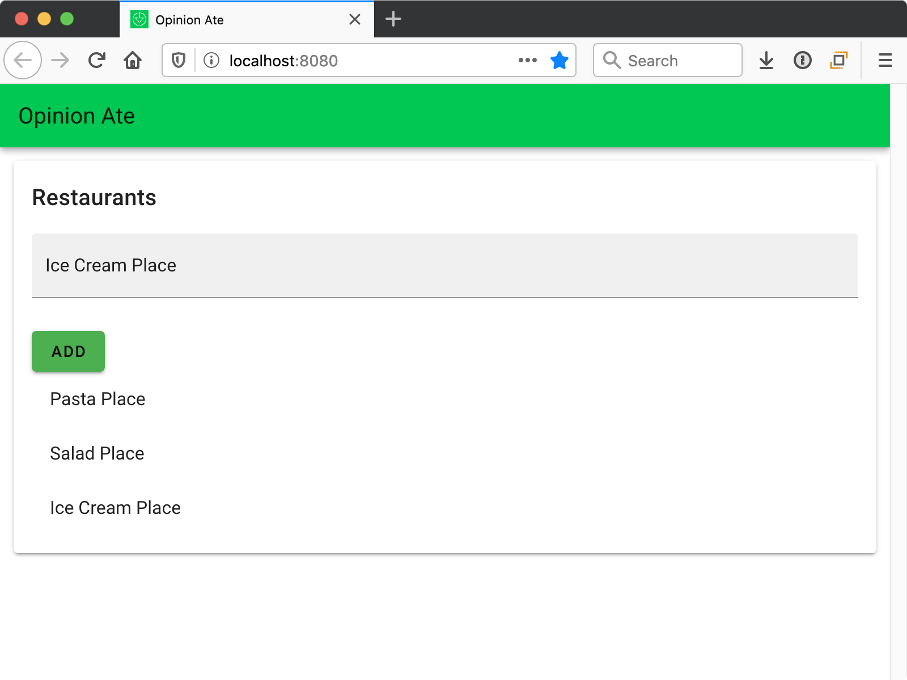
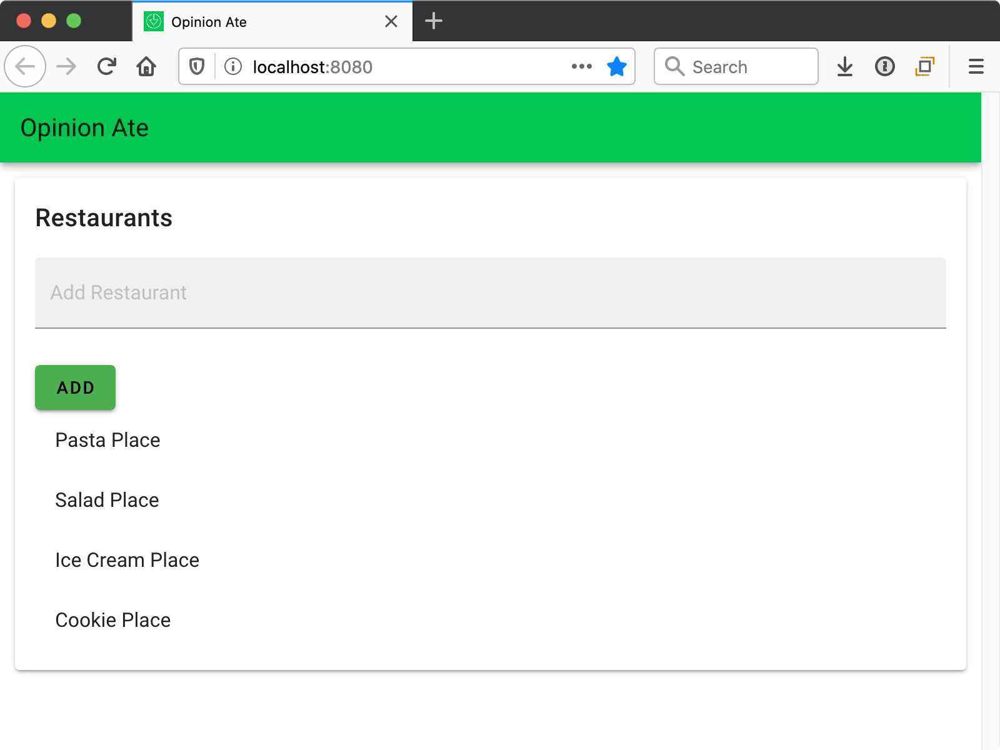
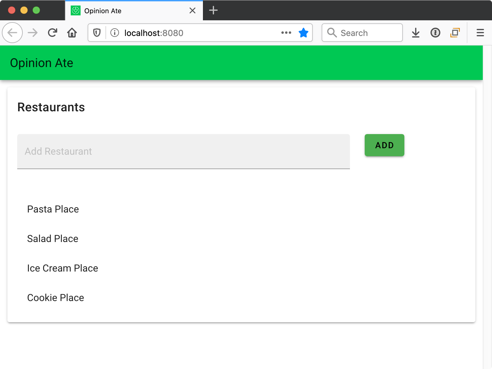
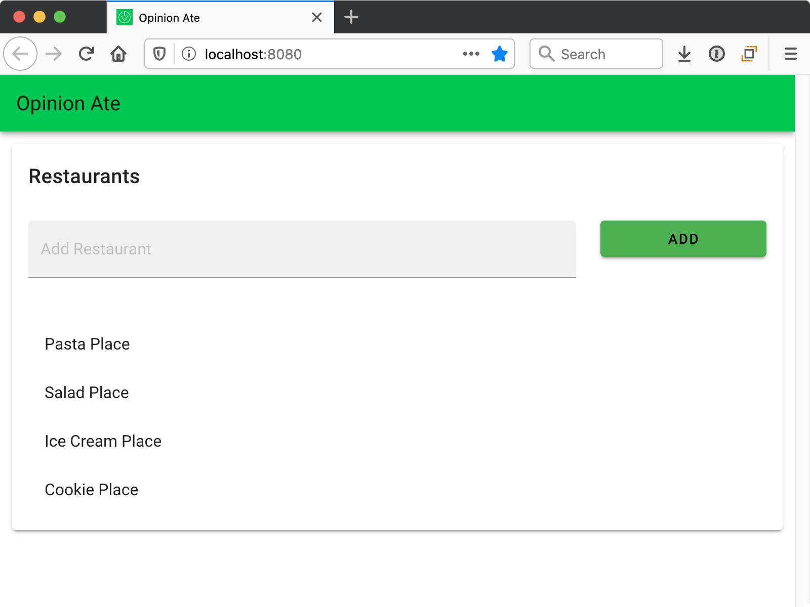

# 5 - Writing Data

In this chapter we'll move on to our next new feature. We'll follow the process of outside-in TDD once again, with an outer and inner red-green-refactor loop. We'll also see some of the situations that come up when testing forms and when saving data to an API.

Our next story in Trello is:

- [ ] Add Restaurants

Now we're on to our next user-facing feature: adding a restaurant. This will give us a chance to go through another outside-in sequence starting from an end-to-end test.

Create a new branch for this story:

```sh
$ git co -b creating-a-restaurant
```

Create a file `tests/e2e/specs/managing-restaurants.spec.js` and add the following:

```js
describe('Managing Restaurants', () => {
  it('allows adding restaurants', () => {
    const restaurantId = 27;
    const restaurantName = 'Sushi Place';

    cy.server({force404: true});

    cy.route({
      method: 'GET',
      url: 'http://localhost:3333/restaurants',
      response: [],
    });

    cy.route({
      method: 'POST',
      url: 'http://localhost:3333/restaurants',
      response: {
        id: restaurantId,
        name: restaurantName,
      },
    }).as('addRestaurant');

    cy.visit('/');

    cy.get('[placeholder="Add Restaurant"]').type(restaurantName);
    cy.contains('Add').click();

    cy.wait('@addRestaurant')
      .its('requestBody')
      .should('deep.equal', {
        name: restaurantName,
      });

    cy.contains(restaurantName);
  });
});
```

As in our previous E2E test, we are stubbing the GET request to load the restaurants—but this time we're returning an empty array, as we don't need any restaurants for the test.

We also stub a POST request, which is the request we'll use to create a restaurant. From it, we return an object that is the new restaurant that is created. We also chain a call to `.as()` on it to give it the name `addRestaurant`—we'll see why in a moment.

We visit the home page, and this time we do some interaction with the page:

- We find an element with a placeholder of "Add Restaurant" (so, presumably a text input), and we type a restaurant name into it.
- We find an element "Add" and click it.

Next, we call `cy.wait()`. This waits for an HTTP request to be sent. We pass the name of the request we want to wait for, prepending an `@` to it. Specifically, we wait for our `addRestaurant` request to complete. Then we check that the restaurant name is correctly sent in the body of the request. It's not enough to stub out the request: we need to confirm our app is sending the *right* data to the server too.

Finally, we confirm that the restaurant name is shown on the page, showing that the restaurant has been added to the list.

Start Cypress with `yarn test:e2e`, then choose the managing restaurants test. It fails, showing the first bit of functionality we need to implement:

> CypressError: Timed out retrying: Expected to find element: '[placeholder="Add Restaurant"]', but never found it.

We need an "Add Restaurant" text input. What component should it be in? We discussed earlier that `RestaurantScreen` would hold both the restaurant list and new restaurant form. The text input should live on the New Restaurant Form, so it's time to create that component.
Create the file `src/components/NewRestaurantForm.vue`, and add the following:

```html
<template>
  <form>
    <v-text-field placeholder="Add Restaurant" filled type="text" />
  </form>
</template>

<script>
export default {
  name: 'NewRestaurantForm',
};
</script>
```

Note the use of Vuetify's `v-text-field` component.

Next, add the form to the `NewRestaurantScreen` component:

```diff
     <v-card-text>
+      <NewRestaurantForm />
       <RestaurantList />
     </v-card-text>
...
 <script>
+import NewRestaurantForm from '@/components/NewRestaurantForm';
 import RestaurantList from '@/components/RestaurantList';

 export default {
   name: 'RestaurantScreen',
-  components: {RestaurantList},
+  components: {NewRestaurantForm, RestaurantList},
 };
```

Rerun the E2E tests and they should get past finding and typing into the Add Restaurant input. The next error is:

> CypressError: Timed out retrying: Expected to find content: 'Add' but never did.

To fix this error, we add a button to `NewRestaurantForm` but don't wire it up to anything yet:

```diff
   <form>
     <v-text-field placeholder="Add Restaurant" filled type="text" />
+    <v-btn color="teal" class="white--text">
+      Add
+    </v-btn>
   </form>
```

Rerun the E2E tests and we get this failure:

> CypressError: Timed out retrying: cy.wait() timed out waiting 5000ms for the 1st request to the route: 'addRestaurant'. No request ever occurred.

So now we need to send the request is our backend service. This is missing logic, so we will want to step down to unit tests to add it. How will it work?

- The `NewRestarantForm` component will dispatch an action to the store
- The store action will call a function in our API client
- The API client will make an HTTP `POST` request

Starting from the outside as usual, we'll start with the `NewRestarantForm` component. We want to reproduce the failure from the E2E test at the unit level. We should specify, when you click the send button, it should dispatch an action to the store. Now, the E2E test failure didn't tell us that we need to send along the restaurant name entered in the form, but we can go ahead and specify that that should be passed to the store, too. Otherwise we would need to go back through our stack to pass it along.

Create the file `tests/unit/components/NewRestaurantForm.spec.js` and start out by setting up the component and Vuex store in a `beforeEach` block:

```js
import Vue from 'vue';
import Vuetify from 'vuetify';
import Vuex from 'vuex';
import {mount, createLocalVue} from '@vue/test-utils';
import NewRestaurantForm from '@/components/NewRestaurantForm.vue';

Vue.use(Vuetify);

describe('NewRestaurantForm', () => {
  const restaurantName = 'Sushi Place';

  const localVue = createLocalVue();
  localVue.use(Vuex);

  let restaurantsModule;
  let wrapper;

  beforeEach(() => {
    restaurantsModule = {
      namespaced: true,
      actions: {
        create: jest.fn().mockName('create'),
      },
    };
    const store = new Vuex.Store({
      modules: {
        restaurants: restaurantsModule,
      },
    });

    wrapper = mount(NewRestaurantForm, {
      localVue,
      store,
      attachToDocument: true,
    });
  });

  afterEach(() => {
    wrapper.destroy();
  });
});
```

A few notes:

- We set up the mock restaurant module with just one action, `create` — this is the one we're going to ensure is called.
- We pass an extra option to `mount()` that was not needed for our list test: `attachToDocument: true`. This actually loads the component into the DOM. The reason we need this for this test is so the submit button can trigger the form submission.
- Because we're attaching the component to the document, we need to call `wrapper.destroy()` afterward to remove the elements from the document again.

Next, let's try to proactively organize our test file. Since we're taking the approach of having one behavior per test, it's likely that we will ultimately have multiple tests for each situation. So let's group situations with a `describe` block with a `beforeEach`, even if there's currently only one expectation. Add the following:

```js
  describe('when filled in', () => {
    beforeEach(() => {
      wrapper
        .find('[data-testid="new-restaurant-name-field"]')
        .setValue(restaurantName);
      wrapper
        .find('[data-testid="new-restaurant-submit-button"]')
        .trigger('click');
    });

    it('dispatches the create action', () => {
      expect(restaurantsModule.actions.create).toHaveBeenCalledWith(
        expect.anything(),
        restaurantName,
      );
    });
  });
```

We describe the situation when the form is filled in. We enter a restaurant name into a text field, then submit the form.
Note that while in the Cypress test we found elements by their placeholder and title text, with Vue Test Utils it's easier to find elements by a `data-testid` attribute, so we use that instead.

In `RestaurantList` we didn't pass a payload to our action, so we just had to confirm that the action function was called. But here, we need to ensure the restaurant name is passed as the payload of the action, so we need to use the `.toHaveBeenCalledWith()` matcher. The first argument is one provided by Vuex that includes a `commit` function and others, so since it's not provided by us there's no reason for us to set an expectation on it. So instead we pass `expect.anything()`, to tell Jest that any value there is fine. It's the second argument, where the payload is passed, that we want to confirm that the correct `restaurantName` is passed through.

Save the file and we get a failing test, as we expect:

```sh
  ● NewRestaurantForm › when filled in › dispatches the create action

    [vue-test-utils]: find did not return [data-testid="new-restaurant-name-field"], cannot call setValue() on empty Wrapper

      36 |       wrapper
      37 |         .find('[data-testid="new-restaurant-name-field"]')
    > 38 |         .setValue(restaurantName);
         |          ^
      39 |       wrapper.find('[data-testid="new-restaurant-submit-button"]').trigger('click');
```

To fix this error, let's add the `data-testid` attribute to the existing text field:

```diff
    <form>
-     <v-text-field placeholder="Add Restaurant" filled type="text" />
+     <v-text-field
+      placeholder="Add Restaurant"
+      filled
+      type="text"
+      data-testid="new-restaurant-name-field"
+    />
     <v-btn color="teal" class="white--text">
```

The next error we get is:

```sh
● NewRestaurantForm › when filled in › dispatches the create action

  [vue-test-utils]: find did not return [data-testid='new-restaurant-submit-button'], cannot call trigger() on empty Wrapper
```

We fix this by adding that test ID as well:

```diff
   />
-  <v-btn color="teal" class="white--text">
+  <v-btn color="teal" class="white--text" data-testid="new-restaurant-submit-button">
     Add
   </v-btn>
 </form>
```

The next failure we get is:

```sh
  ● NewRestaurantForm › when filled in › dispatches the create action

    expect(create).toHaveBeenCalledWith(...expected)

    Expected: Anything, "Sushi Place"

    Number of calls: 0

      39 |       wrapper.find('[data-testid="new-restaurant-submit-button"]').trigger('click');
      40 |
    > 41 |       expect(restaurantsModule.actions.create).toHaveBeenCalledWith(
         |                                                ^
      42 |         expect.anything(),
      43 |         restaurantName,
      44 |       );
```

The test failure reports the action wasn't called at all. This is because our button isn't currently hooked up to anything. The typical way to set this up in HTML forms is to make the button a `submit` button, so it submits the form:

```diff
   />
-  <v-btn color="teal" class="white--text" data-testid="new-restaurant-submit-button">
+  <v-btn
+    type="submit"
+    color="teal"
+    class="white--text"
+    data-testid="new-restaurant-submit-button"
+  >
+    Add
+  </v-btn>
</form>

```

Now, write just enough production code to get past the current test failure, let's just call the action without any arguments:

```diff
 <template>
-  <form>
+  <form @submit="handleSave">
     <v-text-field
...
 <script>
+import {mapActions} from 'vuex';

 export default {
   name: 'NewRestaurantForm',
+  methods: {
+    ...mapActions({
+      createRestaurant: 'restaurants/create',
+    }),
+    handleSave() {
+      this.createRestaurant();
+    },
+  },
 };
</script>
```

We map the `restaurants/create` action into the component, naming it `createRestaurant`. Then then we create a `handleSave` method that calls `createRestaurant`. Finally, we tell the form that upon the `submit` event, `handleSave` should be called.

Why didn't we just have the `submit` event call `createRestaurant` directly? We could, but it's a good idea to wrap Vuex actions with component-specific methods. This creates a semantic difference between the event as the component understands it ("handle save") and what is implemented in the store ("create restaurant"). Also, usually there will end up being some component-specific logic as well, and the component method gives you a place to run that. If you want to take the smaller step in your own code and tie the event directly to the Vuex action, though, that works too.

Save the file and now we get this test error:

```sh
Error: Not implemented: HTMLFormElement.prototype.submit
    at module.exports (/Users/josh/apps/agilefrontend/vue/node_modules/jsdom/lib/jsdom/browser/not-implemented.js:9:17)
```

This is because the HTML form is attempting to submit using the default browser mechanism. By default, HTML forms make their own request to the server when they're submitted, refreshing the page. This is because HTML forms predate using JavaScript to make HTTP requests. This reload restarts our frontend app, losing our progress.

To prevent this page reload from happening, Vue provides a `.prevent` modifier we can add to the action name in the tag to prevent the default browser behavior (analogous to `event.preventDefault()`). Add this:

```diff
 <template>
-  <form @submit="handleSave">
+  <form @submit.prevent="handleSave">
     <v-text-field
```

Save the file and the test failure has changed:

```sh
  ● NewRestaurantForm › when filled in › dispatches the create action

    expect(create).toHaveBeenCalledWith(...expected)

    Expected: Anything, "Sushi Place"
    Received: {"commit": [Function anonymous], "dispatch": [Function anonymous], "getters": {}, "rootGetters": {}, "rootState": {"restaurants": {}}, "state": {}}, undefined
```

Now we're getting to the end of our test, and the function is called, but it didn't receive the arguments it expected. It's a bit hard to find the second argument because the contents of the first argument Vuex provide are spelled out. But it's the `undefined`. To pass the restaurant name, first we're going to need to bind the form field's value to a data property:

```diff
     <v-text-field
       placeholder="Add Restaurant"
       filled
       type="text"
+      v-model="name"
       data-testid="new-restaurant-name-field"
     />
...
   name: 'NewRestaurantForm',
+  data() {
+    return {
+      name: '',
+    };
+  },
   methods: {
```

Then we'll pass the data property when calling the action:

```diff
     handleSave() {
-      this.createRestaurant();
+      this.createRestaurant(this.name);
     },
```

Save the file and the test passes.

We'll circle back to test-drive edge case functionality to the form later, but for now let's move on toward passing our E2E test by test-driving the store module. The restaurants module needs a `create` action that will make the appropriate call to the API, then insert the resulting record into the store. Let's write that test now. Below the "load action" group, add a "create action" group, and write a test to confirm the API is called:

```js
  describe('create action', () => {
    const newRestaurantName = 'Sushi Place';

    let api;
    let store;

    beforeEach(() => {
      api = {
        createRestaurant: jest.fn().mockName('createRestaurant'),
      };
      store = new Vuex.Store({
        modules: {
          restaurants: restaurants(api),
        },
      });
    });

    it('saves the restaurant to the server', () => {
      store.dispatch('restaurants/create', newRestaurantName);
      expect(api.createRestaurant).toHaveBeenCalledWith(newRestaurantName);
    });
  });
```

We'll need to add a second expectation shortly so we go ahead and set up the test in a `beforeEach`.

Save the file, and the test fails because the API method was not called:

```sh
  ● restaurants › create action › saves the restaurant to the server

    expect(createRestaurant).toHaveBeenCalledWith(...expected)

    Expected: "Sushi Place"

    Number of calls: 0
```

We also get a console error that the action doesn't exist:

```sh
  console.error node_modules/vuex/dist/vuex.common.js:422
    [vuex] unknown action type: restaurants/create
```

Let's fix that error first.
Add an empty action to the store module:

```diff
   actions: {
     load({commit}) {
...
     },
+    create() {},
   },
```

This fixes the error, so now we just get the expectation failure that `api.createRestaurant` wasn't called.
Update the `create` action to call it:

```diff
   actions: {
     load({commit}) {
...
     },
-    create() {},
+    create() {
+      api.createRestaurant();
+    }
   },

```

This changes the test failure. Now the method is called, but not with the right arguments:

```sh
  ● restaurants › create action › saves the restaurant to the server

    expect(createRestaurant).toHaveBeenCalledWith(...expected)

    Expected: "Sushi Place"
    Received: called with 0 arguments

    Number of calls: 1
```

Our restaurant name is passed in as the payload of the action, which is the second argument, so we can pass it along to the API method:

```diff
-    create() {
+    create(context, newRestaurantName) {
-      api.createRestaurant();
+      api.createRestaurant(newRestaurantName);
    },
```

We aren't yet using the context, the first argument that Vuex passes to the action, so we ignore it for now.

Save the file and the test passes. Now we need to specify one more thing that happens when the `create` action is dispatched: the returned restaurant from the API, including the ID that the API gives the record, is appended to the restaurant list in the state. To write that test, we're going to need to add a little to the setup as well:

```diff
   describe('create action', () => {
     const newRestaurantName = 'Sushi Place';
+    const existingRestaurant = {id: 1, name: 'Pizza Place'};
+    const responseRestaurant = {id: 2, name: newRestaurantName};

     let api;
     let store;

     beforeEach(() => {
       api = {
         createRestaurant: jest.fn().mockName('createRestaurant'),
       };
       store = new Vuex.Store({
         modules: {
-          restaurants: restaurants(api),
+          restaurants: restaurants(api, {records: [existingRestaurant]}),
         },
       });
     });
```

This adds a restaurant to the pre-existing list of restaurants in the store. Save the file and the tests should still pass.

Now we're ready to specify that the returned restaurant is added to the store. Let's add it in a "describe" block:

```js
describe('when save succeeds', () => {
  beforeEach(() => {
    api.createRestaurant.mockResolvedValue(responseRestaurant);
    store.dispatch('restaurants/create', newRestaurantName);
  });

  it('stores the returned restaurant in the store', () => {
    expect(store.state.restaurants.records).toEqual([
      existingRestaurant,
      responseRestaurant,
    ]);
  });
});
```

We ensure that the existing restaurant is still in the store, and the restaurant record returned from the server is added after it. Save the file and the test fails:

```sh
  ● restaurants › create action › stores the returned restaurant in the store

    expect(received).toEqual(expected) // deep equality

    - Expected
    + Received

      Array [
        Object {
          "id": 1,
          "name": "Pizza Place",
        },
    -   Object {
    -     "id": 2,
    -     "name": "Sushi Place",
    -   },
      ]
```

The store only contains the restaurant it was initialized with, not the new one the server returned. Let's update the action to handle the returned value:

```diff
-    create(context, newRestaurantName) {
+    create({commit}, newRestaurantName) {
-      api.createRestaurant(newRestaurantName);
+      api.createRestaurant(newRestaurantName).then(record => {
+        commit('addRecord', record);
+      });
     },
...
     storeRecords(state, records) {
       state.records = records;
       state.loading = false;
     },
+    addRecord(state, record) {
+      state.records.push(record);
+    },
   },
```

This makes our latest test pass, but our previous "saves the restaurant to the server" test now fails:

```sh
FAIL  tests/unit/store/restaurants.spec.js
 ● restaurants › create action › saves the restaurant to the server

   TypeError: Cannot read property 'then' of undefined

     20 |     },
     21 |     create({commit}, newRestaurantName) {
   > 22 |       api.createRestaurant(newRestaurantName).then(record => {
        |       ^
     23 |         commit('addRecord', record);
     24 |       });
     25 |     },
```

Now that we are chaining `.then()` onto the call to `api.createRestaurant()`, our previous test fails because we didn't configure the API method to resolve. Do that:

```diff
 it('saves the restaurant to the server', () => {
+  api.createRestaurant.mockResolvedValue(responseRestaurant);
   store.dispatch('restaurants/create', newRestaurantName);
   expect(api.createRestaurant).toHaveBeenCalledWith(newRestaurantName);
 });
```

Save and all unit tests pass.

With that, our store should be working. Let's rerun the E2E test to see if it's progressed. The console says:

```sh
TypeError: t.createRestaurant is not a function
```

Our component is successfully dispatching the action to the store, which is successfully calling `api.createRestaurant()`, but we haven't implemented it yet. Let's do that now. Remember, we don't unit test our API, so we can implement this method directly, driven by the E2E test. Let's start by fixing the immediate error by defining an empty `createRestaurant()` method:

```diff
 const api = {
   loadRestaurants() {
     return client.get('/restaurants').then(response => response.data);
   },
+  createRestaurant() {},
 };
```

Now we get another console error:

```sh
TypeError: Cannot read property 'then' of undefined
```

And we also get a test failure after a few seconds:

> CypressError: Timed out retrying: cy.wait() timed out waiting 5000ms for the 1st request to the route: 'addRestaurant'. No request ever occurred.

We still aren't making the HTTP request that kicked off this whole sequence. Fixing this will move us forward better, so let's actually make the HTTP request in the API:

```diff
   },
-  createRestaurant() {},
+  createRestaurant() {
+    return client.post('/restaurants', {});
+  },
 };
```

Now the `POST` request is made, and we get an error on the assertion we made about the request's body:

> ASSERT expected {} to deeply equal { name: Sushi Place }

So we aren't passing the restaurant name in the `POST` body. That's easy to fix by passing it along from the argument to the method:

```diff
-  createRestaurant() {
+  createRestaurant(name) {
-    return client.post('/restaurants', {});
+    return client.post('/restaurants', {name});
  },
```

Cypress confirms we're sending the `POST` request to the server correctly, and we've finally moved on to the next E2E assertion failure:

> CypressError: Timed out retrying: Expected to find content: 'Sushi Place' but never did.

We aren't displaying the restaurant on the page. This is because we aren't yet returning it properly from the resolved value. The Axios promise resolves to the Axios response object, but we want to return a promise that resolves to the record. We can do this by getting the response body:

```diff
   createRestaurant(name) {
-    return client.post('/restaurants', {name});
+    return client.post('/restaurants', {name}).then(response => response.data);
   },
```

Rerun the E2E test and it passes, and we see Sushi Place added to the restaurant list. Our feature is complete!

Start the API and your app and try out creating a restaurant for real. Reload the page to make sure it's really saved to the server.



## Edge Cases
Now let's look into those edge cases:

* The form should clear out the text field after you save a restaurant
* If the form is submitted with an empty restaurant name, it should show a validation error, and not submit to the server
* If the save fails an error message should be shown, and the restaurant name should not be cleared

First, let's implement the form clearing out the text field after saving. In `NewRestaurantForm.spec.js`, add a new test:

```diff
     it('dispatches the create action', () => {
       expect(restaurantsModule.actions.create).toHaveBeenCalledWith(
         expect.anything(),
         restaurantName,
       );
     });
+
+    it('clears the name', () => {
+      expect(
+        wrapper.find('[data-testid="new-restaurant-name-field"]').element.value,
+      ).toEqual('');
+    });
   });
```

Save the test, and we get a test failure confirming that the text field is not yet cleared:

```sh
  ● NewRestaurantForm › when filled in › clears the name

    expect(received).toEqual(expected) // deep equality

    Expected: ""
    Received: "Sushi Place"

      50 |       expect(
      51 |         wrapper.find('[data-testid="new-restaurant-name-field"]').element.value,
    > 52 |       ).toEqual('');
         |         ^
```

Where in the component should we clear the text field? Well, we have another story that the name should _not_ be cleared if the web service call fails. If that's the case, then we should not clear the text field until the store action resolves successfully.
Make this change in `NewRestaurantForm.vue`:

```diff
     handleSave() {
-      this.createRestaurant(this.name);
+      this.createRestaurant(this.name).then(() => {
+        this.name = '';
+      });
     },
```

Save the file and the test should pass. That was an easy one! If you add a new restaurant in the browser, now you'll see the name field cleared out afterward:



Now let's implement the validation error when the restaurant name is empty. Create a new `describe` block for this situation, below the "when filled in" describe block. We'll start with just one of the expectations, to confirm a validation error is shown:

```js
describe('when empty', () => {
  beforeEach(() => {
    wrapper.find('[data-testid="new-restaurant-name-field"]').setValue('');
    wrapper
      .find('[data-testid="new-restaurant-submit-button"]')
      .trigger('click');
  });

  it('displays a validation error', () => {
    expect(
      wrapper.find('[data-testid="new-restaurant-name-error"]').text(),
    ).toContain('Name is required');
  });
});
```

We don't actually need the line that sets the value of the text field to the empty string, because right now it starts out empty. But explicitly adding that line make the intention of the test more clear. And that way, if we did decide in the future to start the form out with default text, we would be sure this test scenario still worked. It's a judgment call whether to add it or not.

Save the file and the test fails, because the validation error message is not found:

```sh
  ● NewRestaurantForm › when empty › displays a validation error

    [vue-test-utils]: find did not return [data-testid="new-restaurant-name-error"], cannot call text() on empty Wrapper

      62 |     it('displays a validation error', () => {
      63 |       expect(
    > 64 |         wrapper.find('[data-testid="new-restaurant-name-error"]').text(),
         |                                                                ^
      65 |       ).toContain('Name is required');
```

Let's fix this error in the simplest way possible by adding the validation error unconditionally:

```diff
   <form @submit.prevent="handleSave">
+    <v-alert type="error" data-testid="new-restaurant-name-error">
+      Name is required.
+    </v-alert>
     <v-text-field
```

The tests pass. Now how can we write a test to drive out hiding that validation error in other circumstances? Well, we can check that it's not shown when the form is initially mounted.

Add a new `describe` above the "when filled in" one:

```js
describe('initially', () => {
  it('does not display a validation error', () => {
    expect(
      wrapper.find('[data-testid="new-restaurant-name-error"]').element,
    ).not.toBeDefined();
  });
});
```

The test fails because we are always showing the error right now:

```sh
  ● NewRestaurantForm › initially › does not display a validation error

    expect(received).not.toBeDefined()

    Received: <div class="v-alert v-sheet theme--dark error" data-testid="new-restaurant-name-error" role="alert"><div class="v-alert__wrapper"><i aria-hidden="true" class="v-icon notranslate v-alert__icon material-icons theme--dark">$error</i><div class="v-alert__content">
        Name is required.
      </div></div></div>

      34 |       expect(
      35 |         wrapper.find('[data-testid="new-restaurant-name-error"]').element,
    > 36 |       ).not.toBeDefined();
         |             ^
```

Time to add some logic around this error.
We'll add a data property to indicate whether it should be shown:

```diff
       data-testid="new-restaurant-name-field"
     />
-    <v-alert type="error" data-testid="new-restaurant-name-error">
-      Name is required.
-    </v-alert>
+    <v-alert
+      v-if="validationError"
+      type="error"
+      data-testid="new-restaurant-name-error"
+    >
+      Name is required.
+    </v-alert>
     <v-btn
...
   data() {
     return {
       name: '',
+      validationError: false,
     };
   },
```

Now, what logic should we use to set the `validationError` flag? Our tests just specify that initially the error is not shown, and after submitting an invalid form it's shown--that's all. The simplest logic to pass this test is to always show the validation error after saving:

```diff
     handleSave() {
+      this.validationError = true;
+
       this.createRestaurant(this.name).then(() => {
         this.name = '';
       });
     },
```

Save the file and all tests pass.

It may feel obvious to you that this is not the correct final logic, so this should drive us to consider what test we are missing. What should behave differently? Well, when we submit a form with a name filled in, the validation error should not appear. Let's add that test to the "when filled in" `describe` block:

```js
it('does not display a validation error', () => {
  expect(
    wrapper.find('[data-testid="new-restaurant-name-error"]').element,
  ).not.toBeDefined();
});
```

We can pass this test by adding a conditional around setting the `validationError` flag:

```diff
 handleSave() {
-  this.validationError = true;
+  if (!this.name) {
+    this.validationError = true;
+  }
```

Save the file and all tests pass.

Now, is there any other time we would want to hide or show the validation error? Well, if the user submits an empty form, gets the error, then adds the missing name and submits it again, we would want the validation error cleared out. Let's create this scenario as another `describe` block, below the "when empty" one:

```js
describe('when correcting a validation error', () => {
  beforeEach(() => {
    wrapper.find('[data-testid="new-restaurant-name-field"]').setValue('');
    wrapper
      .find('[data-testid="new-restaurant-submit-button"]')
      .trigger('click');
    wrapper
      .find('[data-testid="new-restaurant-name-field"]')
      .setValue(restaurantName);
    wrapper
      .find('[data-testid="new-restaurant-submit-button"]')
      .trigger('click');
  });

  it('clears the validation error', () => {
    expect(
      wrapper.find('[data-testid="new-restaurant-name-error"]').element,
    ).not.toBeDefined();
  });
});
```

Note that we repeat both sets of `beforeEach` steps from the other groups, submitting the empty form and then submitting the filled-in one. We want our unit tests to be independent, so they can be run without depending on the result of other tests. If this repeated code got too tedious we could extract it to helper functions that we could call in each `describe` block.

Save the test file and our new test fails:

```sh
  ● NewRestaurantForm › when correcting a validation error › clears the validation error

    expect(received).not.toBeDefined()

    Received: <div class="v-alert v-sheet theme--dark error" data-testid="new-restaurant-name-error" role="alert"><div class="v-alert__wrapper"><i aria-hidden="true" class="v-icon notranslate v-alert__icon material-icons theme--dark">$error</i><div class="v-alert__content">
        Name is required.
      </div></div></div>

      90 |       expect(
      91 |         wrapper.find('[data-testid="new-restaurant-name-error"]').element,
    > 92 |       ).not.toBeDefined();
         |             ^
```

We can fix this by clearing the `validationError` flag upon a successful submission:

```diff
     handleSave() {
       if (!this.name) {
         this.validationError = true;
+      } else {
+        this.validationError = false;
       }
```

Note that we aren't waiting for the web service to return to clear it out, the way we clear out the name field. We know right away that the form is valid, so we can clear it before the web service call is made.

Save and the tests pass. Now that we have an `each` branch to that conditional, let's invert the boolean to make it easier to read. Refactor it to:

```js
      if (this.name) {
        this.validationError = false;
      } else {
        this.validationError = true;
      }
```

Save and the tests should still pass.

Now we can handle the other expectation for when we submit an empty form: it should not dispatch the action to save the restaurant to the server. Add a new test in the "when empty" `describe` block:

```js
it('does not dispatch the create action', () => {
  expect(restaurantsModule.actions.create).not.toHaveBeenCalled();
});
```

We can fix this error by moving the call to `this.createRestaurant()` inside the true branch of the conditional:

```diff
     handleSave() {
       if (this.name) {
         this.validationError = false;
+        this.createRestaurant(this.name).then(() => {
+          this.name = '';
+        });
       } else {
         this.validationError = true;
       }
-
-      this.createRestaurant(this.name).then(() => {
-        this.name = '';
-      });
    },
```

Save the file and the test passes. If you try to submit the form with an empty restaurant name in the browser, you'll see:


Our third exception case is when the web service call fails. We want to display a server error.

Since this is a new situation, let's set this up as yet another new `describe` block in `NewRestaurantForm.spec.js`:

```js
describe('when the store action rejects', () => {
  beforeEach(() => {
    restaurantsModule.actions.create.mockRejectedValue();

    wrapper
      .find('[data-testid="new-restaurant-name-field"]')
      .setValue(restaurantName);
    wrapper
      .find('[data-testid="new-restaurant-submit-button"]')
      .trigger('click');
  });

  it('displays a server error', () => {
    expect(
      wrapper.find('[data-testid="new-restaurant-server-error"]').text(),
    ).toContain('The restaurant could not be saved. Please try again.');
  });
});
```

This is the same as the successful submission case, but in the setup we call the `mockRejectedValue()` method of the mock function `restaurantsModule.actions.create`. This means that when this function is called, it will reject. In our case we don't actually care about what error it rejects with, so we don't have to provide a rejected value.

Save the file and the expectation fails, but we also get an UnhandledPromiseRejectionWarning. Let's fix that warning first by adding an empty `.catch()` function:

```diff
       if (this.name) {
         this.validationError = false;
-        this.createRestaurant(this.name).then(() => {
-          this.name = '';
-        });
+        this.createRestaurant(this.name)
+          .then(() => {
+            this.name = '';
+          })
+          .catch(() => {});
       } else {
```

Save and the promise warning goes away, leaving us with just the expectation failure:

```sh
  ● NewRestaurantForm › when empty › displays a server error

    [vue-test-utils]: find did not return [data-testid="new-restaurant-name-error"], cannot call text() on empty Wrapper

      70 |     it('displays a server error', () => {
      71 |       expect(
    > 72 |         wrapper.find('[data-testid="new-restaurant-name-error"]').text(),
         |                                                                ^
      73 |       ).toContain('Name is required');
      74 |     });
```

As usual, we'll first solve this by hard-coding the element into the component:

```diff
     </v-alert>
+    <v-alert type="error" data-testid="new-restaurant-server-error">
+      The restaurant could not be saved. Please try again.
+    </v-alert>
     <v-text-field
```

Save and the test passes. Now, when do we want that message to *not* show? For one thing, when the component initially mounts. Add another test to the "initially" describe block:

```js
it('does not display a server error', () => {
  expect(
    wrapper.find('[data-testid="new-restaurant-server-error"]').element,
  ).not.toBeDefined();
});
```

Save and the test fails:

```sh
  ● NewRestaurantForm › initially › does not display a server error

    expect(received).not.toBeDefined()

    Received: <div class="v-alert v-sheet theme--dark error" data-testid="new-restaurant-server-error" role="alert"><div class="v-alert__wrapper"><i aria-hidden="true" class="v-icon notranslate v-alert__icon material-icons theme--dark">$error</i><div class="v-alert__content">
        The restaurant could not be saved. Please try again.
      </div></div></div>

      40 |       expect(
      41 |         wrapper.find('[data-testid="new-restaurant-server-error"]').element,
    > 42 |       ).not.toBeDefined();
         |             ^
```

We'll add another flag to the data to track whether the error should show, starting hidden, and shown if the store action rejects:

```diff
     </v-alert>
-    <v-alert type="error" data-testid="new-restaurant-server-error">
+    <v-alert
+      v-if="serverError"
+      type="error"
+      data-testid="new-restaurant-server-error"
+    >
       The restaurant could not be saved. Please try again.
     </v-alert>
...
   data() {
     return {
       name: '',
       validationError: false,
+      serverError: false,
     };
   },
...
         this.createRestaurant(this.name)
           .then(() => {
             this.name = '';
           })
-          .catch(() => {});
+          .catch(() => {
+            this.serverError = true;
+          });
```

Save and the tests pass.

Let's also write a test to confirm that the server error is not shown after the server request returns successfully. In the "when filled in" describe block, add an identical test:

```js
it('does not display a server error', () => {
  expect(
    wrapper.find('[data-testid="new-restaurant-server-error"]').element,
  ).not.toBeDefined();
});
```

Save and the test passes. This is another instance where the test doesn't drive new behavior, but it's helpful for extra assurance that the code is behaving the way we expect.

We also want to hide the server error message each time we retry saving the form. This is a new situation, so let's create a new `describe` block for it:

```js
describe('when retrying after a server error', () => {
  beforeEach(() => {
    restaurantsModule.actions.create
      .mockRejectedValueOnce()
      .mockResolvedValueOnce();

    wrapper
      .find('[data-testid="new-restaurant-name-field"]')
      .setValue('Sushi Place');
    wrapper
      .find('[data-testid="new-restaurant-submit-button"]')
      .trigger('click');
    wrapper
      .find('[data-testid="new-restaurant-submit-button"]')
      .trigger('click');
  });

  it('clears the server error', () => {
    expect(
      wrapper.find('[data-testid="new-restaurant-server-error"]').element,
    ).not.toBeDefined();
  });
});
```

Save the file and you'll get the expected test failure:

```sh
  ● NewRestaurantForm › when retrying after a server error › clears the server error

    expect(received).not.toBeDefined()

    Received: <div class="v-alert v-sheet theme--dark error" data-testid="new-restaurant-server-error" role="alert"><div cl
ass="v-alert__wrapper"><i aria-hidden="true" class="v-icon notranslate v-alert__icon material-icons theme--
dark">$error</i><div class="v-alert__content">
        The restaurant could not be saved. Please try again.
      </div></div></div>

      147 |       expect(
      148 |         wrapper.find('[data-testid="new-restaurant-server-error"]').element,
    > 149 |       ).not.toBeDefined();
          |             ^
```

We should be able to make this test pass by just clearing the `serverError` flag when attempting to save:

```diff
     handleSave() {
       if (this.name) {
         this.validationError = false;
+        this.serverError = false;
+
         this.createRestaurant(this.name)
```

Save the file, but surprisingly, the test failure doesn't change! Why is that? It turns out the culprit is clicking the submit button twice in a row. We want to wait for the first web request to return and update the state, _then_ send the second one.

There are a few ways to do this in Vue tests; one simple one is to use the `flush-promises` npm package. Add it to your project:

```sh
$ yarn add --dev flush-promises
```

Then add it to your test:

```diff
 import Vuex from 'vuex';
+import flushPromises from 'flush-promises';
 import {mount, createLocalVue} from '@vue/test-utils';
...
   describe('when retrying after a server error', () => {
-    beforeEach(() => {
+    beforeEach(async () => {
       restaurantsModule.actions.create
         .mockRejectedValueOnce()
         .mockResolvedValueOnce();

       wrapper
         .find('[data-testid="new-restaurant-name-field"]')
         .setValue('Sushi Place');
       wrapper
        .find('[data-testid="new-restaurant-submit-button"]')
        .trigger('click');
+      await flushPromises();
       wrapper
        .find('[data-testid="new-restaurant-submit-button"]')
        .trigger('click');
    });
```

Note that we need to make the `beforeEach` function `async`, so we can `await` the call to `flushPromises()`. This ensures the results of the first click will complete before we start the second.

Save and the test should pass.

There's one more circumstance we need to clear the server error: if a validation error occurs. Add this test to the "when empty" describe block:

```js
it('clears a server error', () => {
  expect(
    wrapper.find('[data-testid="new-restaurant-server-error"]').element,
  ).not.toBeDefined();
});
```

Now we have just one more component test to make: that the restaurant name is not cleared when the server rejects. This should already be working because of how we implemented the code, but it would be frustrating for the user if they lost their data, so this is an especially important case to test. Add another expectation to the "when the store action rejects" `describe` block:

```js
it('does not clear the name', () => {
  expect(
    wrapper.find('[data-testid="new-restaurant-name-field"]').element.value,
  ).toEqual(restaurantName);
});
```

Save and the test passes, confirming that the user's data is safe.

We have a little bit to unit test in the store as well: `NewRestaurantForm` is relying on the `create` action returning a promise that resolves or rejects depending on whether the server request succeeds or fails. To test this, first let's add a test to the "when save succeeds" block:

```diff
 describe('create action', () => {
...
   let api;
   let store;
+  let promise;

   beforeEach(() => {
...
   describe('when save succeeds', () => {
     beforeEach(() => {
       api.createRestaurant.mockResolvedValue(responseRestaurant);
-      store.dispatch('restaurants/create', newRestaurantName);
+      promise = store.dispatch('restaurants/create', newRestaurantName);
    });

     it('stores the returned restaurant in the store', () => {
       expect(store.state.restaurants.records).toEqual([
         existingRestaurant,
         responseRestaurant,
       ]);
     });

+    it('resolves', () => {
+      return expect(promise).resolves.toBeUndefined();
+    });
   });
 });
```

This passes right away. Now let's add a new describe block for when save fails:

MORE DETAIL HERE ON TESTING PROMISES

```js
describe('when save fails', () => {
  it('rejects', () => {
    api.createRestaurant.mockRejectedValue();
    promise = store.dispatch('restaurants/create', newRestaurantName);
    return expect(promise).rejects.toEqual(undefined);
  });
});
```

Save and this test fails: the promise resolves instead of rejecting. Why is this? It seems like `store.dispatch()` automatically returns a promise. CONFIRM VUEX BEHAVIOR HERE If your action returns a promise, it's forwarded along; otherwise the action just resolves. So fixing this test is as easy as returning the promise chain from our action:

```diff
 create({commit}, newRestaurantName) {
-  api.createRestaurant(newRestaurantName).then(record => {
+  return api.createRestaurant(newRestaurantName).then(record => {
     commit('addRecord', record);
   });
 },
```

The tests pass.

Now let's run our app in the browser and see it handle a server error. Make sure your API server is running, then run the frontend and load it up. Next, stop your API server. Then enter a restaurant name and click "Add". You should see a red server error message:


That was a lot of edge cases, but we've added a lot of robustness to our form!

Imagine if we had tried to handle all of these cases in E2E tests. We either would have had a lot of slow tests, or else one long test that ran through an extremely long sequence. Instead, our E2E tests cover our main functionality, and our unit tests cover all the edge cases thoroughly.

Rerun your E2E tests to make sure they still pass.

Now that all our tests are passing for the feature, let's think about refactoring.
We used Vuetify components to make our form elements look good, but we didn't give any attention to the layout--we just put them one after another.
In single-text-input forms like this one, it can look nice to put the submit button to the right of the text area.

Vuetify offers a [grid system](https://vuetifyjs.com/en/components/grids) that is useful for layout situations like this. Let's apply it to our form.

```diff
   <v-alert
     v-if="serverError"
     type="error"
     data-testid="new-restaurant-server-error"
   >
     The restaurant could not be saved. Please try again.
   </v-alert>
+  <v-row>
+    <v-col cols="9">
       <v-text-field
         placeholder="Add Restaurant"
         filled
         type="text"
         v-model="name"
         data-testid="newRestaurantNameField"
       />
+    </v-col>
+    <v-col cols="3">
       <v-btn
         type="submit"
         color="teal"
         class="white--text"
         data-testid="new-restaurant-submit-button"
       >
         Add
       </v-btn>
+    </v-col>
+  </v-row>
 </form>
```

We wrap the two form elements in a `v-row`, which will lay them out horizontally. We put each in `v-col` column. The `cols` attribute specifies how many units out of 12 the column should take up. We specify our text field should take up 9 of 12 spaces, or three quarters of the width. The button should take up 3 of 12 spaces, or one quarter.

Pull up your app and see how it looks.



The elements are next to each other, but if your window is wide enough, the save button doesn't take up the full width of its containing area. To fix this, specify the button should be a block:

```diff
 <v-btn
   type="submit"
   color="teal"
   class="white--text"
+  block
   data-testid="new-restaurant-submit-button"
 >
   Add
 </v-btn>
```

Check again, and the button fills up its containing area.



The form looks pretty good now!

Most importantly, rerun the E2E tests and confirm that our app still works.

If you have any uncommitted changes, commit them to git. Push up your branch to the origin and open a pull request. Wait for CI to complete, then merge the pull request. Now we can mark off our story in Trello:

- [x] Add Restaurants
